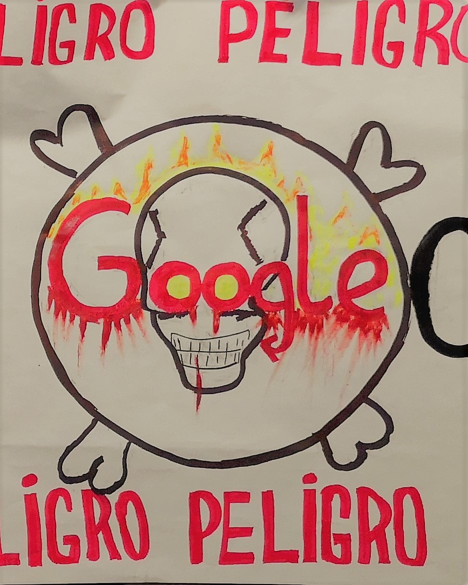
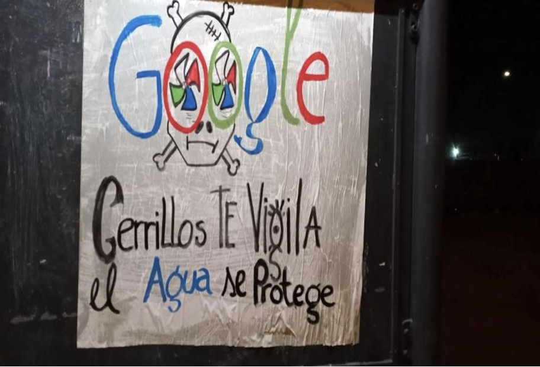
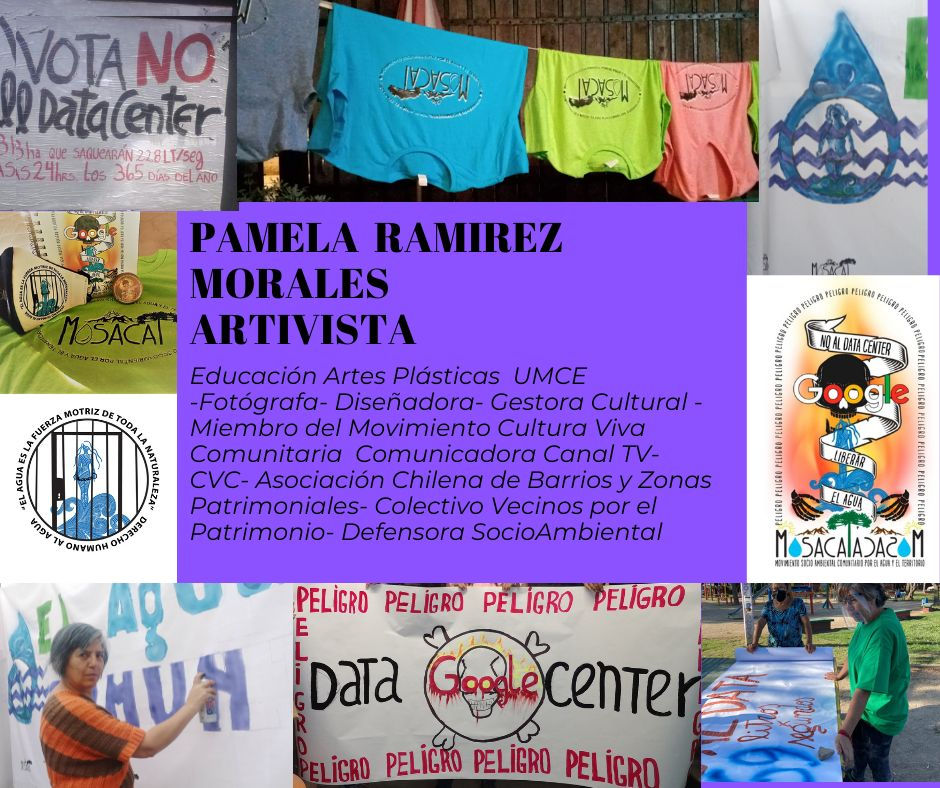

---
Pr-id: MoneyLab
P-id: INC Reader
A-id: 10
Type: article
Book-type: anthology
Anthology item: article
Item-id: unique no.
Article-title: title of the article
Article-status: accepted
Author: name(s) of author(s)
Author-email:   corresponding address
Author-bio:  about the author
Abstract:   short description of the article (100 words)
Keywords:   50 keywords for search and indexing
Rights: CC BY-NC 4.0
...

# STORY 2. No to the Data Center! Resistance and Artivism Against Google in Cerrillos

### Pamela Ramírez M.

In 2019, a group of neighbors organized themselves to fight against the
construction of a Google data center in Cerrillos, a commune in
Santiago, Chile. This project, driven by a powerful technology
transnational, threatened to leave us without water. Our fight involved
challenging support for Google from local authorities and President
Sebastián Piñera.

## Cerrillos and the Data Center

In 2019, Google submitted a project to build a data center to Chile's
environmental evaluation system. This data center would be installed in
Cerrillos, a working-class commune located in Santiago, the capital.
Despite the lack of information, neighbors decided to investigate the
characteristics of this project to better understand its potential
impact. After trying to decipher the technical report, we realized that
Data Luna, Google's legal representative, had purchased water rights to
use 228 liters per second. This figure, stratospheric considering the
drought in the area, threatened our ability to access water for our
daily chores.

Our struggle against the Google project was marked by great inequalities
of power and information. On the one hand, Google is a powerful
multinational with professional communication and community relations
teams. Both President Sebastián Piñera and his government officials in
ministries and services proactively supported the construction of the
data center. Our mayor in Cerrillos also approved the project, arguing
that it would generate job opportunities for the commune. In fact, some
of these actors maintained confidentiality in their dealings with Data
Luna to prevent citizens from opposing its construction.

Supporters of the project used all kinds of subterfuge to ensure its
construction. The country's deficient laws were key to this. In Chile,
companies investing in the project must submit an environmental impact
statement. Usually, in this document, companies declare their good
intentions for local development and rarely make transparent the
environmental impact their projects will have. To achieve this, they
hire 'experts' from different areas to ensure that the project complies
with current environmental regulations. The problem is that the current
system allows atrocities such as, in the case of Google, cooling water
servers using 169 liters per second in an area with mega drought. In
fact, in 2020 the General Directorate of Water gave a yellow alert by
declaring the Metropolitan Zone, where Cerrillos is located, saturated
in water demand.

In Chile, water resources are in private hands. The human right to water
is not guaranteed in our Constitution. It is considered a public good,
but it is allowed to concession water in perpetuity to companies. The
first conversations we had with the authorities were difficult. These
authorities were elected to represent us, but they told us that there
was simply nothing to be done. However, as neighbors of Cerrillos, we
decided to embark on a struggle for our good living despite having
everything against us.

## The Dangers of The Data Center

The Google project took place in a context of ecosystemic fragility in
Chile. In the Metropolitan Region, where Cerrillos is located, there are
cases such as Petorca. After twelve years of lack of rainfall, this area
suffers desertification and its inhabitants receive water through water
trucks. This occurs in parallel to the plundering of our rivers by
mining companies, as well as the expansion of monoculture agribusiness.
This type of abuse has meant that the aquifer of the Metropolitan Region
does not provide enough water for more than six million inhabitants.

It is outrageous that, in this context, Google's data center project in
Cerrillos declared that the cooling system for its servers would use 169
liters per second of water. The average water consumption per inhabitant
in Cerrillos is 15 cubic meters, and we are around eighty-five thousand
inhabitants in the commune. The data center intended to use twice as
much water as the citizens! In addition, and as we denounced during the
campaign, the 7,190,208,000 liters per year used by the data center
would be equivalent to filling 2,130 Olympic swimming pools. That was
the insulting water footprint of Google's project.

Another risk we identified was groundwater contamination. This is
because the project would store more than 800,000 liters of diesel fuel
to run backup electric generators.

## How we Resisted

The scenario was not very encouraging. We took several actions to be
heard, but one after another doors were closed to us. We visited
Congress, where we talked to the Environmental Commission. We also
sought signatures with the support of neighbors in free fairs. At that
time everything seemed to conspire in support of the data center. Our
phrase ‘NO TO THE DATA CENTER’ that we circulated in pamphlets, posters
and social networks did not seem to work when associated with Google,
the Goliath of history.

A requirement for our fight was self-education. We had to understand a
technically written environmental impact statement, trying to translate
it into simple words to explain to neighbors and local authorities our
opposition to the project. Although Law 19,300 opens a window for
citizen participation, the technocratic nature and a series of
bureaucratic requirements made it difficult for us to take full
advantage of it. To make matters worse, we did not have the financial
resources to publicize our struggle. We wanted to produce graphic
material, posters and badges.

Despite this, we managed to develop a campaign based on a few basic
points. These points had to address key aspects of the project and be
understood by the public.

 

A key message we communicated was the danger of the Google project
(Image 1). What did we mean by 'danger'? If the data center was built,
it could mean that those of us who live in Cerrillos would have to
receive water by water truck. In addition, we used the image of a skull
to synthesize the plot behind the project: looting and piracy in the
face of an imminent drought, corporate abuses and the voracious
extractivism of water resources. We also appeal to other water struggles
in Chile to raise awareness.  

 

We resorted to all forms of struggle. One format we used was the
'chaconeo', which consists of making posters with some available paper
and paint or markers. This technique was used in Chile to fight against
the civil-military dictatorship headed by Augusto Pinochet. Through the
'chacones' we communicated our messages and called the attention of the
citizens. In addition to this, large-format canvases were crossed on
highway walkways. This action was recorded and shared through our social
media accounts.

We did not want to be alone in our struggle, so we established alliances
with other causes and movements. We allied ourselves with Social Unity,
a civil society group that was organizing territorially to make politics
from the grassroots. Of great help was also the solidarity expressed by
the Central Unica de Trabajadores (CUT) and the Coordinadora No+AFP
(against the privatization of the health system), among other
organizations.

In October 2019, when we were carrying out our campaign, an
unprecedented social uprising occurred in Chile in which citizens took
to the streets to protest against inequality and corruption. Thanks to
this, several young people began to support us. This allowed us to
generate a second moment of empowerment, as well as to organize marches
and establish new alliances.

In December, as a result of the social uprising, Cerrillos called for a
municipal citizen consultation. This mechanism represented a democratic
way in the face of President Sebastián Piñera's proposal to increase
repression. On that occasion, we demanded that our demand 'No to the
Data Center' be placed on the ballot. We developed an intense
communication strategy, sharing information around the polling places
and papering the vicinity during the early hours of the previous day. As
neighbors, something that helped us was getting to know the territory.
Against all odds, and with only two weeks to carry out an informative
and self-managed campaign, our option won with close to 50%. This
consultation, however, was not binding, so it did not imply the
cancellation of the project.

## Socio-environmental Artivism

In our struggle we also resorted to artivism, a form of resistance with
historical roots in Latin America that uses art to combat inequality.
Our graphic actions worried Google representatives, who contacted us
because they felt we were damaging their corporate image. By that time
we already had followers on social networks. Besides, we had won the
plebiscite. At that time we began to feel listened to. In addition to
the skull, we developed other visual concepts. One of them appealed to a critique of water privatization in Chile.

 

We represented water in a female body, enclosed and chained (Image 3).
Thus, we sought to present water as private and subject to abuses and
violations despite being a natural resource. This image evoked the
patriarchal extractivism from which water, which is a human right and
the driving force of all Nature, must be freed. Thus, by appealing to
gender we managed to connect with the feminist impulse that took place
during and after the social outburst. As Lastesis expressed in their
song 'Un violador en tu camino': ‘An atavistic and rancid system that
also attacks the body. Our bodies hurt us, immobilizes us and kills us’, as well as ‘The patriarchy is a judge that judges us for being born’.

The first awareness-raising product we developed, the badges, evolved in their designs. We also developed products to finance the costs of hiring a lawyer to take our cause to court. Taking advantage of the pandemic, we made masks (@pandemia.style) with our iconic images using silk screen printing techniques. We printed t-shirts, bags and had diaries made. In this identification process, we also came up with the name Mosacat (Movimiento Socio Ambiental Cerrillos por el Agua y el Territorio). Since we then wanted to go beyond the cause of the Google project, we expanded the territory and changed ‘Cerrillos’ to ‘Ciudadano’ (Citizen).

After 3 years of struggle, we signed a waiver of the case in court. We
agreed with Google's representatives for Latin America that, if they
changed the cooling system to a less water intensive one and took all
precautions in the storage of diesel so as not to contaminate the
groundwater, our quality of life would not be affected. It is important
to emphasize that, for different reasons, there were aspects that we did
not refer to, such as electromagnetic contamination in Chile or the
content of the data that would be stored in our commune.

 