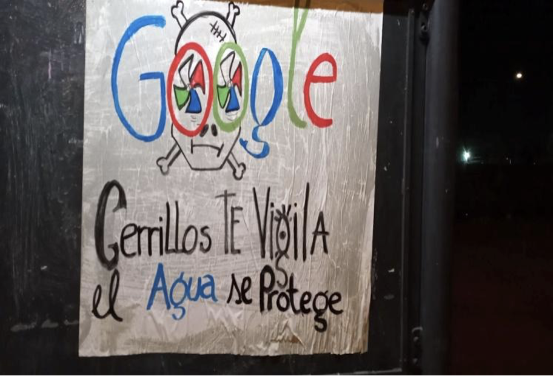
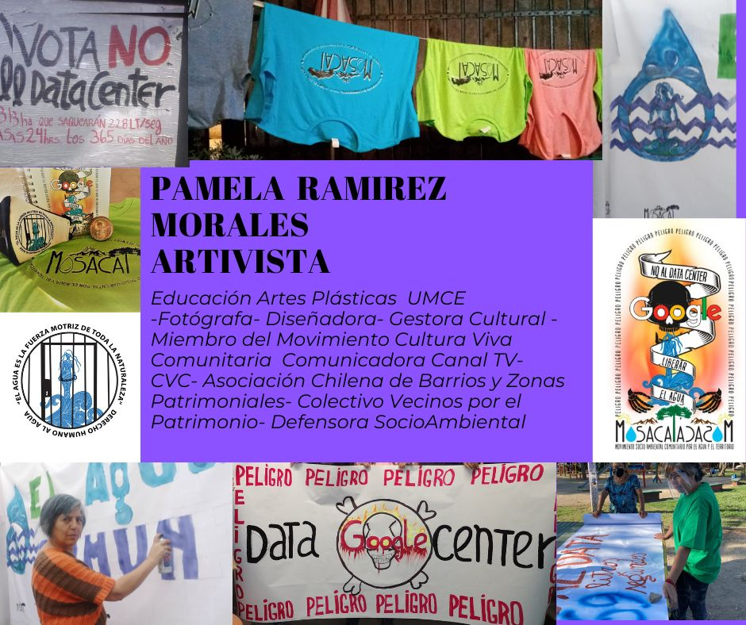
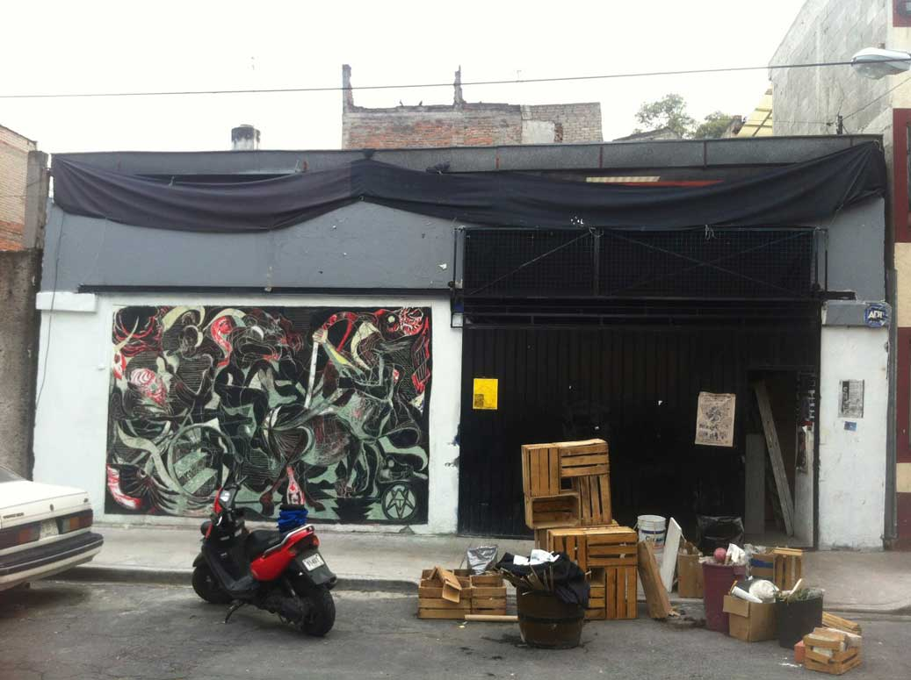

&lt;div style="page-break-after: always"&gt;&lt;/div&gt;

# Colophon

INC Theory on Demand \#45\
**Resisting Data Colonialism – A Practical Intervention**

**Authors:** members and allies of the Tierra Común Network, including
Community Oceans Futures Group, Stefanía Acevedo, Gowri Balasubramaniam,
Clara Belitz, Kainen Bell, Jes Ciacci (Sursiendo), Nick Couldry, Ludmila
Costhek Abílio, Abel Guerra, Rafael Grohmann, Amanda Jurno, Kruskaya
Hidalgo Cordero, Nai Lee Kalema, Alejandro Mayoral, Bruno Moreschi,
Teresa Numerico, Gabriel Pereira, Julian Posada, Paola Ricaurte Quijano,
Pamela Ramírez Martínez, Anita Say Chan, Joana Varón, Chamee Yang

**Cover Design:** Katja van Stiphout\
**Production:** Agnieszka Antkowiak and Erica Gargaglione\
\
Published by the Institute of Network Cultures, Amsterdam, 2022\
ISBN XXXX\
\
**Contact** Institute of Network Cultures\
Amsterdam University of Applied Sciences (HVA)\
Email: [*info@networkcultures.org*](mailto:info@networkcultures.org)\
Web: [*www.networkcultures.org*](http://www.networkcultures.org/)

# TABLE OF CONTENTS

# Acknowledgments 

We wish to thank Geert Lovink and the INC for giving this publication a
home, Ivanna Martínez Polo for the editorial support, as well as
everyone in the wider Tierra Común network for their inspiration!

# INTRODUCTION. There is something wrong with data extraction 

### Nick Couldry

Some people, mainly from the privileged West, think that colonialism is
long over. Others are sure that colonialism has never stopped. This book
explores a third possibility: that not only is colonialism still
continuing, but that right now it is morphing into its most powerful
version yet. We call this data colonialism.

Data colonialism is a landgrab that’s going on in societies across the
world. We don’t mean a literal grab of land, but an act of seizing
resources, any sort of resource, in an absolute way. Colonialism, while
of course it is much more than this, was originally built from such
landgrabs, but even historical colonialism seized much more than land:
it seized the resources under the land and produced from farming the
land, as well as the bodies to do that work. 

Today what is being seized is the social life of human beings. The flow
and texture of individual human lives are being seized by corporations
—and sometimes governments too. They are being seized in the form of
data. That data generates value: economic value for corporations and the
value that governments get from controlling us more effectively. Either
way, a new source of power is being created at human beings’ expense, in
a new data *landgrab*. [^03INTRODUCTION_1],[^03INTRODUCTION_2],[^03INTRODUCTION_3]

It is not that tracking human life to extract value from it is wholly
new. Some institutions such as prisons and schools have for centuries
involved close surveillance. Some workers have been tracked much more
intensively than others, the most extreme case being the constant eye of
the plantation owner on his slaves. 

What is new today is the *scope, scale and depth* of how human life is
being tracked for the benefit of commercial and governmental elites.
Today’s forms of data extraction are more widespread, more fine-grained,
and more multi-layered than anything previously seen in history. And
data extraction operates not just at particular moments, but
cumulatively: the data taken from us *at one moment* can be combined
with data collected from us *and* from other people *at other times*.
Our lives are becoming part of a vast grid of continuous comparison and
analysis by external institutions.

This represents a major shift in the power relations in contemporary
life: knowledge is power, and the amount of knowledge that external
institutions have about us is increasing massively. A shift in power
relations potentially as dramatic as that involved in the original
landgrab of historical colonialism.

In this short book, we try to build some tools to understand what is
going on with data today, why it is colonial, and how collectively to
resist it. This is hard. Not only has resisting colonialism always been
very hard, because of the highly unequal forces pitted against each
other. But today the new stage of colonialism –data colonialism– is
arguably implicated in the everyday running of the economy in ways even
deeper than when historical colonialism provided the fuel for capitalism
to emerge over two centuries ago. Today’s colonizers are not adventuring
conquistadors or governors of provinces, but the very same corporations
that provide us with what seem like our basic services for living –
platforms to social life, apps for monitoring our health, the interfaces
where our children learn in school, and so on.

Instead of coming just from competing European countries, today’s
colonizers are dominated by two poles (the US and China), with other
countries (e.g., India, Israel, and various European countries) playing
a role too in shaping how data is extracted through digital platforms.
So the geopolitics of data colonialism is complicated, but that does not
make data colonialism any less real.

This means that we need to look at the familiar shape of our digital
culture in a new and critical light: in a way that remembers the history
of colonialism and sees its whole history –including today’s unfolding
new phase of massive data extraction– as the continuation of a process
of unequal resource extraction from the many by the few that has been
going on for 500 years.

This book is intended as a *practical tool*. It is the work of many
voices and draws on a diversity of ways of thinking. Building upon
decolonial scholars, our goal is that this discussion of data
colonialism should lead to *praxis*: the enactment of resistance. We
therefore hope the book will prove useful to citizens, communities, and
teachers who want resources to help start thinking and taking action in
regards to data colonialism in their lives.

We have not tried to disguise our individual voices. This book is like a
small concert where all our voices can be heard. It is like a river that
allows the streams of our individual thinking and writing to come
together in a larger river that one day will reach the ocean: the ocean
of a bigger movement to resist data colonialism across all parts of the
world. 

The first part of the book sets out a framework for understanding and
resisting data colonialism. Chapter 1 by Alejandro Mayoral reflects on
what colonialism has been historically, and its different dimensions.
Chapter 2 by Nai Lee Kalema looks at why capitalism is always racial
capitalism, and how that, in turn, is combining with data colonialism to
form digital racial capitalism. Chapter 3 by Teresa Numerico reflects on
the role of science —including Artificial Intelligence, science’s latest
dominant form— in providing an apparently natural medium through which
the far-from-natural processes of colonialism and racial capitalism can
work. Chapter 4 by Gabriel Pereira and Nick Couldry looks at the sorts
of specific harm data colonialism is carrying out today across the
world. Chapter 5 by Joana Varón explores however, beyond banal forms of
datafication, data practices work to erase ways of life, particularly in
the domain of sexuality and gender.

The second part of the book is composed by Stories of Resistance. These
are case studies of resistance to data colonialism, written from the
viewpoint of different communities around the world. We place these
cases \[later in\] the book so that you have lived realities as a
reference-point for thinking about the broader ideas we propose.

Finally, the book also offers practical resources in the form of A Call
to Action, including ten decolonial principles to live by, and a lexicon
of keywords for this struggle.

This book emerged from a thoroughly collective process. Our network,
Tierra Común,[^03INTRODUCTION_4] which was formed at the start of the global COVID-19
pandemic, identified a book as a potential common project. Over time, a
small group formed who wanted to work on this more intensively to create
a common text that could be useful to others. We discussed these
different texts and, across the time span of a year, wrote and edited
the different parts across remote meetings.

The text is published also on the Tierra Común website and that of the
Institute for Network Cultures: other members are free to add to its
online form, including by adding case studies, at any time. This is a
living text. A text whose life we hope will contribute to struggles
against data colonialism everywhere. . .

[^03INTRODUCTION_1]: Ulises Ali Mejias and Nick Couldry, Data Grab: the New Colonialism
    and how to Resist It, Penguin and W. H. Allen & Company, 2024
    forthcoming.

[^03INTRODUCTION_2]: Nick Couldry and Ulises Ali Mejias, The Costs of Connection: How
    Data is Colonizing Everyday Life and Appropriating it for
    Capitalism, Stanford University Press, 2019.

[^03INTRODUCTION_3]: Paola Ricaurte, ‘Data epistemologies, The Coloniality of Power,
    and Resistance’, Television and New Media, 20.4 (2019): 350-365.

[^03INTRODUCTION_4]: Tierra Común. Interventions for data decolonization.
    https://www.tierracomun.net/en/home/

# FRAMEWORK FOR RESISTANCE

# CHAPTER 1. Data colonialism is not a metaphor: Remembering colonialism and why it matters in the digital ecosystem

### Alejandro Mayoral Banos

## Summary 

-   Data colonialism does not disregard the violence of colonialism in
    history as a theoretical concept. Still, it reflects on the methods,
    practices, and oppressions that have been transferred and evolved
    into digital technologies.

-   To understand the scope and boundaries of data colonialism, the
    correlations between the domains of the colonial matrix of power by
    Anibal Quijano and the digital practices are explored.

Colonialism has been based on social, economic, political, and epistemic
oppressive methods to secure the extraction and misappropriation of
resources from different geographies.[^05CHAPTER1_1] Black, Indigenous and Peoples
of Colour communities have continuously faced violent forms of
oppression, such as the aggressive dispossession of lands and their
natural resources, displacement, and the practice and consequences of
slavery since the Age of Discovery in the 15th century by European
empires. Throughout this colonial process, the continuous action of
extraction of all types of resources (e.g., natural, intellectual,
political, and economical) has been central.[^05CHAPTER1_2],[^05CHAPTER1_3],[^05CHAPTER1_4]

 

The examination of colonization transcends the control of physical land
and resources. It extends to controlling narratives about people —their
identities, cultures, histories— and how they should behave, including
norms related to gender and sexuality. It continues to exist and
influence societies long after direct political control by colonial
powers has ended.[^05CHAPTER1_5] Currently, the fast advancement of digital
technologies and their high penetration level across different sectors
and marginalized groups have begun to evolve in an increasingly digital
adoption of Information and Communication Technologies (ICTs) across
diverse populations worldwide.[^05CHAPTER1_6] The transformation of non-digital
actions into digital assets restated the embodiment of human knowledge
in the digital sphere, which meant that more complex forms of human
experience could be at least partially transferred to the digital realm.
This included, for example, marketing and political campaigns, cultural
expressions, physiological data, economic currencies, and psychological
emotions via social media, among others. Cusicanqui argues that
colonialism is not only a historical phenomenon but also a structure
that shapes our mental categories and social practices.[^05CHAPTER1_7] Therefore,
digital technologies are transformed when our mental and social
practices are translated into the digital world.

The advancement of computer power to produce and maintain these forms of
abstraction signified that human experiences could be processed as data
and, in this form, generate patterns and create meaning in order to
produce capital value. The context for this huge change in knowledge and
value production was that, in the last part of the 20th century, the
extraction of natural resources decelerated to being a sustainable and
profitable source of revenue due to the clearly changing climate
conditions and the continuous incremental capital accumulation, which
contrasted with the limited quantity of physical resources available in
the nature (e.g., oil, water, minerals, among many others). As a result,
the colonial essence of resource extraction started to become limited
and unsatisfying for the capital interests of the private sector.

Therefore, from the abstraction of human experiences to the digital
world, a deliberate conception of data as a ‘natural resource’ from a
colonial lens was conceived. It emerged as a form to embody the physical
environment in the digital realm, thus raising awareness of the impact
digital technologies are having at the individual, communal and
environmental levels —as well as helping envision possible systemic
changes. This conceptualization was mainly based on data becoming the
new source of revenue, replicating historical and colonial practices of
oppression through different technologies and their monopolies.[^05CHAPTER1_8] It
is on this basis that data colonialism emerged as a way of naming this
phenomenon but simultaneously recognizing the extractive and oppressive
nature of digital ecosystems. This chapter explains the essential
characteristics and importance of data colonialism through the analysis
of its intersections with the colonial matrix of power in order to build
awareness and expertise in this form of oppression.

## Characteristics of Colonialism

Colonialism is a complex term due to the extensive nature of its usage
and the consequences of its oppressive practices. In 2000, Aníbal
Quijano and Michael Ennis conceived *the colonial matrix of power* as an
approach to explain how different European empires implemented several
domains to secure the misappropriation of all types of resources (e.g.,
natural, political, economic). These strategies were segregated among
different colonial nations and their colonies, and therefore we can see
common forms of oppression worldwide across many diverse communities and
regions. In other words, the colonial matrix of power frames the
essential characteristics of colonialism, and although the local
definitions and experiences of colonialism may differ from one geography
to another, the prevalent forms of domination remain the same because
they have a common colonial origin: European ideologies. These
ideologies and forms of exercising power in colonialism have had the
primary purpose of guaranteeing continuous processes of extraction.[^05CHAPTER1_9]

According to Quijano,[^05CHAPTER1_10] colonialism involved four domains through
which European empires exercised power over their colonies, which are
linked through the idea of the colonial matrix of power:

(1) ***Authority***: The colonial powers maintain and foster unequal
    political relationships that secure resource appropriation; several
    forms of authority, such as the colonial governments, monarchies and
    armies, were institutionalized, validated and legalized within the
    colonies.

(2) ***Economy***: A significant unequal global distribution of the
    benefits from resource extraction (e.g. global poverty,
    multimillionaires, monarchies) through land appropriation,
    exploitation of labor (e.g. slavery, forced labor) and control of
    natural resources.

(3) ***Gender**/**Sexuality***: Women were objectified and seen as a
    medium for reproduction. Women were displaced from positions of
    power to foster the individualistic and sexist perspective of
    capital accumulation via family and education; male-dominant
    societies were fostered and encouraged; and

(4) ***Knowledge and subjectivity***: the enforcement of European
    epistemic ideologies over other ways of knowing to make sense of all
    the oppression. This power imbalance reinforces epistemic ideologies
    over others, which erases several cultural identities, perpetuating
    racist and sexist practices to hold hegemonic power.[^05CHAPTER1_11]

 

These four characteristics of European colonial ideology, working
together, have created huge socioeconomic inequalities and disparities
worldwide. They have also fostered and developed the current global
climate crisis through the uncontrolled extraction of natural resources
for decades. Moreover, colonialism was justified by its protagonists
through the claim of racial superiority, which justified that particular
representatives of the human race could dominate and extract from the
environment and nature without limits and consequences. The continuous
desire for economic dominion has created unlimited wealth accumulation
from what was always a finite amount of available natural resources.

The colonial matrix of power provides a general overview of the common
oppressive characteristics of colonial structures in digital spaces;
however, as Cusicanqui asserts,[^05CHAPTER1_12] it is essential to acknowledge the
agency and resistance of colonized communities in shaping their own
experiences of colonialism at the local level. Therefore, although these
characteristics are common to diverse contexts, the importance of local
definitions and experiences of colonialism needs to be emphasized when
this concept is being applied at the local level, and therefore they
need to be reflected and adapted to the unique historical and cultural
contexts of each community.

## The Matrix of Power and Digital Technologies

When the methods and consequences of oppressive digital practices were
exposed through public scandals —such as the *Cambridge Analytica*
appropriation of people’s Facebook data for divisive electoral purposes—
the conception of data colonialism as a way of articulating these
oppressions became a natural step.[^05CHAPTER1_13] However, data colonialism does
not intend to disregard the violence of colonialism in history as an
epistemic concept, but it aims to reflect the methods, practices, and
oppressions that have been transferred and evolved into digital
technologies.[^05CHAPTER1_14],[^05CHAPTER1_15],[^05CHAPTER1_16] Moreover, the analysis of data
colonialism is part of an effort to dismantle these practices by
conceiving alternative solutions and learning from the historical
resilience of groups in the margins and oppressive practices.
Furthermore, the advancement of digital technologies brings new
technical and ethical challenges and threats that require
transdisciplinary lenses and reflections in order to find solutions and
opportunities for the complex problems of climate change and global
inequality.[^05CHAPTER1_17] These practices must be conceived as complex
constructions from different identities, knowledge areas, and
geographies. Therefore, data colonialism is not conceived as a metaphor
but as an epistemic and pragmatic concept that aims to build awareness
of the non-neutral and negative consequences of the digital ecosystem.

 

Continuous extraction as a method of violence and unequal profitability
defines the vital component between colonialism and its relationship
with data. Moreover, the domains of the *colonial matrix of power*[^05CHAPTER1_18]
within digital technologies continue to transform into ‘innovative’
forms of oppression that create the illusion in the general population
that digital tools are neutral and, moreover, that digital tech is a
simple solution for social and environmental justice. At the same time,
the scope of colonial extraction has now been heavily amplified under
digital technologies. This expansion is part of the evolution of
historical colonialism, which expanded European ideologies to new
territories and centers of power. Nowadays, the European ideologies of
extraction are not centered in continental Europe *per se* but
elsewhere, where primarily Washington (USA) and, secondarily Beijing
(China) are the ideological and geopolitical power centers for promoting
capital accumulation and hegemonic dominance.[^05CHAPTER1_19]

In order to understand the scope and boundaries of data colonialism, we
need to explore the correlations between the domains of the colonial
matrix of power and digital practices. Indeed, this helps us imagine
possible responses to these multiple forms of oppression:

 

\(1) *Authority and digital tech*: Digital technologies have increased
the world’s securitization through internet tools: the cloud, Artificial
Intelligence, big data, social media and the Internet of Things
(IoT).[^05CHAPTER1_20] This factor is happening in various nation-states through
exploiting technology for surveillance, biometric scanners, and radio
frequency identification tags,[^05CHAPTER1_21] to name just a few. Online devices
can provide billions of eyes to the US Department of Defense, the (US)
National Security Agency, and the Central Intelligence Agency for global
surveillance.[^05CHAPTER1_22] Moreover, several dissident voices against
authoritarian regimes have been censored (e.g., incarceration,
assassination, disappearances) with internet tools.[^05CHAPTER1_23],[^05CHAPTER1_24]

In this matter, several authors have linked big data, IoT, cloud
computing and social media to the Foucauldian application of the
panopticon and Orwell’s concept of Big Brother because these
technologies shape perfect forms of surveillance and
power.[^05CHAPTER1_25],[^05CHAPTER1_26]In other words, from these perspectives, digital
technologies are used as oppressive tools to maintain control and
surveillance over citizens.

Moreover, crime has also found a new place of growth in the dark web of
the internet, enabling this type of crime to exist outside of the scope
of the Panopticon and Big Brother of the national totalitarian states
because of the anonymity and privacy features that are attributed to the
dark web.[^05CHAPTER1_27],[^05CHAPTER1_28]

Furthermore, the super-accelerated development of digital technologies
is expediting the decline of the ‘democratized, decentralized and
open-source Internet’ due to the concentration and commodification of
information by a deficient number of stakeholders.[^05CHAPTER1_29] This
transformation is due to the economic and technical power of a few
global companies: Google, Apple, Meta (formerly Facebook), Amazon and
Microsoft (Mosco calls them the ‘Big Five’, and other authors call them
GAFAM) and the national jurisdiction that rules these companies, i.e.,
the United States government.

As stated by Guatemalan lawyer and activist Renata Ávila-Pinto: ‘The
power of surveillance and the concentration of the data gathered by both
public and private mechanisms is focused on a small number of actors,
public and private, based mainly in one jurisdiction and leading to a
rapid erosion of state sovereignty and democracy’.[^05CHAPTER1_30] This
concentration of power and decision-making is one of the signs of the
oppressive character of digital technologies. Transnational American
tech companies significantly affect how global data is managed and
controlled across various jurisdictions. Regarding this issue, Couldry
and Mejias claim that transnational tech companies replicate practices
from the extractive industries (e.g., mining, lodging) through big data
and cloud services.[^05CHAPTER1_31]

In the same regard, Shoshana Zuboff coined the term ‘surveillance
capitalism’ as a form to describe how tech companies ‘predict and modify
human behaviour as a means to produce revenue and market control’.[^05CHAPTER1_32]
Moreover, she described a new form of an economic order that generates a
new social and political order through non-transparent commercial
practices of extraction, prediction and sales. In this form, the logic
of colonial practices continues and is being fostered by the market.

However, these approaches are not recent. In 2006, David Noble warned
about the increase of big data and the use of cloud computing, stating
that: ‘visions of democratization and popular empowerment via the
\[N\]et are dangerous; whatever the gains, they are overwhelmingly
overshadowed and more than nullified by the losses. As the computer
screens brighten with promise for the few, the light at the end of the
tunnel grows dimmer for the many’.[^05CHAPTER1_33]

 

\(2) *Economy and digital tech*: The enormous economic power private tech
companies have over digital technologies signifies that few people from
certain regions and identities are responsible for most of the
infrastructure and policies regarding digital tech. Laws, policies and
regulations allow this disparity to continue over time and in different
regions. In the same way, several legal frameworks justified land
extraction and exploitation during historical colonialism. One of those
frameworks was the doctrine of discovery and the papal bull of *terra
nullius* (from the Latin expression which means ‘nobody’s land’), which
justified the violence and oppression to steal the land and resources of
several Black, Indigenous and local communities.[^05CHAPTER1_34] This continuous
form of extraction created the economic oligarchies and empires
established across Europe since the 15th century.

In the same form, the current digital ecosystem replicates the economic
oligarchies of historic colonialism (and imperialism), in which few
companies and entities own and control both capital resources (i.e.,
cables, servers and data) and intellectual resources (i.e., the most
advanced technicians and research institutions) of digital technologies.
Nowadays, these structures are protected by domestic and international
legal frameworks (e.g. intellectual property rights), which prevent
small economies from adopting policies in favor of local goods and
services with the threat of legal proceedings for adopting
anti-competitive measures.[^05CHAPTER1_35] This also occurs in the legal protection
of the continuous extraction of knowledge from Black, Indigenous and
local communities, as well as in the continuous unequal distribution of
the benefits derived from such information. Moreover, it is also
bringing the ability for digital companies to exploit information and
build online communities while generating revenue primarily through the
personal data of the users using data mining and
advertising.[^05CHAPTER1_36]^,^[^05CHAPTER1_37]

\(3) *Gender/Sexuality and digital tech*: The utopia that digital
technologies were neutral regarding gender, race, class, religion,
language, and other identity categories has been remarkably disproven by
all types of power demonstrations across countries, regions, and
platforms.[^05CHAPTER1_38] The sociocultural constructs of gender and sexuality are
being transferred from the non-digital to the digital realm through the
identities and constructs of the designers and developers of digital
spaces and, moreover, through the user-generated content uploaded to
digital platforms. Digital technologies based on artificial intelligence
and machine learning reproduce the same biases as their white-male
dominant creators and designers.[^05CHAPTER1_39]

In this regard, Lugones has argued that colonialism operates through a
logic of domination, where certain groups are deemed superior and others
inferior based on their race, gender, sexuality, and other identity
categories.[^05CHAPTER1_40] When applying Lugones' framework to the realm of
digital technologies, it becomes evident that these technologies are not
neutral but rather perpetuate and reproduce the power dynamics of
colonialism. As mentioned, digital technologies are designed and
developed by predominantly white-male creators who bring their biases
and perspectives into the digital realm. This results in reproducing
patriarchal and male biases within the digital space.

As a recent example, in 2018 the United Nations called out Facebook for
its function in inciting racist violence and hate speech in Myanmar,
which led to the Rohingya genocide.[^05CHAPTER1_41] Similarly, Salazar asserts that
digital technologies are mainly written in English, and they do not
adapt to other communities’ language necessities.[^05CHAPTER1_42] Ultimately,
studies have concluded that digital technologies are culturally and
socially dominated by patriarchy and male biases because of digital
hegemony.[^05CHAPTER1_43],[^05CHAPTER1_44] For more on this topic, see the Chapter by Joana
Varón below.

\(4) *Knowledge and digital tech*: The original utopian vision that the
internet (especially Web 2.0) was an open space for “everyone” to share
their knowledge and be heard became overwhelmingly challenged through
the conception and development of social media. The political aspiration
of freedom in social media is contested, as large numbers of discourses
on the Internet are not allowing marginalized voices to be heard, and
nowadays, they are frequently censored.[^05CHAPTER1_45] Only people with a certain
number of followers or subscribers on social media (or those who can pay
for them) are considered part of the political debate. Alongside this
phenomenon, cyberbullying and online hate speech promote new forms of
violence against those voices.[^05CHAPTER1_46],[^05CHAPTER1_47] In other words, oppressive
and exclusionary practices are replicated and amplified in several
digital spaces, and social divisions are maintained. From an
epistemological point of view, this phenomenon signifies that only
certain voices, identities and ideologies dominate digital spaces and
discussions; commonly, these forms of knowledge are
European/capitalist/military/Christian/patriarchal/white/heterosexual/male.
Therefore, the dominance of knowledge production by elites continues to
be replicated in digital tech. 

 

This Chapter’s analysis of digital tech through the lens of the Colonial
Matrix of Power highlights the different ways in which colonial methods
of oppression continue to be replicated and expanded. Their tangible
consequences in the different aspects of the economy, societies and
global politics continue to shift the discourses shaping the laws,
policies, and regulations worldwide. Data colonialism is a departing
point where activists, academics, technology creators, designers, and
stakeholders come together to propose and imagine how digital
technologies can be recreated and transformed to dismantle systems of
power and oppression.

[^05CHAPTER1_1]: ^Ramón\ Grosfoguel,\ ‘Transmodernity,\ border\ thinking,\ and\ global\ coloniality.\ Decolonizing\ political\ economy\ and\ postcolonial\ studies’,\ Revista\ Crítica\ de\ Ciências\ Sociais\ 80.4\ (2008).^

[^05CHAPTER1_2]: Couldry and Mejias, The Costs of Connection: How Data is
    Colonizing Everyday Life and Appropriating it for Capitalism.

[^05CHAPTER1_3]: Grosfoguel, ‘Transmodernity, border thinking, and global
    coloniality. Decolonizing political economy and postcolonial
    studies’.

[^05CHAPTER1_4]: Jathan Sadowski, ‘When data is capital: datafication, accumulation
    and extraction’, Big Data & Society 6.1 (2019).
    doi:10.1177/2053951718820549.

[^05CHAPTER1_5]: María Lugones, ‘Heterosexualism and the Colonial/Modern Gender
    System’, Hypatia 22.1 (2007): 186–209.

[^05CHAPTER1_6]: Manuel Castells y Pekka Himanen (eds.), Reconceptualización del
    desarrollo en la era global de la información, Fondo de Cultura
    Económica, 2016.

[^05CHAPTER1_7]: Silvia Rivera Cusicanqui, ‘Ch'ixinakax utxiwa: A reflection on the
    practices and discourses of decolonization’, South Atlantic
    Quarterly 111.1 (2012): 95–109.

[^05CHAPTER1_8]: Densua Mumford, ‘Data colonialism: compelling and useful, but
    whither epistemes?’, Information, Communication & Society 25.10
    (2021): 1511–1516.

[^05CHAPTER1_9]: Aníbal Quijano and Michael Ennis, ‘Coloniality of power,
    Eurocentrism, and Latin America’, Nepantla: Views from South 1.3
    (2000): 533–580.

[^05CHAPTER1_10]: Quijano and Ennis, ‘Coloniality of power, Eurocentrism, and Latin
    America’.

[^05CHAPTER1_11]: Lisa Nakamura and Peter Chow-White (eds.), ‘Introduction—Race and
    digital technology: Code, the color line, and the information
    society’, in Race after the Internet, Routledge, 2012, pp. 1–18.

[^05CHAPTER1_12]: Cusicanqui, ‘Ch'ixinakax utxiwa: A reflection on the practices
    and discourses of decolonization’.

[^05CHAPTER1_13]: Couldry and Mejias, The Costs of Connection: How Data is
    Colonizing Everyday Life and Appropriating it for Capitalism.

[^05CHAPTER1_14]: Couldry and Mejias, The Costs of Connection: How Data is
    Colonizing Everyday Life and Appropriating it for Capitalism.

[^05CHAPTER1_15]: Mumford, ‘Data colonialism: compelling and useful, but whither
    epistemes?’.

[^05CHAPTER1_16]: Sadowski, ‘When data is capital: datafication, accumulation and
    extraction’.

[^05CHAPTER1_17]: Alejandro Mayoral-Baños, Tech Anishinaabe Medicine Wheel:
    Decolonial Design Principles within Digital Technologies through the
    Development of the Indigenous Friends Platform, unpublished PhD
    diss., York University, Ontario, Canada, 2021.
    https://yorkspace.library.yorku.ca/xmlui/handle/10315/38793.

[^05CHAPTER1_18]: Quijano and Ennis, ‘Coloniality of power, Eurocentrism, and Latin
    America’.

[^05CHAPTER1_19]: Walter Mignolo, The darker side of Western modernity: Global
    futures, decolonial options, Durham, NC: Duke University Press,
    2011.

[^05CHAPTER1_20]: Vincent Mosco, Becoming digital: Toward a post-Internet society,
    Bingley, UK: Emerald Group Publishing, 2017.

[^05CHAPTER1_21]: Laurent Elder, Rohan Samarajiva, Alison Gillwald and Hernán
    Galperin, Information lives of the poor : fighting poverty with
    technology, Canada: International Development Research Center, 2013.

[^05CHAPTER1_22]: Mosco, Becoming digital: Toward a post-Internet society.

[^05CHAPTER1_23]: Elder, Samarajiva, Gillwald and Galperin, Information lives of
    the poor : fighting poverty with technology.

[^05CHAPTER1_24]: Evgeny Morozov, The net delusion: The dark side of Internet
    freedom, New York: PublicAffairs, 2011.

[^05CHAPTER1_25]: Morozov, The net delusion: The dark side of Internet freedom.

[^05CHAPTER1_26]: Mosco, Becoming digital: Toward a post-Internet society.

[^05CHAPTER1_27]: Morozov, The net delusion: The dark side of Internet freedom.

[^05CHAPTER1_28]: Tim Unwin, Reclaiming information and communication technologies
    for development, Oxford: Oxford University Press, 2017.

[^05CHAPTER1_29]: Mosco, Becoming digital: Toward a post-Internet society.

[^05CHAPTER1_30]: Renata Ávila-Pinto, ‘Digital sovereignty or digital
    colonialism?’, Sur – International Journal on Human Rights 15.27
    (2018): 15–27.

[^05CHAPTER1_31]: Couldry and Mejias, The Costs of Connection: How Data is
    Colonizing Everyday Life and Appropriating it for Capitalism.

[^05CHAPTER1_32]: Shoshana Zuboff, ‘Big other: Surveillance Capitalism and the
    Prospects of an Information Civilization’, Journal of Information
    Technology 30.1 (2015): 75–89. https://doi.org/10.1057/jit.2015.5

[^05CHAPTER1_33]: Andrew Feenberg, ‘Toward a critical theory of the Internet’, in
    Andrew Feenberg and Norm Friesen (eds.), (Re)Inventing the internet:
    Critical case studies, Boston: Sense Publishers, 2012.

[^05CHAPTER1_34]: Couldry and Mejias, The Costs of Connection: How Data is
    Colonizing Everyday Life and Appropriating it for Capitalism.

[^05CHAPTER1_35]: Ávila-Pinto, ‘Digital sovereignty or digital colonialism?.

[^05CHAPTER1_36]: Ávila-Pinto, ‘Digital sovereignty or digital colonialism?.

[^05CHAPTER1_37]: Unwin, Reclaiming information and communication technologies for
    development.

[^05CHAPTER1_38]: Lisa Nakamura, ‘Race and identity in digital media’, in James
    Curran (ed.), Media and Society, London: Bloomsbury Publishing,
    2010, pp. 336–347.

[^05CHAPTER1_39]: Ruha Benjamin, Ruha. Race After Technology: Abolitionist tools
    for the new Jim code. United States: Polity, 2019.

[^05CHAPTER1_40]: Lugones, ‘Heterosexualism and the Colonial/Modern Gender System’.

[^05CHAPTER1_41]: Tom Miles, ‘U.N. investigators cite Facebook role in Myanmar
    crisis’, Reuters, 12 March 2018,
    https://www.reuters.com/article/us-myanmar-rohingya-facebook-idUSKCN1GO2PN

[^05CHAPTER1_42]: Juan Francisco Salazar, ‘Activismo indígena en América Latina:
    estrategias para una construcción cultural de las tecnologías de
    información y comunicación’, Journal of Iberian and Latin American
    Research 8.2 (2002): 61–80.

[^05CHAPTER1_43]: Nakamura, ‘Race and identity in digital media’.

[^05CHAPTER1_44]: T.V. Reed, Digitized lives: Culture, power, and social change in
    the Internet era, Routledge, 2019.

[^05CHAPTER1_45]: Mark Bauerlein, The digital divide: Arguments for and against
    Facebook, Google, texting, and the age of social networking, New
    York: Penguin, 2011.

[^05CHAPTER1_46]: Bauerlein, The digital divide: Arguments for and against
    Facebook, Google, texting, and the age of social networking.

[^05CHAPTER1_47]: Morozov, The net delusion: The dark side of Internet freedom.

# CHAPTER 2. Intersections of Data Power: Unmasking the Nexus of Data Colonialism and Digital Racial Capitalism

### Nai Lee Kalema

## Summary

-   Modern global capitalism relied on processes of imperialism and
    racialization—a technology of power—to justify the differential
    relations of economic appropriation and exploitation —to extract
    racial surplus value. Thus, modern global capitalism has remained
    inextricably linked to racialization processes.

-   Today, digital transformations across global political-economic
    systems are giving rise to the emergence of digital racial
    capitalism. This is occurring through the convergence of digital
    transformation, racial capitalism, and data colonialism practices,
    resulting in digital- and data-mediated forms of racialisation,
    structural violence, and data necropolitics.

-   Digital racial capitalism creates racialized hierarchies of risk and
    vulnerability to data colonialism, by using data and digital tech to
    reconfigure or create new categories of racialisation (e.g.,
    migrant, terrorist, etc.), and digital technology and data-mediated
    harm. Racialized and ethnicized groups of people are structurally
    more vulnerable to hyper-surveillance and digital harms across
    several dimensions of intersectionality,

-   Digital racial capitalism conceptually explores how colonial power
    enables and is reproduced by data colonialism alongside the
    structurally violent implications of data colonialism. The data
    obtained from data colonialism is being used to create new forms of
    categorisation, stratification and racialisation that place people
    into different categories of ‘dispossessability’ and
    ‘disposability’.

What connects the complexities of colonialism –its multiple, linked
dimensions that Quijano called ‘the colonial matrix of power’– to wider
historical processes? In particular, what connects them to colonial
power relations generally is the continued role that racialism and
imperialism have played in the organization of economies and societies
during the past five centuries, particularly under capitalism? This is
what I explore in the rest of this chapter.

## Looking Back: Coloniality of Power 

In 1992, the Peruvian sociologist Aníbal Quijano introduced his concept
of the ‘Coloniality of Power’  — the structures of power, control, and
hegemony emerging from the era of historical colonialism continue to the
present day in the form of a global caste system.[^06CHAPTER2_1] The concept of the
coloniality of power emerged to look at how colonial legacies of power
were globally and locally interpreted and reconstituted throughout the
world and the complex dimensions of structural inequality stemming from
it. Coloniality of power *continues* to structure racialized, classed,
and gendered social hierarchical orders that privilege (or
provincialize) people, cultures, and knowledge systems. The association
of dominated groups of people with non-paid or non-waged labor was
premised upon their perceived inferiority based on coloniality's social
classifications and racialized hierarchies.[^06CHAPTER2_2] This concept brings into
greater relief how ‘social classification’ has structured social
inequality both within nations and globally as reflected in the current
day social and economic relations, particularly global capitalism and
the geopolitics of knowledge, that structure contemporary
societies.[^06CHAPTER2_3],[^06CHAPTER2_4]

There are very interesting links from this concept to earlier work on
the multiple complexities of how race interacts with other dimensions of
power. In her 1990 ground-breaking book, *Black Feminist Thought:
Knowledge, consciousness, and the politics of empowerment*, sociologist
and Black Feminist scholar Patricia Hill Collins introduced the concept
of the ‘Matrix of Domination’.[^06CHAPTER2_5] Conceptually, the Matrix of
Domination explores the interlocking systems of oppression along the
lines of race, gender, class, sexuality, and other social identities
that lead to the marginalization and othering of certain groups of
people.[^06CHAPTER2_6]

Extending from this, in 2000, Quijano conceptualized the ‘Colonial
Matrix of Power’' to articulate how the coloniality of power became
articulated through four key domains  –authority, economy, knowledge and
subjectivity, gender and sexuality– and propagated through racialism and
economic systems.[^06CHAPTER2_7],[^06CHAPTER2_8] As noted in chapter 1 by Alejandro Mayoral,
the colonial matrix of power produces new categories of racialization
across global and local granularities to justify and sustain
differential social relations of exploitation and appropriation of
resources and labor depending on an identity group's positionality in
racialized hierarchies. But from here, it is only a short step to see
that capitalism itself, far from merely being a matter of the
organization of the economy, is also always from the start a social
formation, that is, *racial* capitalism.

## Racial Capitalism 

Historian Eric Williams’ book, *Capitalism and Slavery*, illustrates how
modern global capitalism emerged from the transatlantic slave trade
between Europe, Africa, and the Americas. First, the premature
accumulation of vast sums of capital extended from the surplus value
elite actors were able to extract from the labor of enslaved African
people; the surplus value extracted from their labor would later play a
pivotal role in financing the industrialisation of Europe and the
Americas.[^06CHAPTER2_9] Colonial imperial expansion has remained entangled with
modern global capitalism through its reliance on racialisation as a
technology of power to extract racial subsidies by marking racialized
populations of people as inherently more disposable through racist
scholarship, policies, and state violence.[^06CHAPTER2_10]

Williams’ work would later be expanded upon through the Black Radical
Tradition's concept of 'Racial Capitalism'. Political Scientist Cedric
Robinson conceptualized Racial Capitalism to describe how ‘the
development, organization, and expansion of capitalist society pursued
essentially racial directions, so too did social ideology. As a material
force, then, it could be expected that racialism would inevitably
permeate the social structures emergent from capitalism’.[^06CHAPTER2_11] The
racial capitalism thesis investigated how racialist ideologies, like
white supremacism and antiblackness, were used to structure power along
political and economic systems through racialized
hierarchies.[^06CHAPTER2_12],[^06CHAPTER2_13],[^06CHAPTER2_14]

Importantly, racial capitalism does not ascribe intentionality,
sociologist Gargi Bhattacharyya elaborates that ‘racial capitalism is a
way of understanding the role of racism in enabling key moments of
capitalist development — it is not a way of understanding capitalism as
a racist conspiracy or racism as a capitalist conspiracy’.[^06CHAPTER2_15] Ruth
Wilson Gilmore, a political-economic geographer, articulates the
coevolutionary nature of racialism and capitalism in shaping the
contemporary global political-economic systems, emphasizing that
‘capitalism requires inequality and racism enshrines it’.[^06CHAPTER2_16] Gillmore
highlights that race is ‘the modality through which political-economic
globalization is lived’ and materiality felt by people.[^06CHAPTER2_17] As the
digital transformations of those modalities occur, the logic
undergirding them, unfortunately, remains the same —imbued with
‘colonialism’s economic imperatives— expansion, exploitation,
inequality’.[^06CHAPTER2_18] Racial Capitalism’s economies of dispossession are
still very present in global digital transformation processes. Thus,
many critical digital scholars are looking back while looking forward to
conceptually looking at the interconnectivities between racialism,
capitalism, and the
digital.[^06CHAPTER2_19],[^06CHAPTER2_20],[^06CHAPTER2_21],[^06CHAPTER2_22],[^06CHAPTER2_23],[^06CHAPTER2_24]

So, then, what is racial capitalism? Racial capitalism ‘speaks not of
racialization, but rather of racializations in the plural’.[^06CHAPTER2_25]
Essentially, racial logics are both globally and locally constituted.
The factors that undergird global racialism also create across local
geographies ‘racial categories, structuring race relations via laws,
labor and spatial territory demands, the transportation of bodies across
borders, and building early ideologies and justifications of racial
rationale and violence’.[^06CHAPTER2_26] Consequently, while racialization is
articulated differently in different places, it is still produced
relative to needs of ‘the global capitalist order’.[^06CHAPTER2_27] Thus, critical
digital studies scholars are both looking back at historical European
colonialism and postcolonial neocolonialism and forward at its modern
incarnation.

Critically, racialization is used as a technology of power to legitimize
the subjugation and oppression of some groups of people over others in
the modern global economy. Global racial capitalism is promulgated
through economic, political, and knowledge systems at the global and
local levels. While global white supremacy remains at the apex of the
global hierarchical order under global racial capitalism, it cannot be
reduced to bodies alone. Rather, whiteness remains ‘materially and
symbolically represented’ through a particular group's position at the
apex of a racialized hierarchy.[^06CHAPTER2_28] National racialized hierarchies are
embedded into global racial capitalism's own racial hierarchy. Not only
do people occupy different positionalities on multiple hierarchies at
once but also access to ‘symbolic whiteness’ is premised on factors that
extend beyond one's phenotypic expression.

This provides a deeper basis from which
to understand recent debates about the digital and data. The emergence
of digital capitalism relies on the accumulation of data. Zuboff
explains how surveillance capitalism enables actors to extract massive
amounts of data as a strategic asset for possible later use through her
concept of behavioral surplus.[^06CHAPTER2_29] While data dispossession is
fundamental to data capitalism, communities’ level of vulnerability to
data dispossession and its harms is tied to racial capitalism.

Racialized communities are more likely to be hyper-surveilled and thus
more vulnerable to data dispossession.[^06CHAPTER2_30],[^06CHAPTER2_31] Thus, the types of
beliefs used to justify the predatory expropriation and exploitation
seen around data—to get the behavioral surplus that facilitates the
emergence of digital capitalism—are tied to racialisation. Cedric
Robinson explains that as ‘surplus was necessary to the production and
reproduction of capitalism, it necessitated discipline and management,
through constant and differing modes of racialization’.[^06CHAPTER2_32] is not
merely apolitical and non-ideological but also premised on very old (and
some new) ideological foundations worth examining.

Racialism is central to capitalism. It helps legitimize the inequality
that capitalism requires by creating fiction about the differential
worthiness of human groups based on the myths of racialization.[^06CHAPTER2_33]
Coloniality is the ideological basis used to explain the differential
worthiness ascribed to human beings  — based on the bodies they occupy,
cultures they are part of, and geographies they find themselves in or
from —  to justify inequality.[^06CHAPTER2_34] Imperialism, racialism, and
coloniality converge to create a fiction about the differential
worthiness of human beings to sort people into categories of (1)
disposability and (2) dispossessability in across political and economic
systems.[^06CHAPTER2_35],[^06CHAPTER2_36] Digital racial capitalism's innovation upon racial
capitalism is in its use of digital technologies, digital transformation
processes, and datafied ways of knowing to devalue, exclude, and
stratify human beings in ways that are tied to and extend beyond prior
iterations of racialism.

Central to this process of digital racial capitalism —in today’s Big
Data era— is data colonialism. Data colonialism is commodifying human
relations, bodies, and behaviors *through data*.[^06CHAPTER2_37] The hierarchies of
risk in terms of which bodies, categorized through the uses of data, are
most vulnerable to that dispossession and its implications are tied to
existing forms of structural oppression and types of racialisation.
These generate the basic features of today’s data-driven digital racial
capitalism.

## Digital Racial Capitalism

The convergence of global racial capitalism, imperialism, and data
colonialism is leading to the emergence of new types of risks and harms
that are mediated through Big Data, AI, and digital technologies. These
data and digital-technology-mediated risks and harms are unevenly
distributed along intersectional racialized hierarchies that mark some
populations of people as inherently more dispossesable and disposable
and thus more vulnerable to data colonialism, hyper surveillance,
algorithmic harm, and structural violence, or in other words, digital
racial capitalism.[^06CHAPTER2_38] Digital racial capitalism also explores how data
and digital technologies, like AI, are being used to create new forms of
racialisation —ascribing racial meanings to a relationship, practice, or
group for the purpose of domination, exploitation, and social
exclusion—[^06CHAPTER2_39] through data and the algorithmic sorting of people.
Digital racial capitalism exacerbates existing and perpetuates new
patterns of racialization and categorization among populations based on
levels of disposability, and exposure to data-driven necropolitics.
Digital racial capitalism both proceeds and extends from data
colonialism. Finally, digital racial capitalism explains how digital
risks and harms get structured in society whereas the structural
violence of digital systems, algorithmic technologies, and data
relations are disproportionately present at the bottom of racialized
hierarchies. tied to global capitalism.[^06CHAPTER2_40]

Digital racial capitalism is being instrumentalized through the state as
well. At different points in time, governments have deployed differing
logics of distribution and calculations of racialization to decide who
should make up the deserving versus undeserving among their citizens and
non-citizens alike.

How states determine who lives and dies through their bureaucratic and
administrative systems is what political theorist Achille Mbembe
conceptually refers to as ‘Necropolitics’*.* Mbembe’s concept of
Necropolitics explores how assemblages of power instrumentalize human
life for some populations while managing the material destruction of
other populations.[^06CHAPTER2_41] In turn, this shift which is dependent on the
use of computers has led to societal transfixation with not only
predicting the future and sorting people into categories of
dispossessability but also the preoccupation of powerful private and
public actors alike with manufacturing the future through the means of
instrumentarian power be it through its velvet-gloved ‘nudges’ or other,
more direct, ways.[^06CHAPTER2_42]

Reminiscent of Couldry and Mejias' explication on data colonialism's
commodification of human life itself, Mbembe articulates how
computational capitalism's molecular deployment of race through the
identification of biological differences has taken a techno-genomic
turn, whereas data and the digital are being utilized to demarcate
further human variation beyond the phenotypical.[^06CHAPTER2_43] Underwriting the
global resurgence in racialism and ethnonationalism is a belief in the
division of humanity into groups based on one's assumed superiority over
another. These ideologies of xenophobia and supremacism are not new.
What is new is how they are being operationalised and reconfigured
through digital technologies targeted at surveilling the bodies of
people who are minoritized, racialized, and subalternized in the name of
‘security’.

Mbembe illustrates this point further, saying: ‘We particularly need to
explore the emerging nexus between biology, genes, technologies, and
their articulations with new forms of human destitution. At stake in the
contemporary reconfigurations and mutations of race and racism is the
splitting of humanity itself into separate species and subspecies as a
result of market libertarianism and genetic technology’.[^06CHAPTER2_44] In a
sense, Mbembe is warning about how data and the digital are being used
to create new racialised typologies of people based on their behavioral
data that can be used to limit, exclude, deny, dehumanize, and
ultimately kill —facilitating the emergence of data necropolitics.[^06CHAPTER2_45]

Bhattacharyya explains that global racial capitalism's ‘sorting of
global and local populations into hierarchies of disposability is
assisted by practices of racialisation’.[^06CHAPTER2_46] In the context of digital
racial capitalism, data colonialism is facilitating the sorting of
populations along hierarchies of disposability today as marked by their
level of actual or risk of subjugation to data necropolitics of the
state.

Data necropolitics refers to the forms of digital governance that expose
people to health inequalities, social violence and death (both literal
and social) and how data is instrumentalized by governments to normalize
health and social inequity.[^06CHAPTER2_47] According to the political scientist
Michael Chisnall, ‘the subsequent use of such data to feed technology
that seeks to control our behaviour, emotions and consumption, so
diminishing our capacity to appropriate our own lives, is morally
repugnant’.[^06CHAPTER2_48] The extensive and exploitative nature of data
extractionism and the ways in which people's personal data is being
instrumentalized is self-alienating, diminishing people's positive
freedoms and cultivating what Chisnall describes as the emergence of
digital slavery.

## Conclusion

In sum, racialism (along with other intersectional categories) is
utilized to facilitate the exploitative social relations necessary to
enable data colonialism's processes of dispossession. In turn, data
colonialism is facilitating digital racial capitalism, producing
contemporary states’ *data* necropolitics. To put it succinctly, data
colonialism and digital racial capitalism are co-constitutive of one
another and facilitative of global digital domination, in the process
diminishing people's agency (e.g. their ability to contest decisions) as
well as alienating people from their data.

[^06CHAPTER2_1]: Aníbal Quijano, ‘Coloniality and modernity/rationality’, Cultural
    studies 21.2 and 21.3 (2007): 168–178.

[^06CHAPTER2_2]: Quijano and Ennis, ‘Coloniality of power, Eurocentrism, and Latin
    America’.

[^06CHAPTER2_3]: Ramón Grosfoguel, ‘Colonial Difference, Geopolitics of Knowledge,
    and Global Coloniality in the Modern/Colonial Capitalist
    World-System.’ Review (Fernand Braudel Center) 25.3 (2002): 203–24.
    http://www.jstor.org/stable/40241548.

[^06CHAPTER2_4]: Ramón Grosfoguel, ‘THE EPISTEMIC DECOLONIAL TURN: Beyond
    political-economy paradigms’, Cultural Studies 21.2 and 21.3 (2007):
    211–223. https://doi.org/10.1080/09502380601162514.

[^06CHAPTER2_5]: Patricia Hill Collins, Black Feminist Thought: Knowledge,
    consciousness, and the politics of empowerment, Routledge, 2000.

[^06CHAPTER2_6]: Cirila P. Limpangog, ‘Matrix of Domination’, in Nancy A. Naples
    (ed.), The Wiley Blackwell Encyclopedia of Gender and Sexuality
    Studies. John Wiley & Sons, Ltd, 2016, pp. 1–3.
    https://doi.org/10.1002/9781118663219.wbegss611

[^06CHAPTER2_7]: Quijano and Ennis, ‘Coloniality of power, Eurocentrism, and Latin
    America’.

[^06CHAPTER2_8]: Walter Mignolo, ‘DELINKING: The rhetoric of modernity, the logic
    of coloniality and the grammar of de-coloniality’, Cultural Studies
    21.2 and 21.3 (2007): 449–514.
    https://doi.org/10.1080/09502380601162647

[^06CHAPTER2_9]: Eric Eustace Williams, Capitalism and Slavery, Penguin Classics,
    2022.

[^06CHAPTER2_10]: Achille Mbembe, Out of the Dark Night: Essays on decolonization,
    Columbia University Press, 2021.

[^06CHAPTER2_11]: Cedric James Robinson, Black Marxism: The making of the Black
    Radical Tradition, University of North Carolina Press, 2000.

[^06CHAPTER2_12]: Kehinde Andrews, The New Age of Empire: How racism and
    colonialism still rule the world, United States: Bold Type Books,
    2021.

[^06CHAPTER2_13]: Ruth Wilson Gilmore, Abolition Geography: Essays towards
    liberation, Verso, 2022.

[^06CHAPTER2_14]: Robinson, Black Marxism: The making of the Black Radical
    Tradition.

[^06CHAPTER2_15]: Gargi Bhattacharyya, Rethinking Racial Capitalism: Questions of
    reproduction and survival, United Stated: Rowman & Littlefield
    Publishers, 2018

[^06CHAPTER2_16]: Gilmore, Abolition Geography: Essays towards liberation.

[^06CHAPTER2_17]: Gilmore, Abolition Geography: Essays towards liberation.

[^06CHAPTER2_18]: Gilmore, Abolition Geography: Essays towards liberation.

[^06CHAPTER2_19]: Rediet Abebe, Kehinde Aruleba, Abeba Birhane, Sara Kingsley,
    George Obaido, Sekou L. Remy, and Swathi Sadagopan. ‘Narratives and
    counternarratives on data sharing in Africa’, FAccT 2021 -
    Proceedings of the 2021 ACM Conference on Fairness, Accountability,
    and Transparency, (2021): 329–341.
    https://doi.org/10.1145/3442188.3445897

[^06CHAPTER2_20]: Ruha Benjamin, Ruha. Race After Technology: Abolitionist tools
    for the new Jim code. United States: Polity, 2019.

[^06CHAPTER2_21]: Simone Browne, Dark Matters: On the surveillance of blackness,
    Duke University Press, 2015.

[^06CHAPTER2_22]: Joy Buolamwini and Timnit Gebru, ‘Gender Shades: Intersectional
    Accuracy Disparities in Commercial Gender Classification’,
    Proceedings of Machine Learning Research 81 (2018): 77–91.

[^06CHAPTER2_23]: Tressie McMillan Cottom, ‘Where Platform Capitalism and Racial
    Capitalism Meet: The Sociology of Race and Racism in the Digital
    Society’, Sociology of Race and Ethnicity 6.4 (2020): 441–449.
    https://doi.org/10.1177/2332649220949473

[^06CHAPTER2_24]: Safiya Umoja Noble, Algorithms of Oppression: How search engines
    reinforce racism, New York University Press, 2018.

[^06CHAPTER2_25]: Mishal Khan, ‘The Indebted Among the “Free”: Producing Indian
    Labor Through the Layers of Racial Capitalism’, in Destin Jenkins
    and Justin Leroy (eds.), Histories of Racial Capitalism, Columbia
    University Press, 2021, pp. 85–110.
    https://doi.org/10.7312/jenk19074-005

[^06CHAPTER2_26]: Michelle Christian, ‘A Global Critical Race and Racism Framework:
    Racial Entanglements and Deep and Malleable Whiteness’, Sociology of
    Race and Ethnicity 5.2 (2019): 169–185.
    https://doi.org/10.1177/2332649218783220

[^06CHAPTER2_27]: Khan, ‘The Indebted Among the “Free”: Producing Indian Labor
    Through the Layers of Racial Capitalism’.

[^06CHAPTER2_28]: Christian, ‘A Global Critical Race and Racism Framework: Racial
    Entanglements and Deep and Malleable Whiteness’.

[^06CHAPTER2_29]: Shoshana Zuboff, The Age of Surveillance Capitalism: The fight
    for the future at the new frontier of power, PublicAffairs, 2019.

[^06CHAPTER2_30]: Browne, Dark Matters: On the surveillance of blackness.

[^06CHAPTER2_31]: Nancy Fraser, ‘Is Capitalism Necessarily Racist?’,
    Politics/Letters Quarterly, 20 May 2019.
    http://quarterly.politicsslashletters.org/is-capitalism-necessarily-racist/

[^06CHAPTER2_32]: Allan E. S. Lumba, ‘Transpacific Migration, Racial Surplus, and
    Colonial Settlement’, in Destin Jenkins and Justin Leroy (eds.),
    Histories of Racial Capitalism, Columbia University Press, 2021, pp.
    111–134. https://doi.org/10.7312/jenk19074-006

[^06CHAPTER2_33]: Jodi Melamed, Represent and Destroy: Rationalizing Violence in
    the New Racial Capitalism, University of Minnesota Press, 2011.

[^06CHAPTER2_34]: Jodi Melamed, ‘Racial Capitalism’, Critical Ethnic Studies, 1.1
    (2015): 76–85. https://doi.org/10.5749/jcritethnstud.1.1.0076

[^06CHAPTER2_35]: Nancy Fraser, ‘Expropriation and Exploitation in Racialized
    Capitalism: A Reply to Michael Dawson’, Critical Historical Studies
    3.1 (2016): 163–178. https://doi.org/10.1086/685814

[^06CHAPTER2_36]: Nancy Fraser, Race, Empire, Capitalism: Theorizing the Nexus, New
    Delhi: South Asian University, 2018.

[^06CHAPTER2_37]: Couldry and Mejias, The Costs of Connection: How Data is
    Colonizing Everyday Life and Appropriating it for Capitalism.

[^06CHAPTER2_38]: Nai Lee Kalema, ‘Deconstructing the Global Coded Gaze on Digital
    Transformation’, in ANTI-RACISM POLICY JOURNAL. A Harvard Kennedy
    School Student Publication, edited by Ian Daniel, Courtney Howard,
    and Paula D. Walker, 67–74. Harvard Kennedy School, 2023.
    https://arpj.hkspublications.org/wp-content/uploads/sites/27/2023/06/ARPJ-2nd-Edition-2023-HKS.pdf

[^06CHAPTER2_39]: Michael Omi and Howard Winant, Racial Formation in the United
    States: From the 1960s to the 1980s, Routledge & Kegan Paul, 1986.

[^06CHAPTER2_40]: Kalema, ‘Deconstructing the Global Coded Gaze on Digital
    Transformation’.

[^06CHAPTER2_41]: Achille Mbembe, ‘Necropolitics’, in Stephen Morton and Stephen
    Bygrave (eds.), Foucault in an Age of Terror: Essays on Biopolitics
    and the Defence of Society, Palgrave Macmillan UK, 2008, pp.
    152–182. https://doi.org/10.1057/9780230584334\_9

[^06CHAPTER2_42]: Mbembe, Out of the Dark Night: Essays on decolonization.

[^06CHAPTER2_43]: Mbembe, Out of the Dark Night: Essays on decolonization.

[^06CHAPTER2_44]: Mbembe, Out of the Dark Night: Essays on decolonization.

[^06CHAPTER2_45]: Antonio Pele, ‘Data Necropolitics V2’, SocArXiv, 2021.
    doi:10.31235/osf.io/pvs2z.

[^06CHAPTER2_46]: Bhattacharyya, Rethinking Racial Capitalism: Questions of
    reproduction and survival.

[^06CHAPTER2_47]: Pele, ‘Data Necropolitics V2’.

[^06CHAPTER2_48]: Mick Chisnall, ‘Digital slavery, time for abolition?’ Policy
    Studies 41.5 (2020): 488–506.
    https://doi.org/10.1080/01442872.2020.1724926.

# CHAPTER 3. Science and colonialism: The violence of abstraction

### Teresa Numerico

## Summary

-   Throughout modernity, both science and colonialism have relied on
    practices of abstraction that underlie both the idea of objectivity
    and specific practices like cybernetics and information science

-   Data colonialism continues this process by automating practices of
    social classification, whose roots go back much earlier in modernity
    but which have been intensified by the forces of capitalism

-   The asymmetries, biases and limits of AI and Big Data all derive
    from these problems of abstraction and standardization, which must
    be replaced with a truly relational view of knowledge

Colonialism and racial capitalism don’t change the world through brute
power alone. They work through knowledge and imagination. Knowledge and
imagination are key elements in how economies and societies get built. A
crucial tool in the emergence of colonial and capitalist economies and
societies was (and still is) *science.* This chapter explains the
crucial role, behind the scenes of everyday life, that the institution
of modern science has played in making colonialism and capitalism
possible.

From the start of Western science, the idea of scientific progress is
related to the quantification and measurement of phenomena which are the
object of interest of the scientists. According to Hannah Arendt in *The
Human Condition*, for the scientist to measure and conceive the
scientific object they have to exit from the space of
representation.[^07CHAPTER3_1] This means they have to stop relying on their
structure of everyday perception and trust artificial tools. The
emergence of Western science thus started with Galileo’s and Descartes’
work on the mathematization of the understanding of physical phenomena
(Galileo) and the measurement of space, via its geometrization
(Descartes)—a work accomplished with the advent of Enlightenment, around
the 17th century.[^07CHAPTER3_2],[^07CHAPTER3_3] 

The very concept of objectivity was defined a bit later, from the start
of the 18th century.[^07CHAPTER3_4] However, once this concept prevailed among
others it defined the idealization of the object that needed to be
understood and described by the scientific method. The notion of
objectivity is crucial to understand all the forms of abstracted
knowledge on which modern science depends.

Contemporary ideology toward scientific method and organization of
information and knowledge has many different sources. One of the most
effective and influential was cybernetics, which was officially born in
1948 with a book by Norbert Wiener, entitled *Cybernetics: or control
and communication in the animal and the machine*. This trans-discipline,
which contributed to ideas such as Artificial Intelligence and the
simulation of human behavior with machines, conceived of interaction
between human beings as a form of communication. It suggested that
communication was a general activity that could belong to humans, but
also across different animals and machines.[^07CHAPTER3_5]

Cybernetics consisted in understanding the feedback loops that were
necessary to adjust conducts in relation to the environment. The idea
was that these feedbacks were very common in natural contexts as well as
in interacting with machines such as radars and thermostats. The
mechanisms that allow animals to survive in natural hostile situations,
according to Wiener, were reproducible patterns that could be simulated
in machine interactions. Control was a special type of communication in
which we want to make sure that the receiver agent of the message
accomplished the order prescribed in the communication stance. The
linguistic context of Cybernetics as well as most of the content that
was its object of study was related to the Second World War and retained
most of the war-like atmosphere in which it was conceived.[^07CHAPTER3_6] 

This approach opened science to a completely new vision of what it meant
to offer a scientific explanation of a phenomenon, whose objectivity was
guaranteed more by the technical system of automating data gathering and
the subsequent data retrieval and sorting out in relevant context. The
human role in science was limited to the governing of the general
process, without any control on the analysis and the organization of
data and relevant models of explanation.[^07CHAPTER3_7] 

Cybernetics was preceded by a seminal paper by Rosenblueth and Wiener on
the role of models in science, according to which the aim and the
organization of science involved a distinctive epistemic frame.[^07CHAPTER3_8] What
did it mean to create a scientific model? Models could be abstract or
material but they both required sorting out some closed-box problems,
deciding which of the variables that contributed to the phenomenon were
worth measurement and which should remain hidden inside the box. 

The evolution of the scientific framework of Western science was then
based on the measurability, objectivity, and abstraction of relevant
characteristics. The idea behind this approach to science was that the
scientist should be in the universal and absolute position to judge and
classify phenomena according to a quantitative, explicit, and rigorous
way.

This is the scenario against the background of which the process of
colonial datafication and extraction of information from human beings
and human life emerges as a project that continues the broader
trajectory of Western science. 

## Data colonialism and the automation of classification

In modern western science there is a reliance on classification. Major
efforts are made to organize knowledge in the form of a classification
following a precise style of judgment that defines substances as
subjects and attributes as characteristics that belong to them.
Substances are hierarchically superior to attributes that are predicated
of them. This is the legacy of Aristotelianism. Modern science was born
against scholastic knowledge, which was supported by the Church, but
though it criticized most of the fundamental premises of that
epistemology, it retained the Aristotelian structure of knowledge in
terms of categories, substances, and attributes. 

In the western world there was also a different tradition which was
based on a more relational conception of reality, both in
epistemological and in ontological terms. Why did the Western tradition
choose to silence, or diminish the influence of a relational approach to
knowledge and understanding that would have been more inclusive,
acknowledging the situatedness and subjectivity of every point of view?
The answer lay in the juridical necessity to justify the appropriative
attitude toward the land of indigenous people, who had to be considered
less ‘human’ than the colonizers. This approach was also backed by the
Christian church which was defeated by the refusal of Modern Western
science to accept its authority in justifying knowledge, but rebuilt a
new alliance with the scientific knowledge in the colonization of
imagination.[^07CHAPTER3_9] 

The ideology of modern science was supported together with the first
essays of capitalistic appropriation of land in the United Kingdom
during the time of the British monarch, Elizabeth the First, that
allowed the first enclosures of public land for private exploitation.
The model of national land grabbing offered by enclosures was soon
exported on the global level, due to the never-ending need of capital
for new sources of appropriation to feed the infinite growth process.
The UK example was followed by the recently founded nation states in
Europe: Spain, Portugal and then France. There was a colonial
appropriative movement also within the western world, and then it was
exported abroad.
 

Underlying this convergence between theoretical science and practical
extraction was the vision of a new relation between humanity and nature
that had been announced by English philosopher Francis Bacon in his book
*Novum Organon*, originally written in 1620*.* For Bacon nature existed
for man to extract from it, through techniques of knowledge and force,
whatever value man wanted, and without concern for the
consequences.[^07CHAPTER3_10]

The idea of Bacon, in fact, was not only that it was possible to extract
value from land but also that this extractive process could last
forever, because no resistance to it was imagined. The possibility of
other human users of that same land was never considered. This landgrab
was in fact the original historical accumulation which was necessary for
capitalism to happen at all. According to Jason Moore in his book
*Capitalism in the Web of Life*, we can read this large-scale
reorganization of resources that comprised early colonialism as a search
for a new frontier of primitive accumulation.[^07CHAPTER3_11]

Capitalist ideology and Western science ideology could survive only if
they could demonstrate the global progression of exploitation,
continuous increase of resources appropriated, never-ending progress of
knowledge creation and the development of technological tools that are
more and more powerful.

This attitude toward unlimited appropriation together with the ideology
of hierarchical categorization of scientific objects and their
characteristics is not necessary for science or for knowledge. It is
only necessary for capitalistic exploitation. This sets the scene for
understanding the special role of *data* in contemporary science.

## Data as quantified, biased, conservative interpretation of the research object

How does this primitive accumulation connect with data? The idea that
data can be a brute univocal representation of facts, without any
intermediation, descends from the suggestion that phenomena can be
reproduced, and eventually directly created in the form of data without
the implication of a representative choice or any specific view. It
presupposes that the data is not situated in a specific contextual way
of representing objects. The idea of objectivity that was crucial for
the idea of western modern science according to Daston and Galison
relied on the invention of some technical devices that allowed the
possibility to compare representations in a univocal way.[^07CHAPTER3_12] In the
world of data gathering the bare idea that it is possible to access such
a huge amount of data counts as the accessibility of *the totality* of
the object of research. 

From a traditional epistemological point of view, however, this view of
knowledge is completely devoid of foundation. Data is a perspective on
the world, as all representations are. Data always falls short of
representing the totality of what is ‘datafied’ and needs all sorts of
external explanation in order to be implemented in a system whose aim is
the production of future predictions, related to people's
characteristics, preferences and behaviors. 

We know that decision-making algorithms must use some methods/tools to
interpret past data to obtain predictions of future behaviors. Many
assumptions are embedded in such projections of past data onto future
situations. These assumptions are often neglected, and they are not
objects of attentive, explicit, conscious reflections. Such a lack of
awareness together with the arrogance of the knowledge system which
claims its accuracy and precision without exhibiting a correct method of
collective auditing of its epistemic scaffoldings is the potential cause
of the appropriative, colonizing structure of this knowledge acquisition
method. This attitude is particularly dangerous because it projects its
(limited) results on the future, configuring the future around the
partial interpretations of past events and presumed preferences and
behaviors. 

There is a connection between the Western scientific approach to
understanding highlighted here and racism —a connection made by Hannah
Arendt.[^07CHAPTER3_13] The categorial representation of the people allows easily
the interpretation of difference as the indication of exclusion
characteristics that are described as ‘naturally’ inferior to the proxy
classification of what we are prepared to consider the standard model of
subjectivities.[^07CHAPTER3_14],[^07CHAPTER3_15],[^07CHAPTER3_16]

The infrastructure of knowledge that allows such a systemic
appropriation and projection of people’s data is critical from a
political as well as from an epistemological point of view.[^07CHAPTER3_17] Its
commercial conditions of production imply a strong asymmetry of power
between those who are modeled and the subjects who are the actors of the
knowledge production strategy. Data science scholars work on a technical
and epistemic structure that is opaque, blurred and hidden, though its
effects are rather visible on society as a whole. The asymmetry is not
only a feature of data’s technical infrastructure scaffoldings but also
linked to the people hired to manage data, who are all trained in the
same universities and belong to a similar group in terms of gender,
ethnic origin and socio-cultural milieu.[^07CHAPTER3_18],[^07CHAPTER3_19],[^07CHAPTER3_20],[^07CHAPTER3_21]
This asymmetry is reinforced by how data is gathered from everyone who
uses digital devices and services. Most of the people whose data is used
are not themselves represented among the workers who make decisions
based on that data through algorithmic processing.

In the following sections, I describe some of the characteristics of the
data interpretation process that deals with automated decision-making
systems. The aim of the description is to suggest the following points:
there is no such a thing as raw data, data are always cooked, no matter
if implicitly or explicitly, there is always some model at work in
interpreting data, models used in AI inferences tend to amplify past
conditions to predict future events, considered inevitable and not
contingent. And, for these reasons, data processing always involves a
certain epistemic violence on the actual environment from which its
knowledge is abstracted.

## The implicit role of context 

For the correlations to make sense within the statistics of data, it is
necessary that the context is clearly established, otherwise it is
possible to make erroneous correlations produced by the lack of
independence between data. We can, for example, erroneously deduce that
people with cardiovascular problems are more protected than others
against pneumonia, which is just the consequence of the fact that those
patients are more monitored than the others due to special prevention
measures assumed to avoid worse consequences in case of catching
pneumonia. In order to understand data, then, it is necessary to have
the context in which data is gathered and all sorts of co-implications
of types of data. 

## Quality plus abstraction produces quantification

When we use data for representing a situation and modeling it for
projecting the past data in future prediction we have to choose an
abstraction method in order to define how to describe the situation in
quantitative format and what can be counted together.[^07CHAPTER3_22] One of the
crucial activities of data science is the production of clusters where
data of different subjects are considered as part of a unique group.
Such a process requires decisions about how to abstract between
different data in order to define a common category to which they are
treated as belonging.

Abstraction is a necessary activity when we want to define a proxy, for
example, in an automated recruitment process. We need to decide which
are the features that are considered the desired ones in order to choose
a candidate for a job position. However, the definition of the model
candidate is not as the definition of the model cat, because it is full
of potential discriminations, depending on which characteristics we
select to abstract and create the proxy of our preferred worker. The
abstraction is necessary to create the profile that we want the system
to learn in order to predict the most valid candidates for the
shortlisting exercise. The technicality of the learning system allows us
to hide the decisions inside the procedure, but the abstraction choices
are there anyway and orient systemic choice in a situated way. 

## Biases are necessary to the learning process 

The use of machine learning methods for the creation of automated
decision-making tools is based on the possibility of making sense of
huge quantities of data. In order to interpret data the systems need
some strategies to identify patterns that are used as examples for
future recognition of similar peculiarities in testing data, once that
training sets of data are identified, classified and properly tagged.
The use of training sets or other relevant methods used to make sense of
future data relies on some sort of learning bias.[^07CHAPTER3_23] The learning bias
is not necessarily negative or epistemically problematic, but it is a
way to synthesize the many possible interpretations that are available
to make sense of data. 

The result is that if we don’t control precisely the external choices
that allow the bias to happen, we risk implementing prejudices and
prescriptions in the code, whose aim is to create an effective learning
function to organize data with meaningful connections. The way in which
we create those connections will influence the results of the system
outputs. This is clearly stated in accounts of data colonialism.[^07CHAPTER3_24] 

One of the consequences of this learning bias over data is the tendency
to project past data into future prediction. One of the implicit
inferences that are adopted by machine learning methods is the use of
the inductive principles to obtain sound conclusions.[^07CHAPTER3_25] But, of
course, if we project the past on the future the temptation is to
consider the past as the measure of the future, and to normalize the
conditions of the past as if they were inscribed in the nature of the
subjects whose future behaviors need to be guessed in advance.

If society were a perfect system in which everybody had access to the
same opportunities in life, intellectual stimuli, education and wealth,
then this approach would face no fundamental objections, but the truth
is that the concrete and practical conditions of human beings are *not*
equal or comparably distributed. Society is unfair because of the
historical unequal conditions imposed from the colonial legacy and other
differences in access to privileges in wealth and cultural consciousness
possibilities. If we fail to take the historical injustices into account
we will repeat the inequities of the past, with the help of the oracular
effect of future predictions offered by technological systems which are
considered more objective and trustworthy than human predictions.
Contingent conditions are absolutized by the automated abstraction
process without any awareness from both who set the system in place and
who use its conclusions as valid without any extra checking effort. 

Data processing’s methods end up by imposing a conservative approach to
predictions which are relevant to anticipate behaviors, desires,
attitudes and preferences of people, inferring those judgements on their
past behaviors, desires etc. Or, even worse, by clustering people in
groups, associating their characteristics to belonging to the same set
of people that share some common elements. These correlations that start
from clusters of people to demonstrate their qualities or behaviors is
particularly dangerous because it is the same attitude of traditional
racism evaluations.[^07CHAPTER3_26],[^07CHAPTER3_27] 

We cannot avoid noticing that the huge economic and technical
investments behind the development of AI machine learning tools, and the
tendency to amplify digital surveillance in all its possibilities,[^07CHAPTER3_28]
imply a deep asymmetry of power between those who face the use of their
data for predicting purposes and those happy or unhappy few who are in
control of the algorithmic processing of data. Understanding this
context precisely means to acknowledge the fact that predictions become
prescriptions, because there is no way to oppose the systemic vision
imposed by AI machine learning tools.[^07CHAPTER3_29] In fact, it doesn’t matter if
data was not correctly *describing* the situations because the
prescriptive approach to the future outcomes, together with the
impossibility to enter the so-called black box where predictions get
made and validated, results in a situation where the subjects of the
predictions are unable to defend themselves.[^07CHAPTER3_30],[^07CHAPTER3_31] Data-driven
predictions taken in an oracular form and there is no way to discuss
them or even ask for a justification of their assumptions.[^07CHAPTER3_32]

## The standardization of interpretations

How do these underlying points about the underlying nature of data
processing connect with our everyday experience of the world today?

Take the example of how data systems, for example embedded within social
media platforms or marketing data, attempt to define a particular set of
facial characteristics as a signal that can be interpreted as a proxy
for whether someone is part of a straight or gay group.[^07CHAPTER3_33] The
universalistic approach to knowledge as based in single ways of
classifying the world is at work here. In this example such a
classification is explicitly inadequate to describe the complex and
highly contextual sexual identities of actual people. The boundaries
between straight and gay are, after all, not the only possible
distinctions between people in terms of their sexual identities.

It is not possible to think about all the possibilities of life on earth
through a single classificatory grid, and this is particularly true when
such classification is married with an universalistic attitude toward
research and science. The risk here is the standardization of the gaze
toward reality so that it is not possible to understand the nuanced
possible interpretation. The standardization is prescriptive when it is
applied to social and human behaviors and it renders it difficult to be
accepted for people who are not perceived as normal.

However, normality is an imposition of the universalistic approach to
understanding. This is yet another aspect of what Quijano called ‘the
coloniality of power’ (see chapter 2 by Nai Lee Kalema). This is one of
the methods of cultural imposition and appropriation that is acted by
the knowledge/power structure. It is based on the asymmetry of power
between who is producing the understanding process and who is the object
of such a process, without any assessment, or ‘aware and informed
consent’ procedure, or audit process in place. The voices of the
subjects represented in the data are always muted. In fact, they are
muted twice because data is always coded as silent and because there is
no representation of those subjects in the processes of knowledge
creation and development. 

## The relational and collective approach to knowledge

It is however possible to understand phenomena from a different
perspective, a pluralistic one, which is based on a relational ontology
and/or epistemology as it is suggested by philosophers from Global North
and Global South such as Whitehead, Stiegler, Mbembe or Yuk Hui, among
others. Wendy Chun’s book, *Discriminating Data* (2021), shows that it
is not necessary to interpret reality according to a unique system that
is based on a precise ideology of discrimination, normalization, and
standardization of human relationships and habits.[^07CHAPTER3_34] 

In order to work in favor of a decolonial perspective about data it is
necessary to step out of the universalistic approach of western science,
and to exit from modernity.[^07CHAPTER3_35] 

We need to provincialize Europe because there is no universal history to
deploy.[^07CHAPTER3_36] We have to understand to accept pluralistic interpretation
of facts, habits and desires of people, so that we do not seek to
hypostatize the relative digital traces transforming those traces into
methods for expropriate behaviors of people by offering a univocal
abstract symbolic meaning. We need to find a way to preserve digital
pluriversality.[^07CHAPTER3_37] 

Without such a transformation of viewpoint, human beings risk being
expropriated as an open terrain, and becoming a new frontier for the
appropriation on which capital survives.

[^07CHAPTER3_1]: Hannah Arendt, The human condition, University of Chicago Press,
    1958 (2013).

[^07CHAPTER3_2]: Alexandre Koyré, From the Closed World to the Infinite Universe,
    Baltimore: Johns Hopkins Press, 1957.

[^07CHAPTER3_3]: Alexandre Koyré, Metaphysics & Measurement: Essays in Scientific
    Revolution, Harvard University Press, 1968.

[^07CHAPTER3_4]: Lorraine Daston and Peter Galison, Objectivity, Princeton
    University Press, 2010.

[^07CHAPTER3_5]: Norbert Wiener, Cybernetics: or Control and Communication in the
    Animal and the Machine, The MIT Press, 1948 (1961).

[^07CHAPTER3_6]: Paul N. Edwards, The Closed World: Computers and the Politics of
    Dis- course in Cold War America, MIT Press, 1997.

[^07CHAPTER3_7]: Joseph Carl Robnett Licklider, Libraries of the Future, MIT Press,
    1965.

[^07CHAPTER3_8]: Arturo Rosenblueth and Norbert Wiener, ‘The Role of Models in
    Science’, Philosophy of Science 12.4 (1945): 316–21.
    http://www.jstor.org/stable/184253.

[^07CHAPTER3_9]: Quijano, ‘Coloniality and modernity/rationality’

[^07CHAPTER3_10]: Francis Bacon, Francis Bacon: the new organon, Cambridge
    University Press, 1620 (2000).

[^07CHAPTER3_11]: Jason W. Moore, Capitalism in the Web of Life: Ecology and the
    Accumulation of Capital, Verso Books, 2015.

[^07CHAPTER3_12]: Daston and Galison, Objectivity.

[^07CHAPTER3_13]: Hannah Arendt, The origins of totalitarianism, Houghton Mifflin
    Harcourt, 1973.

[^07CHAPTER3_14]: Allen Chun, (Post) Colonial governance in Hong Kong and Macau: a
    tale of two cities and regimes, Postcolonial studies 22.4 (2019):
    413–427.

[^07CHAPTER3_15]: Virginia Eubanks, Automating inequality: How high-tech tools
    profile, police, and punish the poor, St. Martin's Press, 2018.

[^07CHAPTER3_16]: Cathy O'Neil, Weapons of math destruction: How big data increases
    inequality and threatens democracy, Crown Pub, 2016.

[^07CHAPTER3_17]: Paul N. Edwards, Geoffrey C. Bowker, Steven J. Jackson, and Robin
    Williams, ‘Introduction: an agenda for infrastructure studies’,
    Journal of the association for information systems 10.5 (2009).
    doi:10.17705/1jais.00200.

[^07CHAPTER3_18]: Jessie Daniels, ‘“My Brain Database Doesn’t See Skin Color”
    Color-Blind Racism in the Technology Industry and in Theorizing the
    Web’, American Behavioral Scientist 59.11 (2015): 1377–1393.

[^07CHAPTER3_19]: Sinduja Rangarajan, ‘Here’s the Clearest Picture of Silicon
    Valley’s Diversity yet: It’s Bad. But Some Companies Are Doing Less
    Bad’, Reveal, 25 June 2018.
    https://www.revealnews.org/article/heres-the-clearest-picture-of-silicon-valleys-diversity-yet/

[^07CHAPTER3_20]: Sarah Myers West, Meredith Whittaker, and Kate Crawford,
    ‘Discriminating Systems: Gender, Race and Power in AI’, AI Now
    Institute, 1 April 2019.
    https://ainowinstitute.org/discriminatingsystems.html

[^07CHAPTER3_21]: Catherine D'ignazio and Lauren F. Klein, Data feminism. MIT
    Press, 2020.

[^07CHAPTER3_22]: Deborah A. Stone, Counting: How we use numbers to decide what
    matters, Liveright Publishing, 2020.

[^07CHAPTER3_23]: Mireille Hildebrandt, The issue of bias: the framing powers of
    ML. Machines we trust. Perspective on dependable AI, MIT Press,
    2021. 

[^07CHAPTER3_24]: Couldry and Mejias, The Costs of Connection: How Data is
    Colonizing Everyday Life and Appropriating it for Capitalism.

[^07CHAPTER3_25]: Osonde A. Osoba, Benjamin Boudreaux, Jessica M. Saunders, J. Luke
    Irwin, Pam A. Mueller, and Samantha Cherney, Algorithmic Equity: A
    Framework for Social Applications, Santa Monica: RAND Corporation,
    2019.

[^07CHAPTER3_26]: Benjamin, Race After Technology: Abolitionist tools for the new
    Jim code.

[^07CHAPTER3_27]: Wendy Hui Kyong Chun, Discriminating Data. Correlation,
    Neighborhoods, and the New Politics of Recognition, MIT Press, 2021.

[^07CHAPTER3_28]: Oscar H. Jr. Gandy, The panoptic sort: A political economy of
    personal information, Oxford University Press, 2021.

[^07CHAPTER3_29]: Antoinette Rouvroy and Thomas Berns, ‘Gouvernementalité
    algorithmique et perspectives d’émancipation. Le disparate comme
    condition d’individuation par la relation’, Réseaux 177.1 (2013):
    163–196.

[^07CHAPTER3_30]: Frank Pasquale, The black box society: The secret algorithms that
    control money and information, Harvard University Press, 2015.

[^07CHAPTER3_31]: Frank Pasquale, New laws of robotics: defending human expertise
    in the age of AI, Belknap Press, 2020.

[^07CHAPTER3_32]: Ed Finn, What algorithms want, MIT Press, 2018.

[^07CHAPTER3_33]: Paul B. Preciado, ‘Dissident Interfaces: Shu Lea Cheang’s 3x3x9
    and the Digital Avant-Garde’, in Preciado, Paul B. (ed.), 3x3x6. Shu
    Lea Cheang, Taiwan: Taipei Fine Arts Museum, 2019, pp. 69–90.

[^07CHAPTER3_34]: Chun, Discriminating Data. Correlation, Neighborhoods, and the
    New Politics of Recognition.

[^07CHAPTER3_35]: Yuk Hui, The question concerning technology in China: An essay in
    cosmotechnics: 3, MIT Press, 2019.

[^07CHAPTER3_36]: Dipesh Chakrabarty, Provincializing Europe, Princeton University
    Press, 2009.

[^07CHAPTER3_37]: Arturo Escobar, Designs for the pluriverse: Radical
    interdependence, autonomy, and the making of worlds, Duke University
    Press, 2018.

# CHAPTER 4. Data Colonialism Now: Harms and Consequences 

### Gabriel Pereira & Nick Couldry

## Summary 

-   Data colonialism is the latest stage of colonialism: instead of
    land, it grabs human life in the form of data. This data extraction
    is radically different in scale and depth from data extraction in
    the past.

-   We get drawn into this data extraction in banal ways on platforms
    and on our devices, but this is only part of a much larger change in
    how business relates to human life through extraction.

-   This can't be fixed by reforming a few rogue cases, because this is
    a new landgrab on a truly colonial scale, affecting many sectors:
    even education, agriculture and health, the fundamental sectors for
    ensuring the quality of human life, are now dominated by tech
    corporations that use them to extra data on an industrial scale.

## What is data colonialism?

Colonialism, and the appropriation of resources and knowledge, like all
major historical phenomena, is not static: it goes on developing. Its
latest form is data colonialism. Whereas historical colonialism grabbed
land, the land’s resources and the bodies to mine them, the latest phase
of colonialism acquires something new to appropriate and grab: human
life, seized through the medium of data. The flow and texture of
individual human lives are being seized by corporations and sometimes
governments too. They are being seized in the form of data. That data
generates value: economic value for corporations and the value that
governments get from controlling us more effectively. Either way, a new
source of power is being created at human beings’ expense.[^08CHAPTER4_1] 

It is not that tracking human life to extract value from it is wholly
new. Some institutions such as prisons and schools have for centuries
involved close surveillance. Some workers have been tracked much more
intensively than others, the most extreme case being the constant eye of
the plantation owner on enslaved people. Most often, it was through data
that marginalized communities have been controlled and surveilled, for
example through ‘race classification’ under Apartheid. 

What is new today is the scope, scale and depth of how human life is
tracked for the benefit of elites. Today’s forms of data extraction are
more universal, more fine-grained, and more multi-layered than anything
previously in history. And data extraction operates not just at
particular moments, but cumulatively: the data taken from us at one
moment can be combined with data collected from us and from other people
at other times. Our lives are becoming part of a vast grid of continuous
comparison and analysis by external institutions, which often remain
opaque under the guise of company's Intellectual Property (IP) secrets.
This represents a major shift in the power relations in contemporary
life: knowledge is power, and the amount of knowledge that external
institutions have about us is increasing massively. 

We are often alert to power grabs of this sort. But the data power grab
is happening in ways that are completely banal, through social relations
of data extraction that can seem harmless, until their wider impacts are
understood. For example, the ‘cookie’ started this: it was invented in
1994 to make interaction with websites easier. It is a file that gets
added to your computer when you visit a web page, a file that enables
your computer to be tracked every time it revisits that page, or even
visits other pages. But the cookie was just the start of a vast shift in
how advertisers operate, from mass marketing to individually targeted
marketing, based on continuous surveillance. 

## What is data colonialism’s specific importance today?

With the COVID-19 pandemic, the scale and pervasiveness of data
colonialism has grown. As the pandemic progressed there was a growing
need to monitor how the disease was spreading throughout the world and
as people were under lockdown, many more processes moved onto digital
platforms. As the scale and pace of digital transformation grew, so too
did the reach of data colonialism. Data dispossession is particularly
material when also looking at how that same data is being
instrumentalised with the AI technologies of digital-era
government.[^08CHAPTER4_2] 

In fact, it may be easy to not perceive data colonialism as a part of
our lives. Data and algorithms are most often operating without any
direct consent or permission, in the background of our lives. We often
agree to this because companies say they just want to make things more
seamless, connected, organized. We may also end up trapped within these
extractive systems because there are no other options, or even due to
the fact they are useful for us. For all of these reasons, it may be
really hard to imagine an alternative way beyond the colonial framework
that we see around us. 

Recognizing the operation of data colonialism allows us to better
respond to its harms and consequences. Data colonialism allows us to
understand the oppressions of datafication today, including the material
impacts data extraction has on people's wellbeing. This includes, for
example, how it is used to further entrench racism through datafied
systems (as previously discussed by Nai Lee Kalema in Chapter 2).
Moreover, it serves as a stepping-stone towards a generative project
that considers which future we actually want. A decolonial framework
considers how people can have full control over their data, as well as
any algorithms that operate from those. It considers not only which
kinds of data collection we want, but also those we do *not* want
because they are not necessary. What counts as ‘necessary’ (in terms of
what data is to be collected and processed, and how) is, after all,
strongly shaped by powerful interests: we need to move towards a
situation where it is shaped more by actual social deliberation by
citizens, that is, by those affected by data’s categorisations. As such,
we suggest considering data colonialism as a call for thinking
otherwise, for building alternative futures.

## How is data colonialism happening in practice?

Data is not neutral. The way data is collected and constructed defines
what it will do in the future, and what gets privileged or not.
Extractivism and dispossession undergird how data is located across our
everyday life today: a key goal of the dominant system is taking control
over people's data in order to profit from it.

The digital platforms we use, like Facebook, literally make no sense
except as machines that process and extract value from the data we
generate by using them. The same goes for our phones and search engines
—except that, in those cases, a public backlash against tracking has led
to some recent adjustments. Google has announced that from 2023 it will
prohibit third party tracking cookies in its Chrome browser, while Apple
has decided to require that apps on its phones must ask for consent to
track users via Apple’s mobile advertising ID. But that Apple ID was
invented to help those same third parties (and Apple) track us
continuously!

But these recent changes will make only a small shift in the wider
landscape. The reality is that we are being tracked continuously by
websites, apps, and our devices; and countless third parties can track
us via those routes. That’s the way the digital economy has come to work
over the past three decades. And this is still only the beginning of a
much bigger shift in how human beings relate, are governed, and
exploited, a much bigger shift in power relations. 

We often first hear of these developments through scandals, particularly
in areas where governments are involved. We hear that, in the hope of
saving money, governments in many countries are employing algorithms to
automate their decision-making, or that of their key agencies. Very
often, however, those shortcuts don't work well. For example, the
commercially developed COMPAS algorithm, designed to influence a
criminal court's legal sentence by ‘predicting’ whether the accused is
likely to commit a future offense, was found to be no more accurate than
a guess made by contributors to the Amazon Mechanical Turk platform.[^08CHAPTER4_3]
And yet, US judges had been asked to rely on it in deciding their
sentences, without having any access to the details of how it worked (or
didn't work). 

Data colonialism has been particularly effective in changing how social
welfare works. In the UK and US, algorithms have been used to 'automate'
decisions about the protection of vulnerable children by social services
departments, but those algorithms have been found to embed numerous
errors which, very often, only compound existing inequalities and
injustices. A similar project took place in Argentina, through the
collaboration between Microsoft and the Salta Province. The Horus
Project, as it was called, monitored poor women and children, using
algorithms to supposedly prevent teenage pregnancy and school
drop-out.[^08CHAPTER4_4] Not only does it continue the longer trajectory of
over-surveilling marginalized communities, the project further inscribes
goals of prediction that ignore the lived experience of subjects in
favor of data and computation.

Meanwhile, in India, a comprehensive biometric data system called
Aadhaar is being developed for centralizing welfare, taxes, and all
interactions with the State. Its key goal is transforming citizens into
machine-readable data, which can be managed and controlled. As explained
by Linnet Taylor, ‘the database started as a way to keep track of
welfare payments and work programs, but has gradually morphed into a
unique public-private configuration’.[^08CHAPTER4_5] The consequences of this are
manifold: although the project continues to gather data in ways that are
unsafe and threaten privacy, it did not in fact help reduce the
inefficiency issues it was proposed to solve. Moreover, its inflexible
requirement may reinforce inequality for people who, for any reason,
have their biometrics not recognized: they may, for example, be denied
subsidies and grants and thus further marginalized.

Other examples of data colonialism in our everyday life abound. In
education, large EdTech (Education Technology) companies such as Apple,
Google, and Pearson are an increasingly significant force in the
classroom. They design and run the platforms on which our children
study, as well as shape curriculum management, evaluation and guidance
of students, and school management. When these companies enter the
classroom, not only do they earn by selling their technology, they also
seek to gather huge amounts of data on student use of their tools and to
get students ‘hooked’ on their proprietary platforms. And what's more:
they can also use their newly-captured data for surveilling students.
This can go as far as the use of eye-tracking in classrooms to detect
‘mind wandering’ or any student distraction. Not only do such
surveillance technologies generate lots of errors, they also exacerbate
the tendency of further data grabs, concentrated in the hands of few
companies and allowing them a central role in the analysis of education
– a crucial element of our society.

A very different sector which faces similar pressures is agriculture. As
Alistair Fraser has said, 'the landgrab yields a data grab'.[^08CHAPTER4_6] AgTech
companies such as John Deere are producing 'smart' farm technologies
that rely on the continuous gathering of data about the farming process
at previously unimaginable levels of detail, but always under the
control of the corporation. Other companies like Monsanto are similarly
expanding towards data control, extracting data from sensors which can
be sold back to farmers. Not only do these forms of data analysis
further the monopoly of data in companies from the Global North, they
also support a way of farming which ignores local knowledge and further
introduces biodiversity-endangering monocultures. In resistance to such
prospects is, for example, the work of the Indian Digital Ecosystem for
Agriculture, which seeks ‘to move from a narrow app-centric approach
toward an ecosystem model that accounts for a farmer-centric vision of
value creation through digitalization’.[^08CHAPTER4_7] Here, the goal is
decentralization and ecosystem-thinking, rather than the monopolizing of
data colonialism by large corporations, including so-called humanitarian
organizations, as sponsored by ex-Microsoft CEO Bill Gates.[^08CHAPTER4_8] 

Meanwhile health services promise perhaps the largest data grab of all,
driven by genuine concerns at the need for gathering more data about the
spread of dangerous disease and poor health habits. In a clear colonial
echo, the Wall Street Journal had called the health sector an 'open
frontier' - not so much for scientific knowledge, as for the extraction
of data and profit.[^08CHAPTER4_9] Although this is now a reality in much of the
Global North, with Amazon expanding into healthcare and companies
merging to monopolize the field, much of the Global South is slowly
creeping in the same direction.

Our cities aren't immune to the land grab of data colonialism.
Supposedly ‘smart cities’ are being rolled out across the world,
developed by big companies such as IBM and Google. Although they present
themselves as cool solutions to real problems, the integration of such
digital gadgets furthers surveillance and data capture. For example,
smart streetlights deployed in San Diego were supposed to track traffic
but were used instead to surveil citizens and share data with law
enforcement.[^08CHAPTER4_10] Meanwhile, corporations are seeking to fully control a
city's data flows, with promises of optimizing them with algorithms. The
impacts of this for urban infrastructure are many—including the way they
can monopolize the future use of data that was generated. Furthermore,
questions regarding infrastructural power abound, for example in the
case of Chinese companies providing data infrastructure development in
South Africa and Kenya.

Perhaps unsurprisingly, data colonialism is often promoted by, or ends
up supporting the goals of, surveillance by law enforcement and the
police. Though the police have historically sought to surveil and
control, the scale of such surveillance can be increased through
continuous data capture. In Rio de Janeiro (Brazil), for example, IBM
has been tasked with building an ‘Integrated Command and Control
Centre’, from which police and other services surveil and act on the
city. However, such data analysis of the city ‘operate\[s\] without any
consent and awareness of the population’, which also furthers future
uses which may go against people's privacy.[^08CHAPTER4_11] One particularly
controversial use of big data gathered by law enforcement is for
forecasting future crimes – also known as ‘predictive policing’.
Different places across the world, for example India and Rio de Janeiro,
have been experimenting with these flawed technologies, which further
discriminate against oppressed and over-surveilled communities. Another
issue is the use of surveillance on criminalized people, particularly
those incarcerated. In Brazil, for example, the use of monitoring
through ankle bracelets has significantly grown during the pandemic,
signifying ‘a rite of passage to a “virtual prison”, a process that has
visible ethical issues with regards to privacy and surveillance that
need to be further discussed.[^08CHAPTER4_12] 

On the borders, data and algorithmic technology are a pressing concern
for migrants, communities of people that are often already subject to
multiple forms of oppression. The ‘smart border’ is becoming a reality,
with Palantir among other companies seeking to datafy migrants and
analyze "data from multiple databases run by DHS and law agencies, as
well as from data streams linked to people’s internet and social media
activity".[^08CHAPTER4_13] The consequences of this are the continued arrests and
killing of migrants, as well as their imprisonment by ICE and other law
enforcement around the world –all while enriching companies with the
public's money.

As all these different cases show, once data is collected, it can be
used in many different ways —often in ways we don’t expect or don’t
want. Data extracted by companies about our everyday lives may be used
for their profit, rather than for the reason why we originally ceded the
data. Without you even realizing it, the same information may be shared
across companies to give you recommendations for new music albums,
suggest what you should buy next, or even to increase the price of your
health insurance. This is particularly problematic because mass data
collection will always support surveillance from those with the most power
in society. The Police or other agencies may, for instance, use data
that was created with a different goal in mind for prosecuting people, a
form of violence which disparately impacts those already marginalized
and powerless. 

At the same time, a lot of what we think about technology comes from the
myths perpetuated by the companies that profit from them. For example,
companies that want to surveil people will try to frame their technology
as positive and efficient. In reality, however, data colonialism is
currently a dominant form of operation, one that we must actively
resist. There is nothing inevitable about the way things are right now,
though they may want us to accept so.

It is tempting to believe that if only those bad cases can be corrected
and principles learned from them, the role of data in decision-making
can be improved. But to believe this is to ignore the wider game that is
at work. In numerous areas of everyday life, large corporations plan to
make money from rearranging them around the extraction and management of
data streams, processes that lie firmly under the control of those same
corporations, rather than the professionals that previously had the
leading expertise in those areas.

[^08CHAPTER4_1]: Mejias and Couldry, Data Grab: the New Colonialism and how to
    Resist It.

[^08CHAPTER4_2]: Killian Clarke, ‘When Do the Dispossessed Protest? Informal
    Leadership and Mobilization in Syrian Refugee Camps’, Perspectives
    on Politics 16.3 (2018): 617–33. doi:10.1017/S1537592718001020.

[^08CHAPTER4_3]: Julia Dressel and Hany Farid, ‘The accuracy, fairness, and limits
    of predicting recidivism’, Science advances 4.1 eaao5580 (2018).
    https://doi.org/10.1126/sciadv.aao5580

[^08CHAPTER4_4]: João Carlos Magalhães and Nick Couldry, ‘Giving by Taking Away:
    Big Tech, Data Colonialism, and the Reconfiguration of Social Good’,
    International Journal of Communication 15 (2021).

[^08CHAPTER4_5]: Linnet Taylor, ‘Why Today’s Aadhaar Judgement Matters for Data
    Justice’, Global Data Justice, 26 September 2018.
    https://globaldatajustice.org/gdj/1859/

[^08CHAPTER4_6]: Alistar Fraser, ‘Land Grab/Data Grab: Precision agriculture and
    its new horizons’, The Journal of Peasant Studies 46.5 (2019):
    893–912.

[^08CHAPTER4_7]: Sakhi Shah and Ranjitha Kumar, ‘The Digital Ecosystem Opportunity
    for Indian Agriculture: Making the Right Choice’, IT for Change, 24
    August 2022. https://itforchange.net/node/2196

[^08CHAPTER4_8]: Navdanya International, ‘Gates Ag One: The Recolonisation Of
    Agriculture’, 16 November 2020.
    https://navdanyainternational.org/publications/gates-ag-one-the-recolonisation-of-agriculture/

[^08CHAPTER4_9]: Sarah E. Needleman and Rob Copeland, ‘Google’s “Project
    Nightingale” Triggers Federal Inquiry’, *Wall Street Journal,* 12
    November 2019.
    https://www.wsj.com/articles/behind-googles-project-nightingale-a-health-data-gold-mine-of-50-million-patients-11573571867?reflink=desktopwebshare\_permalink

[^08CHAPTER4_10]: Tekla S. Perry, ‘Cops Tap Smart Streetlights Sparking Controversy
    and Legislation’, *IEEE Spectrum,* 8 August 2020.
    https://spectrum.ieee.org/cops-smart-street-lights

[^08CHAPTER4_11]: Lalita Kraus, Fabiola de Cássia Freitas Neves, and Aldenilson dos
    Santos Vitorino Costa, ‘Unequal smart spaces: The Command and
    Control Centre of Rio de Janeiro’, *Espaço e Economia. Revista
    Brasileira de Geografia Econômica* 23 (2022).
    https://doi.org/10.4000/espacoeconomia.21619

[^08CHAPTER4_12]: Maria Rita Pereira Xavier, Ana Paula Ferreira Felizardo, and
    Fábio Wellington Ataíde Alves, ‘Smart Prisoners: Uses of Electronic
    Monitoring in Brazilian Prisons during the COVID-19 Pandemic’,
    *Surveillance & Society* 19.2 (2021): 216–227.
    https://doi.org/10.24908/ss.v19i2.14303

[^08CHAPTER4_13]: Mizue Aizeki, Geoffrey Boyce, Todd Miller, Joseph Nevins, and
    Miriam Ticktin, ‘Smart Borders or a Humane World? - Immigrant
    Defense Project*’, Immigrant Defense Project’s Surveillance, Tech &
    Immigration Policing Project, and the Transnational Institute*
    (2021).
    https://www.immigrantdefenseproject.org/smart-borders-or-a-humane-world/

# CHAPTER 5. Coloniality as an Attempt to Erase Other Ways of Living and Forms of Relating to our Bodies and Territories 

### Joana Varón

## Summary

-   Colonization sustained itself also as an epistemic order that
    defines what and who is valuable, what and who is disposable. Under
    the idea of racial, ethnical and gender superiority the colonizer
    had a mechanism to self-legitimize exploitation, domination and
    destruction. This is the same logic operating today in the practices
    of datafication described in chapter 4. The result is a continuous
    attempt to subjugate or eradicate those that do not comply with the
    dominant order. Masked under a supposed technological neutrality,
    data colonization is actually working towards the epistemic
    invisibility of alternative forms of existence. Colonization, in all
    its forms, either criminalizes or depreciates cultures and practices
    from those who are seen as ‘the other’.

-   Before colonization, matriarchal societies were not rare among
    indigenous people, or gender dimensions were not seen as a power
    differential. Likewise, to many indigenous peoples gender was
    perceived as non-binary and sexuality was also not limited by
    heteronormativity. That was all attemptively erased by the
    ‘coloniality of gender’, overriding the more complex understandings
    of gender and sexuality, a process that continues via data
    categorizations today.

-   The proposal of a densely datafied future is actually the business
    model of a very limited group of companies, lead by a homogeneous
    demography with a reduced perception of what life on Earth can be,
    which are globally deploying technologies of control, intertwined
    with a few governments, to promote an universalizing view of what
    the future should look like.

-   Coloniality also implies an attempt to control the production of
    subjectivities. Therefore, beyond the predatory extractivism and
    expropriation of territories, colonization is also focused on trying
    to dominate bodies and minds.

As we have seen in the previous chapter, coloniality implies an attempt
to control resources, labor, bodies, knowledge production systems,
institutions, norms, social relationships, forms of authority, but also
the production of subjectivities.[^09CHAPTER5_1] Therefore, beyond the predatory
extractivism and expropriation of territories, colonization is also
focused on trying to dominate the bodies and minds of the people whose
land is being expropriated. The colonizer burns or violates what is not
valorized or understood by their world view and then criminalizes
cultures and practices of what is seen as ‘the other’.[^09CHAPTER5_2] It operates
as a force that tries to erase what is different.

In the case of Abya Yala (a territory today known as Latin America) and
several territories from the African continent, ways of living that were
different from the white catholic heteropatriarchal european were meant
to be destroyed by the colonizer. In other words, colonization has
violence embedded in its epistemology. People were taken from their
lands and enslaved; sacred objects were stolen (to later compose
collections of fancy museums far away from the descendants of the
cultures they represent); ancient rituals and practices were prohibited,
in an attempt to destroy powerful bonding that keep communities
together; religiosity and other social practices were imposed; those
seen as ‘the other’ were objectified and dehumanized to be killed, raped
and subjugated by the conquerors that actually had just one powerful
advantage: the monopoly and control of firearms, a technology of war.

But in addition to gun power, the colonial order sustained itself also
as an epistemic order that defines what and who is valuable, what and
who is disposable. This order is a mechanism to self-legitimize
exploitation and domination under the idea of racial, ethnic and gender
superiority. The result of this order is the attempt to subjugate or
eradicate those that do not comply with the dominant order, and the
epistemic invisibility of alternative forms of existence. These
asymmetric relations are sustained by the structures of power that
remain until today.

Before colonization, matriarchal societies were not rare among
indigenous people, or gender dimensions were not seen as a power
differential. For instance, the Aymara are matriarchal societies in
which women, among other things, are the ones managing trade and cash.
Among the Quechua people, either women or men could become shamans,
powerful healers respected by their communities, just as men and women
were equally entitled to attend and participate in community assemblies.
Even in the battlefield, some peoples would not differentiate into
genders or sexes; the histories of the Iacamiabas, or of Clara Camarão,
indigenous Potiguara from the Tupi people, also portray female-only
groups of warriors resisting the invasion of Europeans. Going further,
not even a binary perception of gender was perceived as universal. Some
indigenous people in North America had five different genders: male,
female, two-spirit male, two-spirit female, and what today we would call
transgender, with transgender people seen as closer to Gods. Oyèrónké
Oyêwùmí, a sociologist from Nigeria, goes further in the book *The
invention of women*, to affirm that gender is a category imposed by
western culture onto the Ioruba people, more specifically the Oyó-Iorubá
people, who in the pre-colonial period did not have gender as the basis
for social hierarchy. Studying the iorubá language she states that it is
exempted from gender relations and argues that it did not have the
category ‘women’ to differentiate political power before the contact
with colonizers. Social relations were the determinant for hierarchies,
with seniority as the most important category.[^09CHAPTER5_3]

That was all erased by the ‘coloniality of gender’', a term used by
Maria Lugones[^09CHAPTER5_4] to expand Quijano's coloniality of power to include
gender and race dimensions. According to her, colonization lead to the
de-humanization of women of color and definition of white women as the
opposite of the white man seen as fragile, domestic, weak, this
rationality enabled the colonizer to sexual violence as means for
domination.

Just as gender was perceived as non-binary among many indigenous people,
commonly sexuality was also not limited by heteronormativity, and
restricted to oposite-sex attraction. Analyzing letters from colonizers
in the book *Gay indians in Brazil, untold stories of the colonization
of indigenous sexualities*, anthropologists Estevão Rafael Fernandes and
Barbara Arisi, highlighted excerpts that describe indigenous women who
took social positions of warriors and had another woman as a marital
partner, stating that it was not an affront among their people: meaning
that lesbian partners were common among Tupinambá people. But,
paradoxically, while indigenous people were considered by the colonizers
to be closer to nature, which pejoratively implied ‘not civilized’,
their sexual practices would be judged as ‘against nature’, a narrative
that would justify Jesuit control over their bodies.[^09CHAPTER5_5] Therefore,
discourses of lust, blasphemy and sodomy were used for controlling the
Indigenous sexualities as a process for establishing colonial hierarchy,
subordination, and domination.[^09CHAPTER5_6]

While racism, misogyny, or misogynoir (misogyny and racism addressed to
black women),[^09CHAPTER5_7] sexism and even compulsory heteronormativity[^09CHAPTER5_8] are
violences that were amplified with colonization, now they are being
reinforced by data colonization.

Technology has always been the power differential for the colonizer,
originally, gun power, and now computational and market power, are used
to oppress and impose one particular culture, very often the culture of
a white hetero cis male from some start-up in the North, once again a
monoculture. So, colonialism resonating in digital helms also results in
search engines showing lower-paid jobs to women; ads about babies or
beauty standards that are only shown to those identified by social media
platforms as women, as if they were the only ones entitle of care; AI
systems that compile sensitive data on young girls and sell themselves
as if they were a viable tool to predict teenage pregnancy, while
exposing poor vulnerable girls; job hiring algorithms that show
unfavorable outcomes for female job applicants; automatic filters that
censor LGBTQIA and feminist content while promoting hate with higher
visibility in social media; facial recognition technologies that have
higher error rate for faces of black women and transgender people, or
even that are conceived to dangerously force LGBTQIA people ‘out of the
closet’ in harmful contexts; or other surveillance technologies being
deployed to specifically target black communities, indigenous lands and
land defenders. The list is long and continues growing.

In a recent study entitled notmy.ai, about artificial intelligence
systems being deployed by the public sector in Latin America, based on
bibliographical review and also findings from the case-based analysis,
Chilean thinker Paz Peña and I identified that some of these systems
tend to be conceptualized under the following characteristics:
surveillance of the poor; embedded racism; patriarchal by design;
automation of neoliberal policies; lack of transparency; precarious
labor and colonial extractivism.[^09CHAPTER5_9] A framework of analysis that goes
beyond the discourses of fairness, ethical or human-centric A.I. and
seeks a holistic structure that considers power relations to question
the idea of deploying these data intensive A.I. systems.

For all these reasons, in datafied societies it is important to
acknowledge the role of sociotechnical systems to continue to reproduce
colonial epistemic violence and social control. Data cultures are
systems of knowledge that are imposed from the epistemic order of the
West[^09CHAPTER5_10] and contribute to reproducing racism, sexism, patriarchal
heteronormativity and surveillance of communities vulnerabilized by the
matrix of colonial domination through the production of data regimes.
These data regimes constitute an epistemicide based on the annihilation
of racial and linguistic diversity, imposition of heteronormative
visions and reinforcement of a Western, patriarchal and capitalist world
model. Data injustice is inextricably linked to systemic and epistemic
violence resulting from the articulation between capitalism, colonialism
and the patriarchal order.[^09CHAPTER5_11]

It is important to add that all these harmful results of data collection
and data processing are not a matter of simply tuning databases against
biases, or adding diversity policies to start-ups or Big tech companies.
Though very important fights to have in the short term to mitigate harm,
victories in these directions do not change the status quo of the
overall picture: the existence of a very limited group of companies,
lead by a homogeneous demography with a reduced perception of what life
on Earth can be, which are globally deploying technologies of control,
intertwined with a few governments. Both promote an universalizing view
of what the future should look like: a very densely datafied future that
continuously attempts to erase or subjugate ‘the other’ by automating
oppression and maintaining an economic monopoly.

But the proposal of a densely datafied future is actually their business
plan, so this monoculture of thought could continue to hold its global
monopolies. After all, they are the ones with the biggest and most
spread infrastructure capable of collecting and processing huge amounts
of data. ‘The others’ are now, or continue to be seen as the low-tech,
the ones who ‘know nothing’, while the ones with big data centers are
those who can diagnose, predict and sell solutions. But the tragic
periodicity of femicides, police violence against of black youth,
assassination of indigenous leaders, violence against LGBTQIA people,
deforestation and illegal mining, land grabbing of indigenous lands…
These are all facts that society, and particularly affected communities,
have a lot of data about. If public policies do not respond properly to
it, it is because there is a lack of political will, it is because the
mainstream vision of development and the path of technology do not
include these concerns as central. It is not a matter of lack of data.

Likewise, the climate crisis has been diagnosed with alarming data for
decades, with very little actual change on the part of those most
responsible for causing the problem. Even tech companies, which promise
tech solutions to climate change, continue to be part of the problem by
developing devices with programmed obsolescence, by being part of
production chains responsible for chemical pollution and land conflicts
due to illegal mining and e-waste, by increasing the energy and water
consumption of data centers which are draining poor municipalities that
won't gain much with all that data processing. Actually, these
territories are more likely to suffer from periods of drought, as such
extensive water consumption affects riverbeds and groundwater.

It is never enough to remember that coloniality implies an attempt to
control the production of subjectivities, which includes our notion of
being, our hopes, visions and imaginaries of possible futures.
Therefore, beyond the predatory extractivism and expropriation of
territories, colonization is also focused on trying to dominate bodies
and minds, so we ended up becoming part of their vision of the future.
We need to be attentive, so we don't fall into the fallacy of intense
datafication. What is at stake? Who is profiting? Whose ways of living
are being erased? Indigenous leader, writer and activist, Ailton Krenak,
whose work is constantly recalling that indigenous cosmologies
departures from a vision of kinship among humans and other beings and
elements of nature, in an attempt to reconnect us with that ancestral
knowledge that was depreciated by colonization, remind us: ‘The rivers,
these beings that have always inhabited the worlds in different forms,
are the ones who suggest to me that if there is a future to be
considered, it is ancestral, because it was already here’.[^09CHAPTER5_12]

[^09CHAPTER5_1]: Quijano and Ennis, ‘Coloniality of power, Eurocentrism, and Latin
    America’.

[^09CHAPTER5_2]: Frantz Fanon, The wretched of the earth, New York: Grove Press,
    1968.

[^09CHAPTER5_3]: Oyèrónké Oyewùmí, The Invention of Women, Minneapolis: University
    of Minnesota Press, 1997.

[^09CHAPTER5_4]: María Lugones, ‘The Coloniality of Gender’, in: Wendy Harcourt
    (ed) The Palgrave Handbook of Gender and Development, London:
    Palgrave Macmillan, 2016.
    https://doi.org/10.1007/978-1-137-38273-3\_2

[^09CHAPTER5_5]: Estevão Rafael Fernandes and Barbara M. Arisi, Gay Indians in
    Brazil: Untold Stories of the Colonization of Indigenous
    Sexualities, Springer Cham, 2017.

[^09CHAPTER5_6]: Fernandes and Arisi, Gay Indians in Brazil: Untold Stories of the
    Colonization of Indigenous Sexualities.

[^09CHAPTER5_7]: Moya Bailey, Misogynoir Transformed. Black Women’s Digital
    Resistance, NYU Press, 2021.

[^09CHAPTER5_8]: Adrienne Rich, ‘Compulsory Heterosexuality and Lesbian Existence’,
    Signs: Journal of Women in Culture And Society 5.4 (1980): 631–660.
    https://doi.org/10.1086/493756

[^09CHAPTER5_9]: Paz Peña and Joana Varon, Oppressive A.I.: Feminist Categories to
    Understand its Political Effects, notmy.ai, 2021.

[^09CHAPTER5_10]: Paola Ricaurte, ‘Data epistemologies, The Coloniality of Power,
    and Resistance’, Television and New Media, 20.4 (2019): 350–365.

[^09CHAPTER5_11]: Paola Ricaurte. ‘Ethics for the Majority World: AI and the
    Question of Violence at Scale’, Media, Culture & Society, 44.4
    (2022): 726–45.

[^09CHAPTER5_12]: Ailton Krenak, Futuro Ancestral, Companhia das Letras, 2022.

# STORIES OF RESISTANCE

# STORY 1. ‘We are struggling to survive’: Resistance against mining in Acacoyagua, Chiapas

### Jes Ciacci (Sursiendo)

> *We are not moving from here until the machines are gone. We are not
> afraid; we have the courage to be here even if they tell us we are
> being sued.*

– Member of the Frente Popular en Defensa del Soconusco 20 de Junio
(FPDS) during the ‘José Luciano’ roadblock set up to prevent access to
the Casas Viejas mine in the municipality of Acacoyagua, in Chiapas,
Mexico.

## Extractivism and finite resources

Mining is often considered the ‘mother’ of all modern industries. If
minerals are so essential, why do we see so many resistance hotspots in
the countries where they are mined?

Minerals are part of our everyday lives. Without them, life as we know
it would be impossible. They are also found in the technologies we use.
A cell phone, for example, contains more than 200 minerals, 80 chemical
elements and over 300 alloys and varieties of plastic.[^11STORY1_1] Where do our
devices come from? What do we know about their impacts?

We often hear news about the data extractivism that is inherent to the
business model of the large digital platforms. But we know very little
about the ‘other’ extractivisms found throughout their chain of
production. The assumption behind the production of these technologies,
from their very design, is that the world has infinite resources, when
in truth we live in a world of finite resources.

When we look at the economy of materials we find a linear system. Raw
materials are harvested and extracted, transformed, transported,
assembled, transported again, consumed, transported yet again and
finally disposed of as waste. And in each of these stages the variable
of ‘people’ is not factored into the equations.

However, we live in a world of finite resources, of cycles and not
linear systems, with people involved in every tiny aspect of these
chains of production. Moreover, in these systems some people are heard
more than others, while the web of public policies and economic
diplomacy favors corporations over local populations.

A technological development model anchored in this extractivist
conception entails strong negative impacts both on societies and on the
environment.

## Resistance against mining in El Soconusco, Chiapas

Mexico is one of the 17 megadiverse countries in the world and one of
the leading in Latin America, home to a wide variety of native
species.[^11STORY1_2] Among the reasons that explain the existence of such a
variety of plants, animals, fungi and microorganisms are the diversity
of climates, the mix of biogeographic areas and a complex topography of
mountain chains that includes the Sierra Madre de Chiapas, in southeast
Mexico.

Our devices contain a large number of minerals that are extracted from
that biodiversity for use in the production of casings, circuits,
capacitors, screens and sensors. Some of those minerals are found in
Chiapas, where nearly 20% of the territory is under mining concessions.
As of September 2019, the Ministry of the Economy had 140 open-pit mines
registered, with operating permits extending as late as 2060 and with a
high consumption of water.[^11STORY1_3] ‘A small mine consumes around 250,000
litres per hour, while a large one consumes between one and three
million litres in that same amount of time’.[^11STORY1_4]

Concession documents deliberately omit information concerning impacts on
natural diversity and human health. This was one of the reasons that led
the people of the municipality of Acacoyagua[^11STORY1_5] to organize against
mining activities. Some 17,000 inhabitants live in that municipality
under the protection of La Encrucijada and El Triunfo biosphere
reserves, in a region known as El Soconusco, which has 13 active mining
concessions for gold, silver, lead, zinc, iron and titanium extraction.

The leading mineral mined in the area is titanium.[^11STORY1_6] It is most
commonly transformed into titanium oxide for use as a whitening agent in
cosmetics, toothpaste, paint and food products such as milk. Titanium is
also found in surgical instruments, firearms and, of course, computers
and other electronic devices.

On 20 June 2015, the local population, concerned over the impact they
saw on their health and on the environment, formed the Frente Popular en
Defensa del Soconusco (FPDS or the People’s Front for the Defence of
Soconusco), a peaceful citizens’ movement. A little over a year later
they set up two camps and, with just a rope, blocked any machinery from
reaching the mines. Libertad Díaz Vera, who has been with the FPDS since
its inception, recalls how as early as 2006, people in Acacoyagua
started noticing the arrival of companies interested in mining. The
first permits, however, date from 2012 and they were approved without
any information or consultation processes that took into account the
needs of the local population in terms of times and modalities.

By the year 2015 the first health impacts were evident, in particular
skin conditions such as hives, white spots and dryness, but there was
also a rise in the number of cancer patients. Juan Velázquez, a local
doctor, estimates that between 2005 and 2015, the death rate for cancer
increased from 7% to 22%. ‘Cancer in general, but in particular liver
cancer, became the leading cause of death in the area. We are struggling
to survive’, because mining activities release toxic and radioactive
particles, such as thorium and silicon.[^11STORY1_7]

The most evident change in the environment was the pollution of the
waters of the Cacaluta, the region’s main river, which runs from the
reserve to the coast of Chiapas, supplying water to the Acacoyagua
region. ‘The municipality has a system of flowing water. What this means
is that the river replenishes the groundwater and brings water to
households. As there is no sewage system, everything that filters into
the water goes directly into people’s mouths’, said Díaz Vera.

At the same time illnesses increased, the fish also started to die. The
locals could no longer eat the mojarra fish, large river prawns,
lobsters and sardines they had always fished. ‘People started talking
then, wondering what was happening.’ That was the beginning of the
efforts to defend the territory, which have led not only to declaring
the municipality free from mining activities, but also to questioning
other forms of overharvesting the land, including existing
agribusinesses in the area.

An article published in Mongabay magazine notes that ‘in the opinion of
the Chiapas representative of the Ministry of the Environment
(SEMARNAT), Amado Ríos, the prospecting and mining permits granted to El
Puntal were for extracting raw material to be processed elsewhere to
obtain titanium, so that the Ministry assumes the Casas Viejas mine does
not contaminate’.[^11STORY1_8] People are experiencing in their own bodies the
effects of the rocks extracted from the mine.

Despite having grown strong as a social movement and having gained
knowledge of mining activities throughout their organizational process,
it is still difficult for them to track down the companies that invest
in these activities. Neither the state nor the national government, at
their various levels, accept responsibility for reporting, claiming it
is up to the other. The result is that no data is available. There is no
explanation either for the authorisation of mining projects in natural
reserves. The article mentioned above indicates that according to the
Mexican Competitiveness Institute, ‘the files of each concession can
only be accessed by those who can prove a legal interest in them or else
through the General Transparency and Access to Public Information
Act’.[^11STORY1_9]

What they do know is that concessions have changed owners more than
once. This is very common in the mining industry, where activities
usually start with prospecting and exploration projects in the hands of
small or medium-sized national companies, which are later sold to larger
investors, either national or transnational, once it is determined that
there are enough metal resources to warrant mining. With very large
mining projects, tracing the path of concessions is, thus, complicated.
In many cases this is because when the large mining companies set up in
any given country they do so through subsidiaries with very complex
legal ties that make it difficult to establish their legal relationship
with their parent company.

The localities of Escuintla and Acacoyagua were the first to organize
against mining activities. After the FPDS was formed, they joined the
Red Mexicana de Afectados por la Minería (REMA or Mexican Network of
People Affected by Mining) and since then they have deployed different
strategies to defend their territory. These strategies range from direct
actions, such as the roadblocks mentioned above, to information
processes, assembly statements and media and legal actions. Their
actions quickly met with retaliations. But as one of the participants in
the roadblock said, ‘We are defending our land so that our children can
continue living here as happily as we have’.[^11STORY1_10]

The communities lifted the roadblocks in 2018 but they maintain an
active surveillance system, with individuals from the communities
patrolling on their bicycles. If they spot a mining truck coming, they
immediately alert the rest, who mobilize to block it.

This combination of strategies has in a certain way made it possible to
stop the effects they were suffering. ‘People are happy now because they
have seen a dramatic change. We have a photograph from 2019 that shows
river prawns being served at a lunch they organised in the mountains to
welcome a journalist. People are starting to see more life in the
river’, Díaz Vera reported. As for the skin conditions, an improvement
is already evident in both children and adults. However, the more
serious liver and kidney diseases persist.

There are two dates that are key for the communities of the
municipality, as they reaffirm their struggle. Every 20 June, which
marks a new anniversary of the beginning of the process of organization,
they gather by the river for regional singing and dancing, poetry
reading and announcements. It is a significant cultural moment that
alludes to the organizational process. In December, a festival is held
in honor of the resistance, where the communities gather together to
feast to the beat of marimbas and there are raffles and a piñata. Last
year on 15 September there was also an ‘anti-mining character’ who
marched in the national holiday parade, revealing that the resistance
‘is now part of the identity of these communities even at the
institutional level’, said Díaz Vera.

## Changing the model

Despite the negative impacts and the harmful effects on health and the
environment, today’s economies continue to be based on extractivism.
They put the rules of exchange value above the rules of use value. The
price of nature is more important than the value we place on its care to
preserve it for current and future generations.

The system of economic domination is underpinned by an ideology that is
completely removed from the earth and its living beings, including
people. The system of technological development upholds those premises,
causing a negative impact on bodies and territories.

Tracing the path of these technologies clearly is an enormously complex
task mainly due to the lack of transparency and accountability
mechanisms in each of the nodes involved in their production. The
solutions offered by technological corporations are associated with
‘green’ capitalism, that is, a set of ‘responses’ to the climate crisis
that do not question current consumption patterns, but rather propose
‘clean’ ways of continuing to consume eternally through energy produced
by large hydroelectric dams, wind or solar farms, biofuels and
geo-engineering. In a recent open letter, more than 230 civil society
organizations from around the world called on the European Commission to
reassess its raw material sourcing plans due to the many irregularities
they present, their lack of transparency mechanisms and their failure to
heed the growing resistance of local populations.[^11STORY1_11] ‘To display true
leadership in climate matters’, the letter states, ‘the EC needs to
establish and put in place policies for a low-energy, low-material
transition in Europe, with a far greater focus on demand reduction,
recycling, and contributing a fair share of support to Global South
nations to redress the relentless centuries-long extraction of wealth
from the South to Europe’.[^11STORY1_12]

In Latin America, efforts to defend the region’s territories have been
underway for decades, with diverse strategies aimed at caring for
people’s lives and their environment. The struggles are waged at various
levels, but, as the experience in Acacoyagua shows us, what has
succeeded in stopping contamination has been a strong organizational
process and non-violent direct actions.

In order to build future technologies that are sensitive to the call to
protect life, it is necessary to reconnect with other local, nearby
models of consumption that foster diversity and a connection with the
people who produce, models that take into account the cycles of life (it
takes nature millions of years to produce minerals and oil), and designs
that respond to these premises.

These other forms of development that respect the needs of local
communities will also enable us to think of ways of to relocate
technologies and their production and circulation, promote open models
of software and hardware development, reduce and diversify consumption,
respond to issues that are localized, and give rise to proposals based
on caring for people, communities and environments. That may perhaps be
the technological development that will enable us to see a desired
impact on the worlds we inhabit.

Translation: [*Laura Pérez
Carrara*](https://www.apc.org/en/author/laura-perez-carrara)

We are struggling to survive.
[*https://www.apc.org/en/blog/we-are-struggling-survive-resistance-against-mining-acacoyagua-chiapas*](https://www.apc.org/en/blog/we-are-struggling-survive-resistance-against-mining-acacoyagua-chiapas)

[^11STORY1_1]: Minería en tu Vida, Minerales en el celular.
    https://www.lamineriaentuvida.com.ar/minerales-en-el-celular/

[^11STORY1_2]: Comisión Nacional para el Conocimiento y Uso de la Biodiversidad,
    ‘¿Qué es la biodiversidad?’, Biodiversidad mexicana, 31 Julio 2022.
    https://www.biodiversidad.gob.mx/biodiversidad/que\_es.html

[^11STORY1_3]: Andrés Domínguez, ‘Los conflictos futuros de Chiapas por la
    defensa del territorio’, Chiapas Paralelo, 1 Septiembre 2019.
    https://www.chiapasparalelo.com/noticias/chiapas/2019/09/los-conflictos-futuros-de-chiapas-por-la-defensa-del-territorio/

[^11STORY1_4]: Marco Antonio Martínez García, ‘Minería pone en riesgo a áreas
    naturales protegidas: Gustavo Castro’, Programa de las Américas, 10
    Febrero 2015.
    https://www.americas.org/es/mineria-pone-en-riesgo-a-areas-naturales-protegidas-gustavo-castro/

[^11STORY1_5]: Instituto Nacional de Estadística y Geografía, Espacio y datos de
    México: Acacoyagua.
    https://www.inegi.org.mx/app/mapa/espacioydatos/default.aspx?ag=07001

[^11STORY1_6]: Outlet Minero, Titanio, usos y propiedades.
    https://outletminero.org/titanio/

[^11STORY1_7]: Observatorio de Conflictos Mineros de América Latina, ‘Habitantes
    del Soconusco, Chiapas, se organizan para detener la minería’,
    Movimiento M4, 14 Octubre 2016.
    https://www.ocmal.org/habitantes-del-soconusco-chiapas-se-organizan-para-detener-la-mineria/

[^11STORY1_8]: Rodrigo Soberanes, ‘Comunidades se oponen a 21 proyectos mineros
    en la Sierra Madre de México’, Mongabay, 20 Octubre 2017.
    https://es.mongabay.com/2017/10/no-la-mineria-la-lucha-conservar-la-sierra-madre-mexico/

[^11STORY1_9]: Soberanes, ‘Comunidades se oponen a 21 proyectos mineros en la
    Sierra Madre de México’.

[^11STORY1_10]: Observatorio de Conflictos Mineros de América Latina. ‘Habitantes
    del Soconusco, Chiapas, se organizan para detener la minería’.

[^11STORY1_11]: Civil society (234 organisations and academics and 110
    individuals), ‘Open letter: Concerns on EU critical raw materials
    plans’, Friends of the Earth Europe, 28 September 2020.
    https://www.foeeurope.org/sites/default/files/resource\_use/2020/civil\_society\_open\_letter\_-\_concerns\_on\_eu\_critical\_raw\_material\_plans.pdf

[^11STORY1_12]: Civil society (234 organisations, community platforms and
    academics), ‘Media Release: We can’t mine our way out of the climate
    crisis’, The Gaia Foundation, 28 September 2020.
    http://gaiafoundation.org/ec-we-cant-mine-our-way-out-of-the-climate-crisis

# STORY 2. No to the Data Center! Resistance and Artivism Against Google in Cerrillos

### Pamela Ramírez M.

In 2019, a group of neighbors organized themselves to fight against the
construction of a Google data center in Cerrillos, a commune in
Santiago, Chile. This project, driven by a powerful technology
transnational, threatened to leave us without water. Our fight involved
challenging support for Google from local authorities and President
Sebastián Piñera.

## Cerrillos and the Data Center

In 2019, Google submitted a project to build a data center to Chile's
environmental evaluation system. This data center would be installed in
Cerrillos, a working-class commune located in Santiago, the capital.
Despite the lack of information, neighbors decided to investigate the
characteristics of this project to better understand its potential
impact. After trying to decipher the technical report, we realized that
Data Luna, Google's legal representative, had purchased water rights to
use 228 liters per second. This figure, stratospheric considering the
drought in the area, threatened our ability to access water for our
daily chores.

Our struggle against the Google project was marked by great inequalities
of power and information. On the one hand, Google is a powerful
multinational with professional communication and community relations
teams. Both President Sebastián Piñera and his government officials in
ministries and services proactively supported the construction of the
data center. Our mayor in Cerrillos also approved the project, arguing
that it would generate job opportunities for the commune. In fact, some
of these actors maintained confidentiality in their dealings with Data
Luna to prevent citizens from opposing its construction.

Supporters of the project used all kinds of subterfuge to ensure its
construction. The country's deficient laws were key to this. In Chile,
companies investing in the project must submit an environmental impact
statement. Usually, in this document, companies declare their good
intentions for local development and rarely make transparent the
environmental impact their projects will have. To achieve this, they
hire 'experts' from different areas to ensure that the project complies
with current environmental regulations. The problem is that the current
system allows atrocities such as, in the case of Google, cooling water
servers using 169 liters per second in an area with mega drought. In
fact, in 2020 the General Directorate of Water gave a yellow alert by
declaring the Metropolitan Zone, where Cerrillos is located, saturated
in water demand.

In Chile, water resources are in private hands. The human right to water
is not guaranteed in our Constitution. It is considered a public good,
but it is allowed to concession water in perpetuity to companies. The
first conversations we had with the authorities were difficult. These
authorities were elected to represent us, but they told us that there
was simply nothing to be done. However, as neighbors of Cerrillos, we
decided to embark on a struggle for our good living despite having
everything against us.

## The Dangers of The Data Center

The Google project took place in a context of ecosystemic fragility in
Chile. In the Metropolitan Region, where Cerrillos is located, there are
cases such as Petorca. After twelve years of lack of rainfall, this area
suffers desertification and its inhabitants receive water through water
trucks. This occurs in parallel to the plundering of our rivers by
mining companies, as well as the expansion of monoculture agribusiness.
This type of abuse has meant that the aquifer of the Metropolitan Region
does not provide enough water for more than six million inhabitants.

It is outrageous that, in this context, Google's data center project in
Cerrillos declared that the cooling system for its servers would use 169
liters per second of water. The average water consumption per inhabitant
in Cerrillos is 15 cubic meters, and we are around eighty-five thousand
inhabitants in the commune. The data center intended to use twice as
much water as the citizens! In addition, and as we denounced during the
campaign, the 7,190,208,000 liters per year used by the data center
would be equivalent to filling 2,130 Olympic swimming pools. That was
the insulting water footprint of Google's project.

Another risk we identified was groundwater contamination. This is
because the project would store more than 800,000 liters of diesel fuel
to run backup electric generators.

## How we Resisted

The scenario was not very encouraging. We took several actions to be
heard, but one after another doors were closed to us. We visited
Congress, where we talked to the Environmental Commission. We also
sought signatures with the support of neighbors in free fairs. At that
time everything seemed to conspire in support of the data center. Our
phrase ‘NO TO THE DATA CENTER’ that we circulated in pamphlets, posters
and social networks did not seem to work when associated with Google,
the Goliath of history.

A requirement for our fight was self-education. We had to understand a
technically written environmental impact statement, trying to translate
it into simple words to explain to neighbors and local authorities our
opposition to the project. Although Law 19,300 opens a window for
citizen participation, the technocratic nature and a series of
bureaucratic requirements made it difficult for us to take full
advantage of it. To make matters worse, we did not have the financial
resources to publicize our struggle. We wanted to produce graphic
material, posters and badges.

Despite this, we managed to develop a campaign based on a few basic
points. These points had to address key aspects of the project and be
understood by the public.

A key message we communicated was the danger of the Google project
(Image 1). What did we mean by 'danger'? If the data center was built,
it could mean that those of us who live in Cerrillos would have to
receive water by water truck. In addition, we used the image of a skull
to synthesize the plot behind the project: looting and piracy in the
face of an imminent drought, corporate abuses and the voracious
extractivism of water resources. We also appeal to other water struggles
in Chile to raise awareness.  

We resorted to all forms of struggle. One format we used was the
'chaconeo', which consists of making posters with some available paper
and paint or markers. This technique was used in Chile to fight against
the civil-military dictatorship headed by Augusto Pinochet. Through the
'chacones' we communicated our messages and called the attention of the
citizens. In addition to this, large-format canvases were crossed on
highway walkways. This action was recorded and shared through our social
media accounts.

We did not want to be alone in our struggle, so we established alliances
with other causes and movements. We allied ourselves with Social Unity,
a civil society group that was organizing territorially to make politics
from the grassroots. Of great help was also the solidarity expressed by
the Central Unica de Trabajadores (CUT) and the Coordinadora No+AFP
(against the privatization of the health system), among other
organizations.

In October 2019, when we were carrying out our campaign, an
unprecedented social uprising occurred in Chile in which citizens took
to the streets to protest against inequality and corruption. Thanks to
this, several young people began to support us. This allowed us to
generate a second moment of empowerment, as well as to organize marches
and establish new alliances.

In December, as a result of the social uprising, Cerrillos called for a
municipal citizen consultation. This mechanism represented a democratic
way in the face of President Sebastián Piñera's proposal to increase
repression. On that occasion, we demanded that our demand 'No to the
Data Center' be placed on the ballot. We developed an intense
communication strategy, sharing information around the polling places
and papering the vicinity during the early hours of the previous day. As
neighbors, something that helped us was getting to know the territory.
Against all odds, and with only two weeks to carry out an informative
and self-managed campaign, our option won with close to 50%. This
consultation, however, was not binding, so it did not imply the
cancellation of the project.

## Socio-environmental Artivism

In our struggle we also resorted to artivism, a form of resistance with
historical roots in Latin America that uses art to combat inequality.
Our graphic actions worried Google representatives, who contacted us
because they felt we were damaging their corporate image. By that time
we already had followers on social networks. Besides, we had won the
plebiscite. At that time we began to feel listened to. In addition to
the skull, we developed other visual concepts. One of them appealed to a critique of water privatization in Chile.

We represented water in a female body, enclosed and chained (Image 3).
Thus, we sought to present water as private and subject to abuses and
violations despite being a natural resource. This image evoked the
patriarchal extractivism from which water, which is a human right and
the driving force of all Nature, must be freed. Thus, by appealing to
gender we managed to connect with the feminist impulse that took place
during and after the social outburst. As Lastesis expressed in their
song 'Un violador en tu camino': ‘An atavistic and rancid system that
also attacks the body. Our bodies hurt us, immobilizes us and kills us’, as well as ‘The patriarchy is a judge that judges us for being born’.

The first awareness-raising product we developed, the badges, evolved in their designs. We also developed products to finance the costs of hiring a lawyer to take our cause to court. Taking advantage of the pandemic, we made masks (@pandemia.style) with our iconic images using silk screen printing techniques. We printed t-shirts, bags and had diaries made. In this identification process, we also came up with the name Mosacat (Movimiento Socio Ambiental Cerrillos por el Agua y el Territorio). Since we then wanted to go beyond the cause of the Google project, we expanded the territory and changed ‘Cerrillos’ to ‘Ciudadano’ (Citizen).

After 3 years of struggle, we signed a waiver of the case in court. We
agreed with Google's representatives for Latin America that, if they
changed the cooling system to a less water intensive one and took all
precautions in the storage of diesel so as not to contaminate the
groundwater, our quality of life would not be affected. It is important
to emphasize that, for different reasons, there were aspects that we did
not refer to, such as electromagnetic contamination in Chile or the
content of the data that would be stored in our commune.

# STORY 3. Resistance storytelling: Anti-Surveillance campaign in Recife, Brazil

### Kainen Bell

In this essay, I will share recent examples of how Brazilian communities
and activists have resisted digital surveillance, specifically Facial
Recognition, and how these technologies embody data colonialism.
Currently, I am a doctoral student in Information Sciences at the
University of Illinois at Urbana Champaign, researching how
Afro-Brazilian communities resist digital surveillance technologies, and
how to use my identities as an African American and Researcher, to
support their grassroots movements. My interest in this topic sparked
from a personal experience traveling to Recife, Brazil (where I was
living at the time) and being required to use facial recognition to
confirm my identity before boarding the flight. It worried me due to
seeing recent stories of Black individuals being misidentified, and I
was concerned it could happen to me as well.

Surprisingly, one year later while scrolling on Instagram, I learned
about a local Brazilian anti-surveillance campaign titled ‘No Camera in
my Face!’.[^13STORY3_1] The campaign was founded in 2021 by grassroots organizers
and human rights groups, to prevent the initialization of over 100
facial recognition cameras throughout Recife. Their campaign included a
website describing the facial recognition initiative and its potential
to replicate racism, transphobia, target activists, and violate the
personal privacy rights of citizens. In May 2021, Recife’s Mayor, João
Henrique Campos, proposed an initiative to install 108 digital clocks
that would display the time, business advertisements, share free public
Wi-Fi, but also include monitoring cameras with facial recognition
capabilities.[^13STORY3_2] Justifications for the cameras were to assist with
traffic management and preserving the security of public property.[^13STORY3_3]
An open call was created to invite national and international technology
companies to bid for the contract to install and maintain the system for
20 years. The contracted company would also be permitted to use the
advertising services of the digital clocks and have access to all data
collected. This project is the first of a series of public-private
partnership infrastructure initiatives that the mayor intends to
implement before his term ends. This initiative exemplifies data
colonialism because of the unbalanced power of city municipalities to
implement surveillance tools that have capabilities to monitor and track
its citizens against their will, and because of the technology company’s
profit driven interests and ability to extract data from the population
without their knowledge.

In response, twenty-five grassroots and human rights organizations
signed an open letter to the mayor requesting the cameras be removed
from the project.[^13STORY3_4] Their concerns included poor data management
protocols, a lack of transparency of the private company’s access to or
use of the data collected, and the possibility for racial and gender
discrimination. The organizations soon after created the ‘No Camera in
my Face!’ campaign. Campaign leaders raised awareness through public
interviews critiquing the mayor’s initiative. For example, Raquel
Saraiva, President of the Research Institute on Law and Technology of
Recife (IP.rec) warned of the low accuracies of the facial recognition
systems created in the Global North but applied to Brazil. She says:
*‘*The import would be from the Global North, which has a completely
different social composition from ours. With the representativeness
different from that of the databases, the algorithm becomes even more
poorly trained*’*.[^13STORY3_5] Her words also painted a picture of why this
project represents data colonialism.

A common narrative used to convince communities to buy into using facial
recognition cameras are that they will reduce crimes, improve public
safety, and because technology is more accurate and unbiased compared to
humans. However, studies have proven that even the leading facial
recognition systems created by global technology companies like
Microsoft, Amazon, and IBM, have demonstrated high inaccuracies when
used on racial minorities, especially women with darker skin tones.[^13STORY3_6]
Misidentifications often occur when the database of images used to test
and create the systems are not diverse or inclusive of people with
different gender identities or races. In addition, technologies often
replicate discrimination and inequalities that already exist.[^13STORY3_7] For
example, when used by police, who historically have oppressed
marginalized groups like black, low-income, and transgender populations,
it creates huge risks. This is especially true in Brazil which has the
third highest incarceration rate in the world (67% imprisoned are black
or brown people), the most African Descendants outside the African
continent, and research proving that police overuse these technologies
on Black-Brazilians.[^13STORY3_8] Black Brazilians are also 2.3 times more likely
to be killed by police than white Brazilians[^13STORY3_9] and it was reported
that in 2019, 151 people were arrested in Rio de Janeiro and Bahia using
Facial Recognition, and 90.5% were Afro-Brazilians.[^13STORY3_10]

Misidentifications from police have already occurred in Brazil,
including the 2019 Carnaval event in Rio de Janeiro, where a woman was
falsely identified as a convicted murderer.[^13STORY3_11] She was without
documentation and unable to prove her identity, but fortunately the
charges were dropped after being correctly identified at the police
station. Recently, in Rio De Janeiro, it was also reported that a black
educator man named Danilo Felix was misidentified and arrested on two
separate occasions due to photographic recognition systems.[^13STORY3_12] The
first incident occurred in 2020 when he was mistakenly charged with
theft due to a Facebook image used by a police database that identified
him as a crime suspect. He was acquitted after the assault victim proved
his innocence, however his image remained in the police database, and
this year (April 2023) was falsely arrested for another crime.

Transgender communities are also at risk from these technologies. Coding
Rights, a Feminist Digital Human Rights organization in Brazil,
conducted a study on the impacts that facial recognition technologies
have on transgender communities. They found that 90.5% of transgender
individuals believed that facial recognition could operate from a
transphobic perspective.[^13STORY3_13] These findings resonate with the
experiences of Sasha Costanza-Chock in her book, Justice Design, when
describing her experiences as a transgender woman entering the full body
scanners in airports and being exposed to vulnerable situations by the
binary (male vs female) algorithms.[^13STORY3_14] Transgender communities are
already vulnerable to targeting and for 14 consecutive years Brazil has
had the highest violence and murder rate of transgender populations in
Latin America.[^13STORY3_15] Similar to colonial power, surveillance technologies
operate to make white cis-gender individuals the standard and invisible,
while racial minorities and non-gender conforming individuals are
hyper-visible and constantly surveilled.

Due to the demands of the campaign organizers, there were two public
hearings with the city council to share concerns and in March 2022 the
Public Ministry of Pernambuco opened a civil inquiry to investigate the
possibility of racial discrimination.[^13STORY3_16] However, despite the concerns
raised, in June of 2022 the project was contracted to Eletromidia
(Brazil’s largest home media and advertising company) for \$102 million
Brazilian Reais (\$19.3 Million USD).[^13STORY3_17] The mayor said the company
would only build and maintain the project, instead of having the power
to initiate the cameras or collect the data. In addition, he said the
cameras would not be activated until there was a regulation policy made.

This was difficult news for the campaign, but it has not stopped them.
An organizer mentioned that their efforts slowed afterwards due to
shifting attention on the 2022 Presidential elections in October.
However, they are currently focused on increasing public awareness
through community workshops in Recife. Digital rights campaigns have
typically been led by middle class folks and academics, instead of the
vulnerable communities that are directly impacted.[^13STORY3_18] By grounding
their work in the community, understanding their needs, and showing how
these facial recognition projects can impact their lives, it can
strengthen the resistance movement and create more impactful solutions
moving forward.

Their resistance campaign relates to a national movement in Brazil to
completely ban the use of Facial Recognition Technology for security in
public spaces, ‘Get my Face out of Your Sight!’ (Tire Meu Rosto Da Sua
Mira). It was launched in May 2022 by thirty civil society and digital
rights organizations from an open letter calling for the banning of
Facial Recognition Technologies.[^13STORY3_19] Their campaign includes a website
and provides toolkits for community groups to create anti-surveillance
campaigns in their areas, as well as maps of anti-surveillance
legislation in Brazil. Horrara Silva, a consultant for the campaign,
recently mentioned to me their efforts to stop a facial recognition
initiative proposed by the city of São Paulo named Smart Sampa. The
project intends to install 20,000 facial recognition cameras around
schools, health institutions, parks, and other heavily populated
areas.[^13STORY3_20] In partnership with the Public Defender’s Office, several
human rights organizations have entered a lawsuit to sue the city and
stop the bidding process.

As an ally to anti-surveillance projects in Brazil, I encourage everyone
to read and sign their open letter to ban the use of these
technologies.[^13STORY3_21] I also encourage you to read the work of Coding
Rights,[^13STORY3_22] LAVITS,[^13STORY3_23] and the organizations within the ‘No Camera in
my Face!’ campaign. These resistance movements are instrumental to
stopping data colonialism and preventing the installation of
surveillance technologies that discriminate and criminalize minoritized
populations such as Black, low-income, and transgender communities. We
must continue to resist, protest, and never give up the fight!

[^13STORY3_1]: Sem Câmera na Minha Cara.
    https://www.semcameranaminhacara.meurecife.org.br

[^13STORY3_2]: Augusto Tenório, ‘Organizações pedem que PCR abandone projeto de
    relógios com reconhecimento facial’, Universo Online, 23 Novembro
    2021.
    https://jc.ne10.uol.com.br/blogs/jamildo/2021/11/14354363-organizacoes-pedem-que-pcr-abandone-projeto-de-relogios-com-reconhecimento-facial.html

[^13STORY3_3]: Secretaria de Desenvolvimento Econômico, Ciência, Tecnologia e
    Inovação Institucional, ‘Prefeitura recebe proposta de R\$ 100
    milhões para a concessão dos novos relógios eletrônicos digitais’,
    Prefeitura Do Recife, 22 Junho 2022.
    https://www2.recife.pe.gov.br/noticias/22/06/2022/prefeitura-recebe-proposta-de-r-100-milhoes-para-concessao-dos-novos-relogios

[^13STORY3_4]: Maria Carolina Santos, ‘Os riscos das 108 câmeras de
    reconhecimento facial que a prefeitura quer espalhar pelo Recife’,
    Marco Zero, 22 Novembro 2021.
    https://marcozero.org/os-riscos-das-108-cameras-de-reconhecimento-facial-que-a-prefeitura-quer-espalhar-pelo-recife/

[^13STORY3_5]: Maria Lígia Barros, ‘Câmeras com reconhecimento facial no Recife
    podem agravar racismo e ameaçar direitos’, Brasil de Fato, 21 Março
    2022.
    https://www.brasildefatope.com.br/2022/03/21/cameras-com-reconhecimento-facial-no-recife-podem-agravar-racismo-e-ameacar-direitos

[^13STORY3_6]: Buolamwini and Gebru, ‘Gender Shades: Intersectional Accuracy
    Disparities in Commercial Gender Classification’.

[^13STORY3_7]: Simone, Dark Matters: On the Surveillance of Blackness.

[^13STORY3_8]: Barros, ‘Câmeras com reconhecimento facial no Recife podem agravar
    racismo e ameaçar direitos’.

[^13STORY3_9]: David Nemer, Technology of the Oppressed : Inequity and the
    Digital Mundane in Favelas of Brazil, The MIT Press, 2022.

[^13STORY3_10]: Pablo Nunes, ‘Exclusivo: levantamento revela que 90,5% dos presos
    por monitoramento facial no Brasil são negros’, Intercept Brasil, 21
    Novembro 2019.
    https://www.intercept.com.br/2019/11/21/presos-monitoramento-facial-brasil-negros/

[^13STORY3_11]: Edmund Ruge, ‘Brazil’s Biggest Metro Could Get Facial Recognition
    Cameras That Reinforce Racist Policing’, Vice, 2 March 2021.
    https://www.vice.com/en/article/5dp8wq/brazils-biggest-metro-could-get-facial-recognition-cameras-that-reinforce-racist-policing%E2%80%AF%E2%80%AF%E2%80%AF

[^13STORY3_12]: NINJA, ‘Pela segunda vez, jovem negro inocente vira réu após
    reconhecimento por foto’, Mídia NINJA, 12 Abril 2023.
    https://midianinja.org/news/pela-segunda-vez-jovem-negro-inocente-vira-reu-por-causa-de-reconhecimento-por-foto/

[^13STORY3_13]: Mariah Rafaela Silva and Joanna Varon, ‘Threats in the Usage of
    Facial Recognition Technologies for Authenticating Transgender
    Identities’, Privacy International, 30 March 2021.
    http://privacyinternational.org/news-analysis/4474/threats-usage-facial-recognition-technologies-authenticating-transgender

[^13STORY3_14]: Sasha Costanza-Chock, Design Justice: Community-Led Practices to
    Build the Worlds We Need, MIT Press, 2020.

[^13STORY3_15]: Ester Pinheiro, ‘Brazil continues to be the country with the
    largest number of trans people killed’, Brasil de Fato, 23 Janeiro
    2022.
    https://www.brasildefato.com.br/2022/01/23/brazil-continues-to-be-the-country-with-the-largest-number-of-trans-people-killed

[^13STORY3_16]: Barros, ‘Câmeras com reconhecimento facial no Recife podem
    agravar racismo e ameaçar direitos’.

[^13STORY3_17]: Secretaria de Desenvolvimento Econômico, Ciência, Tecnologia e
    Inovação Institucional, ‘Prefeitura recebe proposta de R\$ 100
    milhões para a concessão dos novos relógios eletrônicos digitais’.

[^13STORY3_18]: Nemer, Technology of the Oppressed : Inequity and the Digital
    Mundane in Favelas of Brazil.

[^13STORY3_19]: Civil society (56 organisations and 419 individuals), ‘Open
    Letter to Ban the Use of Digital Facial Recognition Technologies in
    Public Security’, Tire Meu Rosto Da Sua Mira, 8 March 2022.
    https://tiremeurostodasuamira.org.br/en/open-letter/

[^13STORY3_20]: Carlos Petrocilo, ‘Defensoria Pública vai à Justiça contra
    programa de reconhecimento facial em SP’, Folha de S. Paulo, 24 Maio
    2023.
    https://www1.folha.uol.com.br/cotidiano/2023/05/defensoria-publica-vai-a-justica-contra-programa-de-reconhecimento-facial-em-sp.shtml

[^13STORY3_21]: Tire Meu Rosto Da Sua Mira.
    https://tiremeurostodasuamira.org.br/en/home-eng/

[^13STORY3_22]: Coding Rights. Hacking the Patriarchy.
    https://codingrights.org/en/

[^13STORY3_23]: Lavits - Rede Latino-Americana de Estudos Sobre Vigilância,
    Tecnologia e Sociedade. https://lavits.org/en/lavits/

# STORY 4. Futuring Data for Eco-Social Health

### Community Oceans Futures Group[^14STORY4_1] at Simon Fraser University in Vancouver, Canada

In North America, shoreline cleanups have become a popular community
activity. The goal is to remove trash from creek beds, riverside parks,
lakefronts and beaches so that it does not end up in open water
ecosystems. These activities give participants a sense of accomplishment
through getting outside, getting some exercise and spending time in
nature.

A typical cleanup is about more than just picking up trash, however.
Volunteers are also asked to count and categorize the items that they
collect, and weigh the total volume of garbage collected. The data is
then uploaded to a central ‘citizen science’ repository through an App
called Ocean Swell.[^14STORY4_2] This app uses standardized categories to
tabulate the trash found in shoreline ecosystems.

The result is a longitudinal North American database of human generated
marine debris. This data has been successfully mobilized to advocate for
new marine protected areas, bans on single-use plastics, and Extended
Producer Responsibility policies.

Unfortunately, however, little to no reduction in the total amount of
plastic pollution has been documented because of these activities or the
resulting policy changes.[^14STORY4_3] What is more, a 2022 meta-review of
citizen science projects in the journal *Sustainability* found that
volunteer data gathering had no clear link to behavior changes that
could ‘lead to cultural shifts’ in plastics use and consumption.[^14STORY4_4]

Given this state of affairs, our work tries to understand and rethink
the link between citizen-generated insights and social change. We want
to develop new tools to support citizen participation in knowledge
building about issues like marine garbage.

To this end, in fall 2022 we did some background research by holding a
shoreline cleanup at an oceanside park in Vancouver, Canada. Afterwards
we held focus groups to better understand how participants experienced
data gathering.

The first thing we noticed was that participants were deeply affected by
what they witnessed during the cleanup. For example, several
participants talked about finding a ‘shocking’ amount of styrofoam
particles mixed into the sand on the shoreline, leading one participant
to observe that it was like ‘trying to count a liquid’.

However, the act of tallying quickly displaced people’s sense of shock
or outrage. Tallying became the focus of cleanup activities because
participants needed to figure out how to fit trash into the categories
provided. Groups spent a great deal of time discussing how to interpret
and fill the tally sheet.

Overall, while participants reported feeling positive about contributing
to a cleaner environment they did not exhibit a deeper awareness or
understanding of the scale of the trash problem, nor did they make the
cultural connections between ocean plastics and consumerist behaviors.
We found that the event didn’t help them develop an understanding of
their own relationship to the problem, or, indeed, their relationship to
potential solutions.

In the face of these challenges, our goal is to design alternative ways
of producing insights about marine health. In the months since our
cleanup we’ve been working on design solutions to complement or replace
tally sheets.

Our first step was to better articulate the problem.

Humans are fundamentally interconnected with marine ecosystems. But our
entire system of knowledge production about marine health is based on
the assumption that humans are separate from nature; that humans are
autonomous, conscious and intentional in how we produce knowledge about
nature. In this way of thinking, we humans should gather ‘data’ about
‘trash’ before processing it into information and eventually scientific
knowledge about a topic like marine health.

This process of abstraction leads to a huge loss of situated knowledge,
as is shown in Figure 1. The data that volunteers gather gets tabulated
into information that is used to produce scientific insights as well as
policy interventions. But people’s connection to trash – their sense of
shock or their creative observations – are lost in the process.

When we ask volunteers to do the work of collecting data about ‘trash’ -
when we frame the problem as one in which the ocean and marine debris
are discrete, separate and measurable via the objective apparatus of
science - we are asking volunteers to pretend that garbage and oceans
are separate from ourselves. In doing this, we are asking them to
reproduce their hegemonic relationship with the ecosystems that they
actually form a part of. So in producing knowledge about quantities of
trash, citizen science initiatives are reproducing the assumptions that
give humans permission to relate to the ocean in harmful ways. The work
is counterproductive to the goal of producing healthy ecosystems that
also include healthy humans.

As a possible solution, one of our team members suggested asking
volunteers to imagine their bodies as the ocean, and put the garbage
*in* their bodies. This would help them visualize how their health would
be affected if they had garbage in their own personal ecosystem.

Ironically this is not a metaphor! Recent research has found
microplastics in human *placentas*, and research has also shown that
they are ingested by newborn babies.[^14STORY4_5] Since microplastics carry
substances that interfere with the human hormonal system, scientists
hypothesize that the trash that floats in each of our personal ‘oceans’
is already having long term health effects.

But we ended up moving beyond a body-as-metaphor-approach because our
human relationship to the ocean is not metaphorical.

Instead we decided to embrace a more-than-human approach to
contemplating our relationship to ecosystems. More-than-human approaches
seek to produce knowledge through exploring and experiencing the
relationships between different parts of an ecosystem. In doing so they
de-centre humans as the purpose for and source of all change in the
world, and reposition them as but one factor enmeshed in complex
relationships with both the natural and built environments.

Doing this work requires a fundamental rethink of the notion of ‘data’
as the driver of knowledge. Data is usually positioned as discoverable
*facts*, *containers* of meaning, or solidified *agreements* about what
we all assume to be true. These visions of data all suggest that the
world has been stopped, like a butterfly specimen pinned to a board,
ready for our inspection. And of course, we humans are the ones who have
‘pinned down’ these ‘specimens’.

In contrast, relational approaches to data-as-action, data-as-movement
or data-as-mutual-becoming understand the world to be in constant
motion, and given this, focus on the processes of meaning making that
surround observations or experiences. They might ask us to explore how
it feels to see tiny beads of styrofoam mixed into the sand on a beach;
to imagine what our relationship to the ocean might be like under
different ‘truth’ conditions; or, to explore the political
representation of different species in struggles over how to ‘know’ the
world. Relational approaches tell us that the truth of styrofoam on a
beach is not in *its* existence, but in our mutual and collective
*subsistence*. They understand that data isn’t about plastic, but is
itself plastic.

The approach represents a shift away from the DIKW model[^14STORY4_6] in which
**D**ata gets categorized into **I**nformation that can inform
**K**nowledge and **W**isdom for use in, say, policy making. Instead, we
want to develop an ERAC framework in which we center people’s
**E**xperiences and processes of **C**hange through continuous
**R**eflection and **A**ction (see Figure 3). In our vision, an ERAC
approach becomes the foundation for building meshworks of knowing how to
rebuild direct ties between people and their environment.[^14STORY4_7],[^14STORY4_8]

Ultimately, in doing this work we hope to reposition data as a
generative and liberating *action*, rather than as a *form* of capture
and control. Our goal is for observations or experiences to be freed of
the categories and parameters that prevent social change.

Our next steps will be to continue to develop new techniques or tools
that complement or replace the tally sheet. Our group is exploring
design and creativity as tools to help us think *impulsively* –that is
with passion, desire, intuition and inclination– about our relationship
to the health of the ocean. We plan to draw on futuring and speculative
design to help participants in shoreline cleanups imagine a world free
of human generated marine debris.

[^14STORY4_1]: The Community Oceans Futures Group at Simon Fraser University
    (SFU) is an interdisciplinary collaboration between scholars and
    community members studying the relationship between knowledge
    production, design and post-human ontologies. In practical terms,
    this means that we are rethinking what it means to ‘know’ or ‘relate
    to’ the world around us. Our current project focuses on reimagining
    how humans relate to human debris in marine ecosystems. The group
    consists of Rachel Horst, Jihyun Park, Dr. Katherine Reilly, Dr.
    Gillian Russell, Ryland Shaw and Melanie Vidakis. We are also
    working with Oscar Chu, Sunho Chung, Javier Fernandez, Maia Puyat,
    Jaddie Tan, and Xiao Wei from Vancouver’s Centre for Digital Media
    (CDM).

[^14STORY4_2]: Ocean Conservancy.
    https://oceanconservancy.org/trash-free-seas/international-coastal-cleanup/cleanswell/

[^14STORY4_3]: Keisha Rukikaire, ‘Comprehensive assessment on marine litter and
    plastic pollution confirms need for urgent global action’, United
    Nations Environment Program, 21 October 2021.
    http://www.unep.org/news-and-stories/press-release/comprehensive-assessment-marine-litter-and-plastic-pollution

[^14STORY4_4]: Cristina L. Popa, Simona I. Dontu, Dan Savastru, and Elfrida M.
    Carstea, ‘Role of Citizen Scientists in Environmental Plastic Litter
    Research—A Systematic Review’, Sustainability 14.20 (2022): 13265.
    https://doi.org/10.3390/su142013265

[^14STORY4_5]: Gwyn Wright, ‘Microplastics can cross placenta into unborn babies,
    study shows’, The Independent, 28 December 2022.
    https://www.independent.co.uk/news/health/microplastics-in-humans-baby-placenta-b2252375.html

[^14STORY4_6]: Jennifer Rowley, ‘The wisdom hierarchy: Representations of the
    DIKW hierarchy’, Journal of Information Science 33.2 (2007):
    163–180. https://doi.org/10.1177/0165551506070706

[^14STORY4_7]: Tim Ingold, Bringing Things to Life: Creative Entanglements in a
    World of Materials, ESRC National Centre for Research Methods,
    University of Aberdeen, Scotland, 2010.
    https://eprints.ncrm.ac.uk/id/eprint/1306/1/0510\_creative\_entanglements.pdf

[^14STORY4_8]: Kari Martin, ‘The Hope of Creation – a Conversation with Timothy
    Ingold’, The Kenan Institute for Ethics, 26 January 2021.
    https://kenan.ethics.duke.edu/the-hope-of-creation-a-conversation-with-timothy-ingold/

# STORY 5. When Workers Exploit the Platforms

### Julian Posada

Eduardo[^15STORY5_1],[^15STORY5_2],[^15STORY5_3],[^15STORY5_4],[^15STORY5_5] is a former employee of
Venezuela’s Ministry of the Environment who lives with his wife and
elderly parents in the city of Coro near the country’s Caribbean coast.
The worsening economic situation and Eduardo’s position as the family’s
sole breadwinner prompted him to change jobs. Initially, he worked as a
schoolteacher, at first full-time and later more sporadically, after a
friend showed him how to make money online using a data labeling
platform. 

The platform has had many names: CrowdFlower, FigureEight, and, finally,
Appen, after an Australian company acquired it. Eduardo is a user of
this platform (in reality, an independent contractor) and classifies the
world from his home computer. Recent tasks have involved categorizing
companies according to their core business and clothing according to the
brand and type. He receives the instructions in English but reads them
in Spanish using Google Translate.

Even the latest iteration of the large language model, GPT-4, which uses
a technique called ‘Reinforcement Learning with Human Feedback’ requires
human input –and labor– to operate. Platforms like the one Eduardo works
for have enabled a system where workers’ labor, knowledge, and cognition
is extracted from territories that have the tools for online work and
difficult economic situations as in the case of many in Venezuela and
other places in the Philippines, India, Kenya, and other countries
worldwide. Platform workers are required to generate, annotate, and
verify data, tasks that are essential for artificial intelligence
systems like GPT-4 to function.

When Eduardo started working for the platform, it was difficult to find
tasks because they could appear at any time of the day, sometimes in the
middle of the night and on any day of the week. However, the job
provides more income than his regular teaching job, up to ten U.S.
dollars per task, vastly exceeding the local minimum wage. As a
result, Eduardo decided to exploit the platform as much as possible. 

Of course, he realized that he could not make more money alone, so he
created a group with other workers in Venezuela, using Telegram to
communicate. At first, the group only included people Eduardo knew from
his neighborhood, but the group rapidly grew, accepting numerous people
from across the country. Eduardo pooled the membership fees to hire a
coder in Spain to develop a bot that alerts members when a task becomes
available, allowing them to work on it before it disappears. This tool
allows Eduardo and other members to focus on tasks and increase their
earnings. Their pooled fees also serve as a form of insurance, enabling
the group to help when something happens to a member, such as becoming
the victim of an online scam or facing some other emergency.

Workers also share insights about tasks and how to understand
English-language instructions, as well as tips for maximizing earnings
on the platform. These strategies can include using different accounts
simultaneously, despite the platform’s prohibition, which expects
obedient and autonomous workers. However, users with numerous accounts
and extensive networks of cooperation, motivated by resistance to
precarity, are the ones labeling their data. This may not be the
high-quality data the platforms’ clients desire, but it doesn't even
matter for people like Eduardo. For him, defending his family,
neighborhood, and colleagues—his community—is a priority. He is
unconcerned about some data that is used to train machines for some
unknown companies. 

Consequently, the platform profits but also falls victim to its design,
losing clients because cheap, controlled, and distributed labor does not
yield a superior product. This realization is not universal, enabling
Eduardo and his colleagues to resist and engage in myriad ways in the
ongoing fight against those who view labor is a mere
commodity.

[^15STORY5_1]: Eduardo is an anonymous worker who shared his experience with me
    during my journey as a researcher and educator. I want to use this
    venue to tell his story and share the projects of colleagues who are
    fighting against data extractivism and platform exploitation.
    Colleagues from the Fairwork project are ranking platforms based on
    five essential fair work principles—no single platform worldwide has
    had a minimum score. The Platform Cooperativism Consortium maintains
    a list of alternative platforms functioning as cooperatives, where
    workers have a voice in management and share ownership. Artist Mimi
    Onuoha and activist Mother Cyborg developed a pamphlet that explains
    artificial intelligence, its ethics, and societal implications. I
    included their project and other readings in a publication for the
    Mayworks Festival of Working People and the Arts. I want to thank
    the many workers like Eduardo who took the time to share their
    stories and believe that a better future of work is possible.

[^15STORY5_2]: Fairwork. https://fair.work/en/fw/homepage/

[^15STORY5_3]: Platform Cooperativism Consortium. https://platform.coop/

[^15STORY5_4]: Mimi Onuoha and Diana Nucera, A People’s Guide To AI, Michigan:
    Allied Media, 2020.

[^15STORY5_5]: Julian Posada, ‘Controller of the Universe? A Reading List on
    Labour and Technology’, Mayworks Festival Of Working People & The
    Arts, 5 May 2022. https://mayworks.ca/2022-festival/2022/readinglist

# STORY 6. Becoming a Loss: On the Resolution (or not) of Conflicts in Autonomous Communities

### Stefania Acevedo

One of the strongest experiences I have gone through in the last two
years has been to face my process of leaving one of the spaces where I
had found the most vitality and political power since 2014. A
combination of rage, affection, disappointment, joy, confusion, doubts,
the feeling of missing those I felt close to, melancholy and
(im)potency, to mention perhaps the registers where I locate how I have
felt my passage through the *hackerspace* Rancho Electrónico.

This *hackerspace* located in Mexico City has a long history as a
self-managed space. Before being founded as such, the Rancho Electronico
lived as a HackLab in the squat Zona Autónoma Makhnovtchina (ZAM).[^16STORY6_1]
Eventually, the people who met there to experiment with free *software*
in its intersection with Zapatismo, *hacker* culture, free media
creation and computer security, decided, in 2013, to join with other
collectives such as the Inverted Crater Cooperative and the anarchist
collective Fury in the Streets to pay together the rent for a warehouse.
Afterwards, they continued to move into different buildings in the
Colonia Obrera.

The story I am going to tell is a partial version, yes, because it is
mine. It is precisely where it finds its value, because it implies
giving place to just a little piece of the experiences of those of us
who have gone through the Electronic Ranch. In the narration there are
affections that do not fail to show themselves and play a fundamental
role in the way we face an event. To recognize a value in this is
important because, on the contrary, the bet for conceiving life only
through data implies a neutrality or objectivity that is impossible, no
matter how much information one has.

Until a few years ago I felt that what I had experienced at Rancho
Electrónico was guided by joyful militancy. I saw us full of life and
impulse to sustain this space, to find the resources to pay the rent,
electricity, water, to have chips, bread and coffee to share with those
who attended a workshop, to organize a *hackmitin* or other events. This
took place, but unfortunately it was also accompanied by profound
machismo, transphobia, violence and exercises of power. Sometimes we are
ashamed to recognize that we have inhabited spaces like this, but
telling this story is also a bet to resonate in others how we can lose
those patriarchal skins that surround us, those skins that smell of
transphobia, of exclusion of dissidence; those rigid skins that do not
allow themselves to be permeated.

The first time I went to an assembly of the Electronic Ranch[^16STORY6_2] I
witnessed a very strong and explicit discussion, where there was anger,
frustration and I don't remember if there was shouting. There was also a
lot of silence from everyone there. Nobody wanted to take sides. It gave
me that anxious feeling of not knowing what to do and seeing that no one
was doing anything. To date, that discussion has not been resolved,
there were no ways to mediate the conflict. After that one, there were
others and we did not manage to resolve them either. I can take
responsibility for having tried unsuccessfully with the Working Group on
Violence that after a few months we decided to close because we were
unable to do anything between our limited energy and lack of tools.[^16STORY6_3]
I remember that I decided to leave the Rancho Electrónico because in an
assembly, which had the purpose of delivering the results of a survey
conducted by the Working Group on Violence, one of the participants said
that free *software* was the important thing and that he was not
interested in ‘ideologies’ such as feminism. Although this had been
evidenced multiple times before, it finally dawned on me that I had to
stop insisting on a space where people who decided to continue with the
*hackerspace* did not see a problem with this statement nor could they
see that this, as well as most tech spaces, is a hostile space for trans
and cis women. One has to learn to stop insisting and recognize that the
fascination of tech for tech's sake, even if it is open source, wins out
even in these places.

I'm always late for everything, I join collectivities when they are
already crumbling, when they are past their best years. This makes me
feel like a loser but I'm glad because I don't like to hang out with
winners. Besides, I perceive that this fiction of the golden years of a
collectivity, about which only the elders can speak, that is, those who
have been there the longest, is also a cover-up of the abuses and
conflicts that were lived inside. Who can tell the stories to the new
generations? This is experienced in the self-managed collectives,
because those who are still there are the ones who tell the history of
the spaces, explain the absences and the presences. Before me, a lot of
other women had left, and when I was arriving, driven by fascination, I
could not see that as a problem, nor did I question it. All this happens
through a narrative that is always partial. That is why it is important
that there is a diversity of stories, that they are contradictory, that
they offer other versions, and that they are not closed under the logic
of data, where there is a fantasy of processing as much information as
necessary to offer only one type of reading of an event. When I
recognize the partiality of my narration, I know that it is an
ethical-political act insofar as I am taking a position on how to
narrate it, in the data that position is obturated, it seems that one
can be neutral and that there is a separation from any bias.

When data is collected on self-managing collectives in these
territories, categories are often created that homologize the practices
and *ethos* of those who participate in it. Certain keywords can make a
semantic universe of \#tags that make up what *should be*, in this case,
a hackerspace: technology, free software, autonomy, commons, hacking,
mutual support, etc. What is almost always expected is to respond to
certain already known cases, this raises expectations about what to find
when lifting those data. Perhaps in hackerspaces elsewhere, where there
are certain assurances and material conditions, people can deal with
innovative issues around technology and free software. While, as far as
collective projects in this territory are concerned, the priority is to
self-manage a space-home-shelter, in addition to having to face the
emotional work involved in the conflict in a collective walk. It seems
to me that these differential conditions may lead us to wonder if, in
fact, a space where technology is not so present, understood from a
hegemonic conception where only certain practices would be validated and
others not, continues to be a hackerspace. We can see how a certain
classification begins to be exercised from a certain reference to a
mold/data in which perhaps we do not fit.

That is why I distrust the logic of data, I see it as petrified, I feel
that it encloses in a generalization the pretension of making us
transparent, and of exhausting all our complexity. The nuances are what
a datum cannot contain. I trust that asking ourselves how to narrate
ourselves also implies other aesthetic forms that go beyond data. We
will have to invite ourselves, then, to the contamination of the
hegemonic way of understanding data, where transparency is demanded and
a calculation is made that only serves the machinery of death. This will
imply changing the known interfaces and producing other *common notions*
that do not remain only in the digital. Trying to tell our stories
beyond the numbers, beyond the *accounting* as that which refers to what
can be divided and made into a figure; and move, instead, to the
*narratable*, with all those contradictions and complications that
cannot be fully trapped or synthesized.

I know that in this territory called Mexico, where loss is painfully
predominant, it seems absurd to bet on it, but I would like to emphasize
that the losses we live with here on a daily basis are violently imposed
on us, making us believe that it is the only condition of existence. But
there is another type of loss that we can choose and that can help us to
transform ourselves, especially those of us who bet on collective work.

I do not want to lose the spaces that have been won and for which so
many people have fought, leaving energy, affection and scratches. But I
do want to lose the ways in which we have learned to silence discomfort
in order to privilege the appearance of the radical, the contentious,
and being indifferent to painful experiences because it seems that
maintaining a self-managed space itself is more important than the
people who sustain it.

Not only Rancho Electrónico, but also many collectives that bet on
self-organization, have faced in the last years the difficulty of
knowing how to deal with conflicts, mainly gender conflicts that
evidence the patriarchal forms that permeate the organizations; and,
even more, with ways to solve them in a communitarian way. Once a friend
of mine told me that we do not even have to solve them, but to accept
the power to act politically from these internal difficulties. I do not
know if we are going to achieve it, but we continue, from different
fronts, to work for it.

This narration is the way in which I try to give place to a loss, yes of
collectivity, but not of horizon, that I carry with me and share it with
others because where we learn to lose there is also resistance.

[^16STORY6_1]: Dicidente Radio, ‘La Zona Autónoma Makhnovtchina (ZAM)’, Indy
    Media, 3 Diciembre 2010.
    http://mexico.indymedia.org/spip.php?article1783

[^16STORY6_2]: Rancho Electrónico. https://ranchoelectronico.org

[^16STORY6_3]: Anamhoo, Hacklib, Steffff, and Boox, ‘Carta del Grupo de trabajo
    sobre violencias en el RE’, 10 Enero 2023.
    https://transitional.anarchaserver.org/jirafeau/f.php?h=2btzr20Z&d=1

# STORY 7. Resisting Data Colonialism and Digital Surveillance in a Midwestern Classroom: Exploring Community-driven Alternatives to Automated License Plate Readers 

### Chamee Yang, Gowri Balasubramaniam, Clara Belitz and Anita Say Chan

‘Everyday lived experience is the richest form of data’, James Kilgore,
the Urbana, Illinois, USA-based educator and activist said in critiquing
the persistent growth of electronic monitoring technologies and law
enforcement tools across small towns and large cities alike in 2022.[^17STORY7_1]
The observation underscores the alarming breadth and scale of data
capture that social justice advocates in diverse geographic contexts
have had to contend with as the processes of data colonialism accelerate
around the world, particularly through the expansion of security
technologies. This essay explores the growing drive to automate security
from the geographic and economic ‘periphery’ of high-tech and finance
capitals[^17STORY7_2] on the U.S. east and west coasts. This essay’s deliberate
focus on micro-urban contexts and ‘flyover country’ of Central Illinois
explores the range of efforts –and the use of class-based engagements
specifically– to resist the growth of data-driven surveillance systems
outside of large urban metropolises. We further problematize framings of
‘the North’ as a monolithic construct, and instead acknowledge the
long-standing dynamics of value extraction from diverse global
peripheries (even within ‘the North’ itself) to feed the growth of
centers[^17STORY7_3],[^17STORY7_4] that extends into contemporary datafication regimes.
While the data politics of ‘flyover country’ have been largely
overlooked in comparison to the nation’s coasts and larger Midwestern
cities like Chicago or Detroit, we argue that such oversights miss
opportunities to attend to the specific dynamics of data colonialism and
their resistances as they evolve in diverse geographic zones and local
‘peripheries’ within the North itself. As critical data scholars Nick
Couldry and Ulises Mejias posit,[^17STORY7_5] today’s emerging state of
data-driven capitalism has expanded by enabling Northern corporations to
profit from data gathered from diverse regions around the world, while
undermining the data sovereignty of political bodies and actors in the
periphery. This applies not only to national interests in the Global
South but also, as we point to here, to the circumvention of democratic
oversight in local regions even in ‘the North’ itself.

This essay thus underscores the localizing processes of data colonialism
through tracking the growth of data-driven security industries –and
their resistances– from Urbana, IL –a micro-urban context in the
Midwestern U.S. Attention to such contexts demonstrates how marginalized
populations, communities of color, and ‘peripheral’ geographies have
been increasingly targeted by data-driven security companies as
strategic assets for data exploitation and local market opportunities.
This parallels the growth of surveillance technologies in ‘smart city’
initiatives, where increasingly spatialized and automated forms of
management strategies seek to render the population more ‘knowable and
governable’ through data.[^17STORY7_6] We also provide a snapshot of our use of a
Midwestern university classroom and a Community Data graduate seminar
–one of two classes seeded at the University of Illinois in the Spring
2022–[^17STORY7_7] that were developed to document and critically refuse such
expansions. Our local resistance to data colonialism ‘at the periphery’
invests in community infrastructures and alternative pedagogies through
the use of classrooms as critical technologies that contrast with
data-driven security systems. The Community Data class drew attention to
varied civic organizations’ critique of police and municipal contracts
for Automated Licence Plate Readers (ALPRs) as an alleged deterrent to
violent crime across the nation, while highlighting groups’ work to
develop alternatives to commercial surveillance systems in local
communities.[^17STORY7_8]

While ALPR architectures have been roundly critiqued over the last
decade for subjecting minority populations to heightened forms of
criminalizing surveillance and for lack of proven efficacy in reducing
violent crime, new ALPR vendors like Flock Safety[^17STORY7_9] stress their use
of predictive and AI-based technologies and expanded data pools to
promise enhanced efficacy to local municipalities, despite the lack of
empirical evidence on ALPRs’ impacts on violent crime.[^17STORY7_10] Due to
heightened concerns raised by citizens over the lack of evidence-based
efficacy surrounding the technology, and reports presented –including by
the authors– on the efficacy of alternative community-based approaches,
the city of Urbana declined the use of ALPR in 2022.[^17STORY7_11] Flock
epitomizes the recent explosion of public-private surveillance models,
where government and public entities rely on the private sector to
produce surveillance information.[^17STORY7_12] While Flock pushes their product
to local police departments and municipalities, they also sell to large
national private groups, enabling the company's extractions to feed into
a large, centralized public-private surveillance network.[^17STORY7_13] These
surveillance models rely on, and recreate, colonial visions of
technological determinism and social control. As Dujuan ‘Zoe’ Kennedy, a
community organizer and violence interrupter with Force Detroit, put it
in an interview with students in the course, ‘We are targets. Not just
as people, but as a social construct’.[^17STORY7_14] For these reasons, the
American Civil Liberties Union joined local community groups in early
2023, calling for people to oppose Flock in their communities.[^17STORY7_15]

In a national context where rising rates of violent crime were coupled
with growing challenges for resource provision for public services
during the COVID-19 pandemic, the hyped ‘technological solutionism’ of
Flock could gain fast traction in local municipalities.[^17STORY7_16],[^17STORY7_17]
Problematically, the growth of such commercial surveillance
architectures not only normalizes the monitoring of citizens’ everyday
activities but further monopolizes data about minority communities in
ways that undermine, silence, and deprive community-led and driven
solution-making as alternative responses to local problems.

Following heated public debates in the Fall of 2021 after citizens were
notified of the Urbana Police Department’s consideration of an ALPR
contract with Flock, faculty, post-docs, and students at the University
of Illinois’ Community Data Clinic[^17STORY7_18] came together with Urbana City
Council members concerned over the persistent focus on surveillance tech
as the ‘only possible solution’ to crime. Together, we planned to
dedicate the Spring 2022 graduate seminar of the Community Data Clinic
to the topic of ALPRs. Using the classroom as a participatory
infrastructure and transformational technology, we recentered debates
around ALPRs to draw focus to the forms of justice-driven alternatives
led by community-based initiatives. It should also be noted that our
class was part of a broader set of cross-campus consensus and research
initiatives around community violence, such as Tariq Khan’s Spring 2022
class on Public History: Policing in the United States.[^17STORY7_19],[^17STORY7_20]
Throughout the semester, we zoomed out to focus on violence reduction as
a holistic problem and dove instead into enmeshed resistances in local
communities across various U.S. contexts. By doing so, we drew from the
work of other community-partnered researchers who describe their work as
‘centered on understanding and prioritizing how information and
information technologies can empower communities, support their
development, resilience, health, and well-being, promote
self-determination, social inclusion, and social justice, and bridge
divides’.[^17STORY7_21] One of the crucial premises underlying our efforts has
been recognizing community partners as experiential experts whose years
of lived experience and knowledge must be centered as pathways toward
transformative justice. By centering experiential expertise that is
based on lived experiences of community experts rather than just data
and statistics, we hoped to challenge the simplified and racialized
narratives about gun violence and promote more inclusive and holistic
approaches to addressing the issue.

Our class-based research thus explored cases of community work dedicated
to resisting data colonialism and the expansion of securitization
architectures in a range of U.S. contexts. Using qualitative research
methods, we opened up our classroom space to engage community
organizations nationwide that have played active roles in advocating for
non-surveillance approaches to gun violence. During the course of the
semester, we dedicated course time to collecting narratives, conducting
interviews, inviting community and Urbana City Council feedback, and
building relationships with key actors in a range of justice-based
initiatives recognized for deterring gun violence through
community-based programs - from Pittsburgh, PA’s Mad Dads,[^17STORY7_22] to
Oakland, CA’s Youth ALIVE!,[^17STORY7_23] and from West Palm Beach, FL’s Inner
City Innovators,[^17STORY7_24] to Detroit, MI’s Force Detroit.[^17STORY7_25] Our efforts
highlighted the strength of social infrastructures designed by community
leaders, and amplified their efficacy in a May 2022 Urbana City Council
Meeting where ALPRs were debated.

Among the findings we stressed were that community leaders’ long record
of work to build public understanding around gun violence as a leading
cause of death in communities of color preceded COVID-19’s deadly
impacts.[^17STORY7_26],[^17STORY7_27] As these community leaders emphasized,
gun-violence deaths in communities of color in Urbana and nationwide are
primarily driven by factors such as income inequality, poverty,
under-resourced public services, and easy access to firearms. This was
so much the case that in 1979 the Center for Disease Control and
Prevention declared gun violence a public health crisis. Like COVID-19,
gun violence is contagious and affects distinct populations
differently.[^17STORY7_28],[^17STORY7_29] Our findings further credited the dedication
of justice-based advocates who had long worked to build public
literacies around public health approaches to gun violence reduction
that stressed holistic and integrated solutions to address the root
causes of violence and reduce the precarity of people’s access to food,
shelter, and safety, particularly since these challenges are often
result of systemic inequality and the city’s historical neglect in poor
and Black neighborhoods.[^17STORY7_30] Such work highlighted how solutions can
thus take many forms, from housing assistance to after-school programs
to the distribution of free gun safes. Finally, we stressed how national
justice-based organizations’ investments around public health models
echoed the data politics of local organizers from citizen groups like
Urbana’s First Followers,[^17STORY7_31] and CU Fresh Start.[^17STORY7_32] Such groups have
maintained that a technology-centered punitive approach is an obstacle
to building trust and community-centered forms of safety.

In January 2022, the Urbana City Council voted down the proposal for
ALPRs in the city. Given the continued marketing of ALPRs to Central
Illinois cities like Urbana, the adoption of ALPRs by Urbana’s adjacent
twin city Champaign, and the success of Flock in selling its devices in
surrounding areas (from Peoria to Quincy and Gurnee, IL - and from
Comanche, IA to Wichita, KS in the Midwest alone),[^17STORY7_33],[^17STORY7_34] local
organizers expect new proposals to come. Our work thus continues a
second phase of this project to amplify the work of advocates for public
health and care-based approaches to addressing gun violence[^17STORY7_35],[^17STORY7_36]
and to resist the pressure to expand surveillance-based solutions. In
Urbana, the resistance continues as ALPRs are adopted in surrounding
towns and existing installations nearby are lauded as ‘successes’. We
note the efforts too of other Illinois-based data activists like the
Invisible Institute of Chicago,[^17STORY7_37] who have likewise begun to
recognize the importance of addressing data colonialism outside of large
cities Chicago, and who recently launched new civic tools to monitor
police abuses (to complement Chicago-based tools they previously
developed). Our local resistance to data colonialism ‘at the periphery’
offers a distinct if complementary approach to such tool-based
developments around counter data by investing in community
infrastructures, alternative pedagogies, and just and equitable
approaches to fostering safety communities outside of large cities –
where surveillance technologies like ALPRs present growing obstacles
rather than solutions.

[^17STORY7_1]: Haymarket Books, Understanding E-Carceration: A Book Launch with
    James Kilgore and Ruth Wilson Gilmore, 18 January 2022, video.
    https://www.youtube.com/live/fc2JaRJWcFM?feature=share

[^17STORY7_2]: The use of the term “flyover” in the US context also highlights
    the notion that these regions are frequently disregarded and
    bypassed in favor of these centers.

[^17STORY7_3]: Anita Chan, Networking Peripheries: Technological Futures and the
    Myth of Digital Universalism, MIT Press, 2014.

[^17STORY7_4]: William Cronon, Nature's Metropolis: Chicago and the Great West,
    United States: W. W. Norton, 2009.

[^17STORY7_5]: Couldry and Mejias, The Costs of Connection: How Data Is
    Colonizing Human Life and Appropriating It for Capitalism.

[^17STORY7_6]: Chamee Yang, ‘Smart Stadium as a Laboratory of Innovation:
    Technology, Sport, and Datafied Normalization of the Fans’,
    Communication & Sports, 10.2 (2022): 374–389.

[^17STORY7_7]: Chamee Yang, ‘IS 594 Community Data Spring 2022’, Illinois School
    of Information Sciences, 15 February 2022. IS594 SP22 Yang Syllabus
    (revised).pdf

[^17STORY7_8]: Christopher S. Koper and Cynthia Lum, ‘The Impacts of Large-Scale
    License Plate Reader Deployment on Criminal Investigations’, Police
    Quarterly 22.3 (2019): 305–329.
    https://doi.org/10.1177/1098611119828039

[^17STORY7_9]: Flock Safety. https://www.flocksafety.com/

[^17STORY7_10]: Research on the efficacy of ALPRs is very limited and has mainly
    focused on non-violent crimes, showing a statistically insignificant
    reduction in case clearance and investigation time.

[^17STORY7_11]: Rachel Gardner, ‘Urbana says “no” to license plate readers, but
    Champaign says “yes” in effort to reduce gun violence’,
    CU-CitizenAccess, 19 January 2022.
    https://cu-citizenaccess.org/2022/01/urbana-says-no-to-license-plate-readers-but-champaign-says-yes-in-effort-to-reduce-gun-violence/

[^17STORY7_12]: Jay Stanley, The Surveillance- Industrial Complex: How the
    American Government Is Conscripting Businesses and Individuals in
    the Construction of a Surveillance Society, New York: American Civil
    Liberties Union, 2004.
    https://www.aclu.org/sites/default/files/FilesPDFs/surveillance\_report.pdf.

[^17STORY7_13]: Jay Stanley, ‘Fast-Growing Company Flock is Building a New
    AI-Driven Mass-Surveillance System’, American Civil Liberties Union,
    3 March 2022.
    https://www.aclu.org/report/fast-growing-company-flock-building-new-ai-driven-mass-surveillance-system

[^17STORY7_14]: Jack Brighton, Jana Perkins, and Sarah Unruh, ‘More Investing,
    Less Arresting: A Public Health Model for Reducing Gun Violence in
    Detroit’, White Paper for Spring 2022 Community Data 594 (2022).

[^17STORY7_15]: Chad Marlow and Jay Stanley, ‘How to Pump the Brakes on Your
    Police Department’s Use of Flock’s Mass Surveillance License Plate
    Readers’, American Civil Liberties Union, 13 February 2023.
    https://www.aclu.org/news/privacy-technology/how-to-pump-the-brakes-on-your-police-departments-use-of-flocks-mass-surveillance-license-plate-readers

[^17STORY7_16]: Techno-solutionism, a concept by Evgeny Morozov, refers to an
    extreme belief that all social problems can be solved through
    technological means, which ignores the complex socio-political
    factors that contribute to the problems.

[^17STORY7_17]: Evgeny Morozov, To Save Everything, Click Here: The Folly of
    Technological Solutionism. United States: PublicAffairs, 2013.

[^17STORY7_18]: Community Data Clinic. https://communitydata.illinois.edu

[^17STORY7_19]: Our work also aligns more broadly with recent critical pedagogic
    interventions that aim to teach data science differently, such as
    those outlined in the book, “Data Feminism”, which emphasizes the
    need to incorporate intersectional feminist principles into data
    education.

[^17STORY7_20]: D'ignazio and Klein, Data feminism.

[^17STORY7_21]: Sue McKemmish, Frada Burstein, Shannon Faulkhead, Julie Fisher,
    Anne Gilliland, Ian J. McLoughlin, and Rob Wilson, ‘Working with
    communities: Community partnership research in information
    technology, management and systems’, Information, Communication &
    Society 15.7 (2012): 985–990.

[^17STORY7_22]: Mad Dads of Greater Pittsburgh. https://www.pittsburghmaddads.org

[^17STORY7_23]: Youth Alive! https://www.youthalive.org

[^17STORY7_24]: Inner City Innovators. https://innercityinnovators.org/

[^17STORY7_25]: Force Detroit, ‘Building peace: A vision for a freer, safer
    Detroit’, December 2021.
    http://forcedetroit.org/build-peace-report-2/

[^17STORY7_26]: For instance, Black men make up 6% of the total US population but
    over 50% of gun homicide victims.

[^17STORY7_27]: The White House, ‘More Details on the Biden-⁠Harris
    Administration’s Investments in Community Violence Interventions’, 7
    April 2021.
    https://www.whitehouse.gov/briefing-room/statements-releases/2021/04/07/fact-sheet-more-details-on-the-biden-harris-administrations-investments-in-community-violence-interventions/

[^17STORY7_28]: Brighton, Perkins, and Unruh, ‘More Investing, Less Arresting: A
    Public Health Model for Reducing Gun Violence in Detroit’.

[^17STORY7_29]: Force Detroit, ‘Building peace: A vision for a freer, safer
    Detroit’.

[^17STORY7_30]: For more information on the history of community violence in
    Chapampaign-Urbana (CU), see Tariq Khan’s Spring 2022 website for
    his class on Public History: Policing in the United States: A Safe
    CU. https://asafecu.com/?page\_id=21

[^17STORY7_31]: First Followers. https://www.firstfollowersreentry.com

[^17STORY7_32]: A Safe CU, Exploring the root causes of gun violence in
    Champaign-Urbana, both historical and present-day.
    https://asafecu.com/

[^17STORY7_33]: Enumerating every city that employs Flock would be intractable.
    That being said, their ALPRs are currently in use in communities
    near Urbana, including the adjacent city of Champaign, IL; Peoria,
    IL; and Gurnee, IL. In the midwest United States, they can be found
    in Comanche, Iowa and Wichita Kansas. Nationally, they can be found
    in states from California to Florida to Michigan. The Electronic
    Frontier Foundation maintains an (incomplete) list of contracts in
    the United States.

[^17STORY7_34]: The Electronic Frontier Foundation. Atlas of Surveillance.
    https://atlasofsurveillance.org/search?vendor=Flock+Safety

[^17STORY7_35]: Brighton, Perkins, and Unruh, ‘More Investing, Less Arresting: A
    Public Health Model for Reducing Gun Violence in Detroit’.

[^17STORY7_36]: Chinyere E. Oteh and Clara Belitz, ‘Care Works: An Analysis of
    Community Based Gun Violence Prevention in Pittsburgh, PA’, White
    Paper for Spring 2022 Community Data 594 (2022).

[^17STORY7_37]: Invisible Institute. Champaign-Urbana Civic Police Data Project.
    https://champaign.cpdp.co/

# STORY 8. Resisting Platform Scams in Brazil

### Abel Guerra, Gabriel Pereira, Rafael Grohmann, Ludmila Costhek Abílio, Bruno Moreschi, and Amanda Jurno[^18STORY8_1],[^18STORY8_2],[^18STORY8_3]

Imagine you are in an underpaid job trying to make ends meet. The money
you make depends on the tasks you receive and complete. You work hard,
but as costs keep rising, it feels nearly impossible to make it work —
uncertainty is not a luxury you can afford at the moment. Yet, every day
you are greeted by your “employer” with a promise: if you just perform
well, if you just complete a certain number of tasks, then you could get
a lot of money. They say success is around the corner as long as you’re
resilient enough to pursue it. The promise is hardly fulfilled and all
the effort and stress put into the job often turn into frustration.

You may start to feel you are being deceived by this job. An opportunity
to make quick money? Sounds more like a scam. Add some mobile apps,
continuously generated data, algorithmic governance, and a lot of hype
to the description above, and you end up with a somewhat ‘fair’
description of the very unfair platform economy.

Platforms have become a crucial part of our everyday lives and habits:
we can use apps to get rides or shop for same-day groceries. What makes
this economy tick is a set of algorithms used to organize and assign
labor to workers, whether locally or around the globe. In recent years,
it has become increasingly evident that these platform workers are not
being paid enough, do not have their labor rights respected, and often
are made to do illegal or dangerous things to comply with platforms'
demands.

It is not rare to see platform companies calling workers who learn to
work around the apps to improve their earning ‘scammers’. But if we
shift this perspective, it turns out that scam is actually a core
feature of this platform economy itself, just as much as the algorithms
and data that run it. The dishonesties and uncertainties inscribed in
platforms’ algorithmic management are a part of workers' (often labeled
‘partners’ or ‘contractors’) daily journeys as they go about their work.
In that sense, platform companies are powerful and often legitimized
scammers that make use of lobbies, misinformation, and infrastructural
asymmetries to foreground injustice and uncertainty as labor models.

So what do workers do in this scenario? They don't sit idly waiting for
change to happen as mere pawns in the ‘platform's game’... Instead, they
resist and subvert platform scams through different tactics and
strategies.

Take the example of Uber, a popular platform for ride-hailing. One of
Uber's features is surge pricing, an algorithmically-induced raise in
fares to make drivers’ supply meet occasional high demand levels. In his
earlier days as an Uber driver in São Paulo (Brazil), Felipe[^18STORY8_4],
associated surge pricing with a feeling of excitement and the
opportunity to earn more money. However, just like other drivers, he
came to understand that this was ‘more of an illusion than reality’, as
he often receives regular fare rides despite being in a surge area. In
other cases, Felipe has noticed surge pricing disappear as soon as he
arrives at a surge zone. One might say Uber is not directly pocketing
Felipe and other drivers’ money. However, it is constantly playing an
illusion game in which drivers are scammed by an eternal promise of
financial gain, spending time and fuel to keep Uber’s wheel rolling.
Just like other facets of uncertain and dishonest algorithmic
management, this is not an error: surge pricing is, in fact, operating
as intended. It keeps workers hooked and Uber's finances going. Drivers’
needs, however, are nowhere in sight.

Felipe does not just accept being scammed by Uber. In fact, workers like
him find ways to resist, responding to platform scams through different
tactics and strategies. A case in point is Uber drivers’ appropriation
of surge pricing as a protest instrument that grants visibility to their
demands. During the 2019 global Uber drivers strike, Brazilian driver’s
WhatsApp (a messaging app) groups were filled with screenshots showing
the surge’s reddish shade taking over the map of different cities. While
some of these groups were created with the purpose of organizing
demonstrations for the strike, WhatsApp groups are a well-established
communication infrastructure for drivers to speak also in their
day-to-day work. As drivers went offline, surge pricing kicked in and
made the strike visible to drivers, riders and Uber itself. The
‘bleeding screen’ resulting from the increase of surge pricing areas, as
one driver put it, was proof that the strike was, in fact, working and
disrupting Uber’s revenue and rider’s experiences.

Another example of resistance is the so-called ‘click farm’ platforms in
Brazil, which are self-described Public Relations agencies focused on
social media. One of them claims to have the mission to overcome the
‘pain’ of people who need more followers while at the same time helping
others generate extra income. Thus, they promise real followers to their
customers and easy money to workers. How do they do it? Through scam!

Maria, a worker in a click farm, needs to follow, comment and like
social media accounts for a very small sum, often US\$0.0001 (yes, you
read that right). The platform has told her that it's an easy task that
can be done in seconds. But even many US\$0.0001 don't build up to much
at the end of the day. Maria worked for years in the informal market and
was even a waste picker. She has no choice in terms of deciding on more
'ethical' or 'moral' labor. Every day, since before the emergence of
digital platforms, she fights for her own survival, from gig to gig.
Since Maria started working for click farms, some of them have even
changed their name a few times, or were sued by social media platforms
and no longer exist. When that happens, Maria asks for help to find the
next 'hot' platform to work on.

Tired of doing so much for so little, Maria and other workers resort to
their own tactics. One of them is to create several fake accounts in
order to do more tasks and earn more money. The problem is: the fake
accounts they create need to be ‘convincing’ in order not to be banned
by Instagram and TikTok (social media platforms) for being a ‘scam’.
After all, if Maria ends up being blocked by the platforms, she will
receive nothing for her work —not even US\$0.0001!

But imagine how many clicks it takes to take care of 100 fake accounts.
All this while caring for one's children, family, and home. As click
farms mobilize a predominantly gendered work force, platform labor is
intimately articulated to domestic work. Faced with similar overwhelming
demands, she soon discovered how to use bots to automate their tasks.
She joined the parallel markets for bots, where workers buy and sell
tools to automate their labor —at least to some extent. For US\$3, Maria
buys a robot that can run up to 300 accounts at the same time. Life gets
easier, and her pay is boosted —at least until the platform changes or
disappears again!

The experience of Felipe and Maria, as well as many others, shows how
platform workers are not mere pawns in the platforms' game. Although the
platforms are the ones who define what is (il)legal, (ir)regular, and
(un)desirable in their systems, workers find ways to fight back and
demand justice in a system that doesn't care about them, with their own
tools. Workers' tactics of resistance, these and other stories, should
help us to reimagine platform labor: To create a world in which
platforms don't scam, and workers are not forced to
resist.

[^18STORY8_1]: This story draws on Grohmann, Pereira, Guerra, Abílio, Moreschi,
    and Jurno. A version of this story was also published as a blog post
    on the London School of Economics and Political Science.

[^18STORY8_2]: Rafael Grohmann, Gabriel Pereira, Abel Guerra, Ludmila Costhek
    Abilio, Bruno Moreschi, and Amanda Jurno, ‘Platform scams: Brazilian
    workers’ experiences of dishonest and uncertain algorithmic
    management’, New Media & Society 24.7 (2022): 1611–1631.
    https://doi.org/10.1177/14614448221099225

[^18STORY8_3]: Abel Guerra and Gabriel Pereira, ‘Are scams a core feature of the
    platform economy?’, London School of Economics and Political
    Science, 1 August 2022.
    https://blogs.lse.ac.uk/medialse/2022/08/01/are-scams-a-core-feature-of-the-platform-economy/

[^18STORY8_4]: Felipe and Maria are fictional characters based on the accounts
    and experiences of workers we have interviewed.

# STORY 9. Between cleaning apps and the border: Roxy's story for Domestic Code in the flesh

### Kruskaya Hidalgo Cordero[^19STORY9_1]

It has been 22 years since Roxy left Mexico City with a suitcase and
crossed the border into the United States.[^19STORY9_2] She escaped the
structural violence, the narco, the bad governments. She decided to
leave with her then boyfriend –who is now her husband– after he was
kidnapped in Mexico. They migrated out of fear that something like that
would happen again. They came to California and stayed in Los Angeles,
where they made their new home. Roxy is 41 years old, has a 21-year-old
daughter and 18-year-old twins. She has worked in cleaning and property
maintenance since she arrived in California, through word-of-mouth
recruitment, various agencies, web advertising sites and different
*apps*. Her two decades of work anecdotes show the changes in the U.S.
care labor market and, above all, the technification and capitalist
competition against paid work in the home.

One of the first experiences she recounts in the cleaning field was
between 2004 and 2007, when she worked for a beach house cleaning agency
in Venice Beach. One day she arrived with another colleague to clean a
house and while dusting the kitchen shelves, she found a gun. They were
both scared out of their wits. ‘I opened the spoon drawer and found a
gun. So, I grab it and go and lock the door. There was only one door to
get in and out. I told my partner, "we have to lock it because they are
going to come for it" and we got scared’, she says.

Roxy then called the agency supervisor and tried to explain the
situation: ‘I spoke little English and she spoke little Spanish, so I
told her that there was a *gun*[^19STORY9_3] in an *apartment*’. The supervisor
told her to leave the gun in the drawer and to leave the place
immediately. ‘That's when I said “no more, I don't want this job
anymore, I don't want to put my life at risk, and for so little money"’.
So she stopped working with the cleaning agency and soon after, she
joined Craigslist – a classified ads website. She worked with Craigslist
for more than eight years.

Moving into Roxy's experiences in the platform economy, she has worked
with several different cleaning *apps*, including Jan-Pro and Care. In
none of the *apps* Roxy has worked with can the paid domestic workers
rate the clients, nor can they leave feedback for them. However, clients
do rate them and do leave comments on their profiles, which are public.
For Roxy, this way of rating *apps* is unfair. In addition, clients
often rate them poorly for subjective reasons and prejudices, such as
their nationality, and not because of the work they do.

‘I would like to rate the clients. One would also put little stars on
them and say “watch out for this person because this happened to me with
her”’. Roxy insists on this because the *apps* do not allow paid
domestic workers to be in contact with each other. So they have no way
of alerting others if a client is harassing, discriminating, racist, and
so on. Therefore, Roxy demands that they, as workers, should also be
able to leave comments and rate them.

This reveals the unethical practices of these platforms, where control
and inequality are found in the very design of the application. But,
moreover, where the personal information of workers such as their age,
their photograph and their name are datafied, extracted and
commercialized. An economy based on the extraction of data where –it is
redundant– the data flows of workers, in particular of migrant and
irregularized women, end up in the hands of certain countries and
certain companies.

\*\*\*\*\*\*

Since the beginning of the 21st century, the crisis of social
reproduction has triggered a gigantic demand from the Global North for
care workers from the Global South, mainly women. According to the U.S.
Bureau of Labor Statistics, 88% of domestic workers, caregivers and
nannies are women. Of these, 49% are Latinas. In other words, 1 out of
every 2 domestic workers in the U.S. are Latinas. In cleaning apps this
trend continues, however, this does not mean that Spanish-speaking paid
domestic workers have the language barriers solved by their
overrepresentation in the sector.

In fact, one of the most common barriers faced by Roxy and many migrant
workers is language. Their command of English is sometimes beginner or
intermediate and this creates tensions with clients.

> They see us as ignorant because of the accent, because you don't speak
> English very well. Sometimes they \[the clients\] don't speak Spanish
> and they get frustrated because they think you don't understand them
> or something... I understand a little bit of English, but my sister
> didn't go to school here or anything, and she doesn't understand
> anything. With her it's more of a problem, so I tell her to take a
> picture if there's something wrong and I send a message to the client
> and tell her what's wrong and so on.

These barriers are often also discrimination, racism, xenophobia. They
are not only difficulties, they are pains. It is the encounter and
disagreement between various forms of oppression; it is the incarnation
of *border subjectivities in the* words of the Chicana Gloria
Anzaldúa.[^19STORY9_4]

On the other hand, some cleaning *apps* in the U.S. require workers to
be citizens. Others ask for residency and others for a social security
number. But the control is not very strict, the need to work is pressing
and there are many irregular workers working with the *apps*. As the
slogan says, ‘we are everywhere’ and *migrant women* are in the *apps*
as well.

The Jan-Pro platform functions as a digital job marketplace where
cleaning service providers and seekers meet. In other words, Roxy is
considered a cleaning service provider who has her own business. She has
a profile on the app where she promotes her business. To open it, she
had to make a one-time payment. ‘In Jan-Pro you start with \$900, it's
like a down payment. They say it's not a franchise, it's 900 dollars as
a down payment according to, but they keep that, they don't give it
back. It's a, oh, I don't know how they said, the word... a deposit’.

In addition to the non-refundable deposit, Roxy tells us that in Jan-Pro
one can invest money to get better houses or offices to clean. A sort of
auction to compete for a place to be cleaned on a monthly basis, on a
‘permanent’ basis.

That is, many of these platform companies offer places with large
cleaning areas, such as offices and houses of more than 300m^2^. Then,
if the workers ‘win’ that offer, they must hire more people. In other
words, the *apps* do not assign them cleaning shifts, but they must
compete to win a job. In most cases, they subcontract to people in the
process of regularization or irregularized in order to have competitive
prices and win the bids. In addition, the compañeras hire their
relatives, people from their community, and other migrant people to lend
them a hand. ‘The *app* says that if you need to hire people to help
you, they have to be legal in this country, so you get into trouble
because it is not true. I, for example, am just in the process of
arranging it’.

Roxy's dream is to have her own *app* business. An *app* that pays a
fair price, provides accident insurance for workers, cares about the
well-being of co-workers and thinks about the cleaning products used at
work. ‘I would like to have my own *app* and help maids to get *insured*
and get jobs. Make nice *flyers*, nice *business cards* and have letters
of recommendation. Everything so they don't struggle like I struggled,
so they don't suffer so much!’

Roxy mentions that the products that clients have for cleaning offices
and homes, most of the time, are very toxic. The use of these products
affects the health of the workers and also the environment. ‘I want to
use liquids that don't harm us or the customer. What I always tell them
when I go to an office and I see commercial liquids is "*oh, to be
honest*, to be honest, *I don't like this kind"*. Sometimes I ask for
*baking soda* and vinegar’.

Unlike the other apps in the region, Roxy faces a much more tech-driven
platform economy in the United States. Where the idea of ‘be your own
boss’ is stretched to the point of ‘have your own business within the
app’ or ‘be your own sole proprietorship’. Despite this, Roxy dreams of
having her own app, an app that helps paid domestic workers to get
decent jobs, accompany them in their regularization processes, have
labor contracts, social security, and also have cleaning implements that
do not harm the health of workers and nature.

Paid domestic workers within these apps dare to imagine other possible
ways of working with these platforms. They generate ingenious tactics to
resist the datafication of care work and algorithmic control: taking
pictures before cleaning to demonstrate their work, using their migrant
network to translate into English, relying on the community to hire
irregularized people. Roxy dreams, imagines, envisions other possible
technologies for paid housework. It is there, in ‘the app we dream
of’[^19STORY9_5] that she enunciates her resistance to datafication. It is a
latent desire to deactivate the hegemonic and dehumanizing algorithms
from the migrant collective body itself.

[^19STORY9_1]: Kruskaya Hidalgo Cordero, Código Doméstico in the flesh. Relatos
    de trabajadoras en apps de limpieza, Ecuador: London School of
    Economics and Political Science, 2022.
    https://www.codigodomestico.com/pdf/CODIGO%20DOMESTICO%20in%20the%20flesh\_Kruskaya%20Hidalgo.pdf

    Hidalgo Cordero, Kruskaya. Domestic Code in the Flesh. Stories of
    workers in cleaning services apps, Ecuador: London School of
    Economics and Political Science, 2022.
    https://www.codigodomestico.com/en/pdf/domestic\_code\_in\_the\_flesh.pdf

[^19STORY9_2]: Roxy's story told here is part of a long term project called
    Domestic Code in the flesh. A militant research proposal that
    questions the hegemonic reading inscribed in the skin of which are
    the bodies that perform domestic work and under what parameters of
    performance and efficiency this work is organized. A space to
    imagine how we would like these apps to be and at the same time a
    counter-territory where paid domestic workers and those who work on
    this project connect outside the algorithmic mechanism of the apps.

[^19STORY9_3]: Please note that my conversations with Roxy have been in Spanish.
    However, when she speaks, she uses certain words and phrases in
    English. In the words of Gloria Anzaldúa (1987), this reveals the
    language of the borderlands, a working-class English, a slang
    English, a Mexican Spanish, a Chicano Spanish, a Tex-Mex. In short,
    the complexity of migrant communities and the myriad of languages
    they speak. For this reason, I italicize all the words he says in
    English in his original account.

[^19STORY9_4]: Gloria Anzaldúa, Borderlands/La Frontera: The New Mestiza. San
    Francisco: Aunt Lute Book Company, 1987.

[^19STORY9_5]: "The one we dreamed of" was an exercise in imagining and drawing
    that Roxy did as part of a workshop at the Institute for Popular
    Education of Southern California (IDEPSCA).

# A CALL TO ACTION

# Resisting data colonialism: What lies ahead

### Paola Ricaurte Quijano

Given what we have learned about how data colonialism works, there is no
reason we have to accept the *status quo*. We need, collectively and
individually, to be disobedient and work towards a different, more just
world.

The peoples of the majority of the world have always developed
strategies and created spaces of resistance in spite of the will of
extermination and dispossession of the systems of violence. These
strategies of resistance can be considered as epistemic
disobedience:[^21Resistingdatacolonialism_1] a resistance that struggles to break away from the
coloniality of power, which is exercised through the coloniality of
knowledge, being and feeling.[^21Resistingdatacolonialism_2] The value of resistance lies in the
possibility of producing fissures in the systems of violence that make
existence possible. The native peoples of the world and many other
groups around the globe in search of autonomy, dignity and their right
to the future, have traced a trajectory of practices that have not
succumbed to the annihilating logic of the
capitalist/colonial/patriarchal model of the world.

This discussion raises important questions for thinking about what
potential alternatives or modes of resistance we can develop. That is,
if these values and ways of operation of data colonialism do not do us
much good, how can we go against them? In what way do subjects *resist*
the coloniality of power that materializes through datafication,
algorithmic mediation and automation? What does resistance mean in
conditions of extreme inequality, in contexts where the worst
expressions of capitalism, colonialism and patriarchy are
manifested?What are the consequences of the colonial mode in which data
operates in our life today?

Indeed, we have to ask: *Why* resist? What is the *meaning* of
resistance? The social order constructed through datafication is rooted
in historical and emergent forms of violence. Data extraction as a form
of dispossession generates economic, racial, gender, epistemic,
environmental, and other forms of injustice. There’s little care for the
social consequences of data systems, or the social worlds that they
directly impact. Our freedom, autonomy, other ways of knowing, and our
democracies are eroded. Realizing this is a departing-point for action.

## What is the meaning of resistance?

Resistance is a way of remaking the world. In this way, resisting is
re-existing. Albán refers to resistance as practices through which
communities recreate their material and symbolic worlds, and from there
confront inequalities, marginalization, discrimination and
racialization. Re-existence, then, is understood as ‘the redefinition
and resignification of life in conditions of dignity’.[^21Resistingdatacolonialism_3] To resist is
to re-exist, to explore alternatives for a dignified life and to delink
ourselves from that which subtracts humanity from us. Datafication, if
instituted as a dominant rationality governed by the market, becomes a
process that reduces us, quantifies our lives, redefines social orders
of classification and creates new knowledge orders. It also reinforces
social asymmetries. Datafication takes away our autonomy and our
capacity to make decisions, prefigurating our future. For this reason,
resisting in the context of datafied societies implies recovering
autonomy, sovereignty, communality, conviviality, but above all,
recovering our right to the future, and our forms of collective agency
despite actors who seek to appropriate our ways of sustaining life.

## How to resist?

Decoloniality as a political praxis, is a roadmap to imagine various
actions against data colonialism. Coloniality is multidimensional and we
need to understand it in order to imagine ways to resist data
colonialism. The repertoires of resistance might take the form of
material and immaterial alternatives that take into account the
plurality of forms of being, knowing, feeling, doing, and living in the
world. An act of resistance entails imagining tactics for disengagement
on various spheres of life in which oppressive datafication systems are
embedded: our social interactions, epistemic frameworks, bodies, and
territories. Thus, we can undertake legal, pedagogical, organizational,
communicative, technical, infrastructural, and creative actions of
resistance that allow the construction of a common sense of struggle. 

We can speak of forms of resistance to socio-technical violence on
multiple levels: on the one hand, resistance to the processes of
datafication, algorithmization and automation. On the other, resistance
on the continuum from the macro to the micro-political levels. Finally,
agency and resistance take place at various domains from the material to
the immaterial: infrastructures, practices, imaginaries or even the
unconscious.[^21Resistingdatacolonialism_4] Decolonial praxis takes different forms.

## What can I do? How can I get involved? How could things be different? 

Some people think that resisting datafication means passing legislation
or making technical adjustments. What we propose here is that resistance
does not mean that we can resist data coloniality only by changing the
technology behind it. We must also change the relationships that govern
the social and economic systems that support it.  This book offers some
practical take-away resources for starting to do just this!

## 

[^21Resistingdatacolonialism_1]: Walter Mignolo, ‘Epistemic disobedience, independent thought and
    decolonial freedom’, Theory, culture & society 26.7 and 26.8 (2009):
    159–181.

[^21Resistingdatacolonialism_2]: Quijano, ‘Coloniality and modernity/rationality’

[^21Resistingdatacolonialism_3]: Adolfo A. Albán, ‘¿Interculturalidad sin decolonialidad?:
    colonialidades circulantes y prácticas de re-existencia’ in Wilmer
    Villa and Arturo Grueso Bonilla (comps), Diversidad,
    interculturalidad y construcción de ciudad, Bogotá: Alcaldía Mayor
    de Bogotá y Universidad Pedagógica Nacional, 2008

[^21Resistingdatacolonialism_4]: Suely Rolnik, Esferas de la insurrección. Apuntes para
    descolonizar el inconsciente, Buenos Aires: Tinta Limón, 2019.

# 10 Ways to Resist Data Colonialism

1.  Identify the ways in which datafication is operating in your daily
    life.

2.  Embrace digital communality and data stewardship (common good).

3.  Prevent and diminish varying forms of structural oppression that
    gets embedded in data and digital architectures, which includes the
    duty to demand reparations from data harms.

4.  Organize your community and support communities most affected by
    data colonialism while enhancing your data protection to the extent
    that you can.

5.  Support strong legislation and policy frameworks to promote data
    justice and limit platform abuse and market concentration,
    especially in the “Global South.”

6.  Promote alternative forms of data governance. Communities can
    develop data models, but also countries.

7.  Promote a permacultural approach to data and technologies (promote
    policies that take responsibility for the environmental impact of
    the digital economy.).

8.  Develop other tools and models of knowing/doing data through
    alternative values for data justice.

9.  Fight for justice for the workers whose labor is exploited within
    the data economy.

10. Add your own actions!

# Lexicon of resistance 

## Justice

There are numerous definitions within justice theory that situate it
within the fields of philosophy, law, ethics, among others. Miranda
Fricker proposed in her 2007 monograph, an approach that moves beyond
the established frames of distributive accounts of economic disparities
or political accounts of proceduralism at institutional level. Instead,
she criticizes the way justice creates an impression that it is the norm
and injustice the unfortunate aberration. She coined the term ‘epistemic
injustice’ in order to talk about the level of representation and
participation in knowledge production. Epistemic injustice occurs when
dominant structures in knowledge production result in; exclusion and
silencing, invisibility, inaudibility and having one's contributions
distorted, misheard and/or having diminished status in communicative
practices.[^23Lexiconofresistance_1],[^23Lexiconofresistance_2],[^23Lexiconofresistance_3] Thus, epistemic justice implies the right
of every person to their own knowledge and ways of generating,
legitimizing and valuing it.[^23Lexiconofresistance_4]

Moreover, the concept of social justice may be understood as the
continuing efforts to create and sustain a fair and equal society in
which all people and groups are valued and affirmed. It is defined by an
openness to change, seeking to end the systems that devalue the dignity
of individuals. It recognizes that the legacy of the past remains and
people continue to struggle for justice in their contemporary contexts.
Therefore, social justice is not considered to be a goal to be achieved,
but rather an ongoing process that promotes action in support of
restoration and implementation of human and civil rights.[^23Lexiconofresistance_5],[^23Lexiconofresistance_6]

## Communality

Communality is the thought and action of community life.[^23Lexiconofresistance_7] It
expresses universal principles and truths with regard to indigenous
societies, which should be understood from the outset not as something
opposed to, but as different from Western societies.[^23Lexiconofresistance_8] From a
philosophical approach, it is an experiential concept that allows the
integral, total, natural and common understanding of life based on the
interdependence of its elements, temporal and spatial, as well as the
capacity of the living beings that conform it.[^23Lexiconofresistance_9]

The elements that define communality can be understood as:

-   The Earth, as Mother and as territory.

-   Consensus in Assembly for decision making.

-   Free service as an exercise of authority.

-   Collective work as an act of recreation.

-   Rites and ceremonies as an expression of the communal gift.[^23Lexiconofresistance_10]

In sum, communality is based on respect for diversity and the principles
of respect, reciprocity and a work that allows the survival of the world
as a whole, as well as that of each of its instances and elements, which
achieves well-being and enjoyment.[^23Lexiconofresistance_11]

## Autonomy

Autonomy is a feature of the decision-making process or the formation of
normative judgments.[^23Lexiconofresistance_12] The modern-day concept addresses personal
autonomy insofar as the agent may elect to act, or not to act, according
to specified prescribed standards, norms or rules. It is generally
accepted that autonomy is that condition when an agent may determine the
conception, articulation and execution of concepts, ideas and actions
for themself.[^23Lexiconofresistance_13] According to Álvarez, autonomy is opposed to models
of domination and oppression; rejects dependency resulting from the
denial of moral recognition of people, thus rejecting discrimination and
marginalization; and it condemns authoritarianism insofar as it
represents the denial of the denial of the capacity for political
choice.[^23Lexiconofresistance_14] When it comes to societies, Cornelius Castoriadis affirmed
in 2006 that they are autonomous only when they are lucid with respect
to the artificial character of their institutions. From this
perspective, the autonomy of each subject is articulated with a
collective dimension and is composed together with others.[^23Lexiconofresistance_15]

## Sovereignty

Sovereignty is the exclusive right to exercise supreme political
authority (legislative, judicial, executive) over a geographical region,
over a group of people, or over themselves. Deleanu states that it ‘is
not a magic word, an occult and miraculous force; it expresses the right
of the state to decide for itself. However, sovereignty cannot be any
pretext for arbitrariness, voluntarism, arrogance or
self-consolation’.[^23Lexiconofresistance_16]

## Disobedience

Disobedience has to do with proposing new and provocative paths, new and
disturbing questions, and to dream of daring alternatives through which
the image of another possible reality is filtered.[^23Lexiconofresistance_17] In such a way,
to think disobedience is in the first instance an exercise of thinking
order, structure, norms and, strictly speaking, power relations.[^23Lexiconofresistance_18]
One of the most widespread forms of disobedience is civil disobedience,
a mechanism of participation and political protest used by minorities in
the process of shaping public opinion. It’s a form of political
dissidence that’s highly valuable in order to revitalize the
participatory fundamentals of representative democracy.[^23Lexiconofresistance_19]

## Care

According to Colliére, care is ‘everything that helps to live and makes
it possible to exist’. It is both a relationship and a process, a social
capacity and an activity, and it’s directed to everything that nurtures
and stimulates life. It is a kind of relationship constituted by a
genuine disposition towards the other, reciprocity and the commitment to
promote their well-being and flourishing. That is, prioritizing care
means recognising and embracing our interdependencies.[^23Lexiconofresistance_20]^,^[^23Lexiconofresistance_21] Care
policies encompass public measures concerning the social and economic
organization of work to ensure the day-to-day physical and emotional
well-being of people. They concern both the recipients and providers of
care, and include measures to ensure access to the services, time and
resources needed for giving and receiving care, as well as regulations
and oversight to safeguard its quality.[^23Lexiconofresistance_22]

[^23Lexiconofresistance_1]: Franziska Dübgen, ‘Epistemic Injustice in Practice’, *Wagadu: A
    Journal of Transnational Women’s and Gender Studies,* 15 (2016).

[^23Lexiconofresistance_2]: Miranda Fricker, *Epistemic Injustice Power and the Ethics of
    Knowing,* New York: Oxford University Press, 2007.

[^23Lexiconofresistance_3]: Martina Hutton and Benedetta Cappellini, ‘Epistemic in/justice:
    Towards ‘Other’ ways of knowing’, *Marketing Theory* 22.2 (2022),
    155–174*.* https://doi.org/10.1177/14705931221076563

[^23Lexiconofresistance_4]: Syvlia Schmelkes, ‘Epistemic justice and the knowledge commons for
    lifelong and lifewide learning*’, UNESCO,* 9 January 2023.
    https://www.unesco.org/en/articles/epistemic-justice-and-knowledge-commons-lifelong-and-lifewide-learning

[^23Lexiconofresistance_5]: John Lewis Institute for Social Justice, ‘Our Definition of Social
    Justice*’, Central Connecticut State University,* (n.d.)*.*
    https://www.ccsu.edu/john-lewis-institute-social-justice/our-definition-social-justice

[^23Lexiconofresistance_6]: Donna Riley, *Engineering and Social Justice.* Springer
    International Publishing, 2008.
    https://doi.org/10.1007/978-3-031-79940-2

[^23Lexiconofresistance_7]: Jaime Martínez Luna, ‘Conocimiento y comunalidad’, *Bajo el
    Volcán* 15.23 (2015): 99–112*.*
    https://www.redalyc.org/articulo.oa?id=28643473006

[^23Lexiconofresistance_8]: Sofía Robles Hernández y Rafael Cardoso Jiménez, ‘Comunidad y
    comunalidad’ en Universidad Nacional Autónoma de México (ed.),
    *Floriberto Díaz . Escrito. Comunalidad, energía viva del
    pensamiento mixe Ayuujktsënää’yën - ayuujkwënmää’ny – ayuujk
    mëk’äjtën,* México: Voces Indígenas, 2014, (31–46).

[^23Lexiconofresistance_9]: Martínez Luna, ‘Conocimiento y comunalidad’.

[^23Lexiconofresistance_10]: Robles Hernández y Cardoso Jiménez, ‘Comunidad y comunalidad’.

[^23Lexiconofresistance_11]: Martínez Luna, ‘Conocimiento y comunalidad’.

[^23Lexiconofresistance_12]: Jan-Reinard Sieckmann, ‘El Concepto de Autonomía’ *DOXA,
    Cuadernos de Filosofía del Derecho* 31 (2008): 465–484.

[^23Lexiconofresistance_13]: Pagollang David Motloba, ‘Understanding of the principle of
    Autonomy (Part 1)’, *South African Dental Journal* 73.6 (2018)
    418–420*.* http://dx.doi.org/10.17159/2519-0105/2018/v73no5a7

[^23Lexiconofresistance_14]: Silvina Álvarez, ‘La autonomía personal y la autonomía
    relacional’, *Análisis Filosófico* 35.1 (2015): 13–26.
    http://www.redalyc.org/articulo.oa?id=340042261002

[^23Lexiconofresistance_15]: Diego Carmona Gallego, ‘Autonomía e interdependencia. La ética
    del cuidado en la discapacidad’, *Revista Humanidades,* 10.2
    (2020)*.* https://doi.org/10.15517/h.v10i2.41154

[^23Lexiconofresistance_16]: Ramona Gabriela Tătar and Adela Moiși, ‘The Concept of
    Sovereignty’, *Journal of Public Administration, Finance and Law* 24
    (2022): 292–303*.* https://doi.org/10.47743/jopafl-2022-24-27

[^23Lexiconofresistance_17]: Liliana Colanzi, *La Desobediencia. Antología de Ensayo
    Feminista,* Bolivia: Dum Dum Editorial, 2019.

[^23Lexiconofresistance_18]: Maurizia D 'Antoni, Juan Gómez Torres, Luis Gómez Ordoñez y José
    Fabio Soto Arguedas, ‘La desobediencia como forma de resistencia:
    jóvenes que se hacen sujetos en contextos de "declive"
    institucional. Al respecto de la enseñanza colegial costarricense’,
    *Revista Ensayos Pedagógicos* 1.1 (2011), 37–54*.*

[^23Lexiconofresistance_19]: Juan Carlos Velasco, ‘Revitalizing democracy through civil
    disobedience’, *Unisinos Journal of Philosophy* 17.2 (2016):
    111–120. doi:10.4013/fsu.2016.172.04

[^23Lexiconofresistance_20]: Carmen de la Cuesta Benjumea, ‘El cuidado del otro: Desafíos y
    posibilidades’, *Investigación y Educación en Enfermería* 25.1
    (2007): 106–112*.* https://www.redalyc.org/pdf/1052/105215404012.pdf

[^23Lexiconofresistance_21]: Andreas Chatzidakis, Jamie Hakim, Jo Littler, Catherine
    Rottenberg, and Lynne Segal, *The Care Manifesto. The Politics of
    Interdependence,* London: Verso Books, 2020.

[^23Lexiconofresistance_22]: Comisión Económica para América Latina y el Caribe, ‘Sobre el
    cuidado y las políticas de cuidado*’, Naciones Unidas,* (s.f.).
    https://www.cepal.org/es/sobre-el-cuidado-y-las-politicas-de-cuidado

# REFERENCES

## Introduction

Couldry, Nick and Mejias, Ulises Ali. *The Costs of Connection: How Data
is Colonizing Everyday Life and Appropriating it for Capitalism,*
Stanford University Press, 2019.

Mejias, Ulises Ali and Couldry, Nick. *Data Grab: the New Colonialism
and how to Resist It,* Penguin and W. H. Allen & Company, 2024
forthcoming.

Ricaurte, Paola. ‘Data epistemologies, The Coloniality of Power, and
Resistance’, *Television and New Media,* 20.4 (2019): 350-365.

Tierra Común. *Interventions for data decolonization.*
https://www.tierracomun.net/en/home/

## Framework for Resistance

#### Chapter 1 

Ávila-Pinto, Renata. ‘Digital sovereignty or digital colonialism?’, *Sur
– International Journal on Human Rights* 15.27 (2018): 15–27.

Bauerlein, Mark. *The digital divide: Arguments for and against
Facebook, Google, texting, and the age of social networking*, New York:
Penguin, 2011.

Castells, Manuel y Himanen, Pekka (eds.). *Reconceptualización del
desarrollo en la era global de la información*, Fondo de Cultura
Económica, 2016.

Couldry, Nick and Mejias, Ulises Ali. *The Costs of Connection: How Data
is Colonizing Human Life and Appropriating it for Capitalism,* Stanford
University Press, 2019.

Cusicanqui, Silvia Rivera. ‘Ch'ixinakax utxiwa: A reflection on the
practices and discourses of decolonization’*,* *South Atlantic
Quarterly* 111.1 (2012): 95–109.

Elder, Laurent; Samarajiva, Rohan; Gillwald, Alison; and Galperin,
Hernán. *Information lives of the poor : fighting poverty with
technology,* Canada: International Development Research Center, 2013.

Feenberg, Andrew. ‘Toward a critical theory of the Internet’, in Andrew
Feenberg and Norm Friesen (eds.), *(Re)Inventing the internet: Critical
case studies,* Boston: Sense Publishers, 2012.

Grosfoguel, Ramón. ‘Transmodernity, border thinking, and global
coloniality. Decolonizing political economy and postcolonial studies’,
*Revista Crítica de Ciências Sociais* 80.4 (2008).

Lugones, María. ‘Heterosexualism and the Colonial/Modern Gender System’,
*Hypatia* 22.1 (2007): 186–209.

Mayoral-Baños, Alejandro. *Tech Anishinaabe Medicine Wheel: Decolonial
Design Principles within Digital Technologies through the Development of
the Indigenous Friends Platform,* unpublished PhD diss., York
University, Ontario, Canada, 2021.
https://yorkspace.library.yorku.ca/xmlui/handle/10315/38793.

Mignolo, Walter. *The darker side of Western modernity: Global futures,
decolonial options*, Durham, NC: Duke University Press, 2011.

Miles, Tom. ‘U.N. investigators cite Facebook role in Myanmar crisis’,
*Reuters*, 12 March 2018,
https://www.reuters.com/article/us-myanmar-rohingya-facebook-idUSKCN1GO2PN

Morozov, Evgeny. *The net delusion: The dark side of Internet freedom,*
New York: PublicAffairs, 2011.

Mosco, Vincent. *Becoming digital: Toward a post-Internet society*,
Bingley, UK: Emerald Group Publishing, 2017.

Mumford, Densua. ‘Data colonialism: compelling and useful, but whither
epistemes?’, *Information, Communication & Society* 25.10 (2021):
1511–1516.

Nakamura, Lisa. ‘Race and identity in digital media’, in James Curran
(ed.), *Media and Society*, London: Bloomsbury Publishing, 2010, pp.
336–347.

Nakamura, Lisa and Chow-White, Peter (eds.). ‘Introduction—Race and
digital technology: Code, the color line, and the information society’,
in *Race after the Internet*, Routledge, 2012, pp. 1–18.

Quijano, Aníbal and Ennis, Michael. ‘Coloniality of power, Eurocentrism,
and Latin America’, *Nepantla: Views from South* 1.3 (2000): 533–580.

Reed, T.V. *Digitized lives: Culture, power, and social change in the
Internet era,* Routledge, 2019*.*

Sadowski, Jathan. ‘When data is capital: datafication, accumulation and
extraction’, *Big Data & Society* 6.1 (2019)*.*
doi:10.1177/2053951718820549.

Salazar, Juan Francisco. ‘Activismo indígena en América Latina:
estrategias para una construcción cultural de las tecnologías de
información y comunicación’, *Journal of Iberian and Latin American
Research* 8.2 (2002): 61–80.

Unwin, Tim. *Reclaiming information and communication technologies for
development,* Oxford: Oxford University Press, 2017.

Zuboff, Shoshana. ‘Big other: Surveillance Capitalism and the Prospects
of an Information Civilization’, *Journal of Information Technology
30*.1 (2015): 75–89. https://doi.org/10.1057/jit.2015.5

#### Chapter 2 

Abebe, Rediet; Aruleba, Kehinde; Birhane, Abeba; Kingsley, Sara; Obaido,
George; Remy, Sekou. L.; and Sadagopan, Swathi. ‘Narratives and
counternarratives on data sharing in Africa’, *FAccT 2021 - Proceedings
of the 2021 ACM Conference on Fairness, Accountability, and
Transparency*, (2021): 329–341. https://doi.org/10.1145/3442188.3445897

Andrews, Kehinde. *The New Age of Empire: How racism and colonialism
still rule the world*, United States: Bold Type Books, 2021.

Benjamin, Ruha. *Race After Technology: Abolitionist tools for the new
Jim code*. United States: Polity, 2019.

Bhattacharyya, Gargi. *Rethinking Racial Capitalism: Questions of
reproduction and survival*, United Stated: Rowman & Littlefield
Publishers, 2018

Browne, Simone. *Dark Matters: On the surveillance of blackness,* Duke
University Press, 2015.

Buolamwini, Joy and Gebru, Timnit. ‘Gender Shades: Intersectional
Accuracy Disparities in Commercial Gender Classification’, *Proceedings
of Machine Learning Research* 81 (2018): 77–91.

Chisnall, Mick. ‘Digital slavery, time for abolition?’ *Policy Studies*
*41.5* (2020): 488–506. https://doi.org/10.1080/01442872.2020.1724926.

Christian, Michelle. ‘A Global Critical Race and Racism Framework:
Racial Entanglements and Deep and Malleable Whiteness’, *Sociology of
Race and Ethnicity* 5.2 (2019): 169–185.
https://doi.org/10.1177/2332649218783220

Couldry, Nick and Mejias, Ulises Ali. *The Costs of Connection: How data
is colonizing human life and appropriating it for capitalism*, Stanford
University Press, 2019.

Fraser, Nancy. ‘Expropriation and Exploitation in Racialized Capitalism:
A Reply to Michael Dawson’, *Critical Historical Studies* 3.1 (2016):
163–178. https://doi.org/10.1086/685814

Fraser, Nancy. *Race, Empire, Capitalism: Theorizing the Nexus*, New
Delhi: South Asian University, 2018.

Fraser, Nancy. ‘Is Capitalism Necessarily Racist?’, *Politics/Letters
Quarterly,* 20 May 2019.
http://quarterly.politicsslashletters.org/is-capitalism-necessarily-racist/

Gilmore, Ruth Wilson. A*bolition Geography: Essays towards liberation*,
Verso, 2022.

Grosfoguel, Ramón. ‘Colonial Difference, Geopolitics of Knowledge, and
Global Coloniality in the Modern/Colonial Capitalist World-System.’
*Review (Fernand Braudel Center)* 25.3 (2002): 203–24.
http://www.jstor.org/stable/40241548.

Grosfoguel, Ramón. ‘THE EPISTEMIC DECOLONIAL TURN: Beyond
political-economy paradigms’, *Cultural Studies* 21.2 and 21.3 (2007):
211–223. https://doi.org/10.1080/09502380601162514

Hill Collins, Patricia. *Black Feminist Thought: Knowledge,
consciousness, and the politics of empowerment*, Routledge, 2000.

Kalema, Nai Lee. ‘Deconstructing the Global Coded Gaze on Digital
Transformation’, in *ANTI-RACISM POLICY JOURNAL. A Harvard Kennedy
School Student Publication*, edited by Ian Daniel, Courtney Howard, and
Paula D. Walker, 67–74. Harvard Kennedy School, 2023.
https://arpj.hkspublications.org/wp-content/uploads/sites/27/2023/06/ARPJ-2nd-Edition-2023-HKS.pdf

Khan, Mishal. ‘The Indebted Among the “Free”: Producing Indian Labor
Through the Layers of Racial Capitalism’, in Destin Jenkins and Justin
Leroy (eds.), *Histories of Racial Capitalism,* Columbia University
Press, 2021, pp. 85–110. https://doi.org/10.7312/jenk19074-005

Limpangog, Cirila P. ‘Matrix of Domination’, in Nancy A. Naples (ed.),
*The Wiley Blackwell Encyclopedia of Gender and Sexuality Studies*. John
Wiley & Sons, Ltd, 2016, pp. 1–3.
https://doi.org/10.1002/9781118663219.wbegss611

Lumba, Allan E. S. ‘Transpacific Migration, Racial Surplus, and Colonial
Settlement’, in Destin Jenkins and Justin Leroy (eds.), *Histories of
Racial Capitalism,* Columbia University Press, 2021, pp. 111–134.
https://doi.org/10.7312/jenk19074-006

McMillan Cottom, Tressie. ‘Where Platform Capitalism and Racial
Capitalism Meet: The Sociology of Race and Racism in the Digital
Society’, *Sociology of Race and Ethnicity* 6.4 (2020): 441–449.
https://doi.org/10.1177/2332649220949473

Mbembe, Achille. ‘Necropolitics’, in Stephen Morton and Stephen Bygrave
(eds.), *Foucault in an Age of Terror: Essays on Biopolitics and the
Defence of Society*, Palgrave Macmillan UK, 2008, pp. 152–182.
https://doi.org/10.1057/9780230584334\_9

Mbembe, Achille. *Out of the Dark Night: Essays on decolonization*,
Columbia University Press, 2021.

Melamed, Jodi. *Represent and Destroy: Rationalizing Violence in the New
Racial Capitalism*, University of Minnesota Press, 2011.

Melamed, Jodi. ‘Racial Capitalism’, *Critical Ethnic Studies*, 1.1
(2015): 76–85. https://doi.org/10.5749/jcritethnstud.1.1.0076

Mignolo, Walter. ‘DELINKING: The rhetoric of modernity, the logic of
coloniality and the grammar of de-coloniality’, *Cultural Studies* 21.2
and 21.3 (2007): 449–514. https://doi.org/10.1080/09502380601162647

Noble, Safiya Umoja. *Algorithms of Oppression: How search engines
reinforce racism*, New York University Press, 2018.

Quijano, Aníbal. ‘Coloniality and modernity/rationality’, *Cultural
studies* 21.2 and 21.3 (2007): 168–178.

Quijano, Aníbal and Ennis, Michael. ‘Coloniality of Power, Eurocentrism,
and Latin America’, *Nepantla: Views from South* 1.3 (2000): 533–580.

Omi, Michael and Winant, Howard. *Racial Formation in the United States:
From the 1960s to the 1980s,* Routledge & Kegan Paul, 1986.

Pele, Antonio. ‘Data Necropolitics V2*’*, *SocArXiv,* 2021.
doi:10.31235/osf.io/pvs2z.

Robinson, Cedric James. *Black Marxism: The making of the Black Radical
Tradition*, University of North Carolina Press, 2000.

Williams, Eric Eustace. *Capitalism and Slavery*, Penguin Classics,
2022.

Zuboff, Shoshana. *The Age of Surveillance Capitalism: The fight for the
future at the new frontier of power*, PublicAffairs, 2019.

#### Chapter 3 

Arendt, Hannah. *The human condition*, University of Chicago Press, 1958
(2013).

Arendt, Hannah. *The origins of totalitarianism*, Houghton Mifflin
Harcourt, 1973.

Bacon, Francis. *Francis Bacon: the new organon*, Cambridge University
Press, 1620 (2000).

Barocas, Solon and Andrew D. Selbst. ‘Big Data’s Disparate Impact’,
*California Law Review* 104.3 (2016): 671–732.
<http://www.jstor.org/stable/24758720>.

Benjamin, Ruha. *Race After Technology: Abolitionist tools for the new
Jim code*, United States: Polity, 2019.

Bowker, Geoffrey C. *Memory practices in the sciences*, MIT Press, 2005.

Chakrabarty, Dipesh. *Provincializing Europe*, Princeton University
Press, 2009.

Chun, Allen. (Post) Colonial governance in Hong Kong and Macau: a tale
of two cities and regimes, *Postcolonial studies* 22.4 (2019): 413–427.

Chun, Wendy Hui Kyong. *Discriminating Data. Correlation, Neighborhoods,
and the New Politics of Recognition*, MIT Press, 2021.

Couldry, Nick and Mejias, Ulises Ali. *The Costs of Connection: How Data
is Colonising Everyday Life and Appropriating it for Capitalism,*
Stanford University Press, 2019.

Daniels, Jessie. ‘“My Brain Database Doesn’t See Skin Color” Color-Blind
Racism in the Technology Industry and in Theorizing the Web’, *American
Behavioral Scientist* 59.11 (2015): 1377–1393.

Daston, Lorraine and Galison, Peter. *Objectivity*, Princeton University
Press, 2010.

D'ignazio, Catherine and Klein, Lauren F. *Data feminism*. MIT Press,
2020.

Edwards, Paul N. *The Closed World: Computers and the Politics of Dis-
course in Cold War America*, MIT Press, 1997.

Edwards, Paul N., Bowker, Geoffrey C., Jackson, Steven J., and Williams,
Robin. ‘Introduction: an agenda for infrastructure studies’, *Journal of
the association for information systems* 10.5 (2009).
doi:10.17705/1jais.00200.

Escobar, Arturo. *Designs for the pluriverse: Radical interdependence,
autonomy, and the making of worlds,* Duke University Press, 2018.

Eubanks, Virginia. *Automating inequality: How high-tech tools profile,
police, and punish the poor*, St. Martin's Press, 2018.

Finn, Ed. *What algorithms want,* MIT Press, 2018.

Foucault, Michel. *The order of things*, Routledge, 1970 (2005).

Gandy, Oscar H. Jr. *The panoptic sort: A political economy of personal
information*, Oxford University Press, 2021.

Hildebrandt, Mireille. *The issue of bias: the framing powers of ML.
Machines we trust. Perspective on dependable AI*, MIT Press, 2021.* *

Hui, Yuk. *The question concerning technology in China: An essay in
cosmotechnics: 3*, MIT Press, 2019.

Moore, Jason W. *Capitalism in the Web of Life: Ecology and the
Accumulation of Capital*, Verso Books, 2015.

Keller, Evelyn Fox. *Making sense of life: Explaining biological
development with models, metaphors, and machines*, Harvard University
Press, 2002.

Koyré, Alexandre. *From the Closed World to the Infinite Universe*,
Baltimore: Johns Hopkins Press, 1957.

Koyré, Alexandre. *Metaphysics & Measurement: Essays in Scientific
Revolution,* Harvard University Press, 1968.

Licklider, Joseph Carl Robnett. *Libraries of the Future*, MIT Press,
1965.

O'Neil, Cathy. *Weapons of math destruction: How big data increases
inequality and threatens democracy*, Crown Pub, 2016.

Osoba, Osonde A.; Boudreaux, Benjamin; Saunders, Jessica M.; Irwin, J.
Luke; Mueller, Pam A.; and Cherney, Samantha. *Algorithmic Equity: A
Framework for Social Applications*, Santa Monica: RAND Corporation,
2019.

Pasquale, Frank. *The black box society: The secret algorithms that
control money and information*, Harvard University Press, 2015.

Pasquale, Frank. *New laws of robotics: defending human expertise in the
age of AI*, Belknap Press, 2020.

Preciado, Paul B. ‘Dissident Interfaces: Shu Lea Cheang’s 3x3x9 and the
Digital Avant-Garde’, in Preciado, Paul B. (ed.), *3x3x6. Shu Lea
Cheang*, Taiwan: Taipei Fine Arts Museum, 2019, pp. 69–90.

Quijano, Aníbal. ‘Coloniality and modernity/rationality’, *Cultural
studies* 21.2 and 21.3 (2007): 168–178.

Rangarajan, Sinduja. ‘Here’s the Clearest Picture of Silicon Valley’s
Diversity yet: It’s Bad. But Some Companies Are Doing Less Bad*’*,
*Reveal*, 25 June 2018.
https://www.revealnews.org/article/heres-the-clearest-picture-of-silicon-valleys-diversity-yet/

Rosenblueth, Arturo and Wiener, Norbert. ‘The Role of Models in
Science’, *Philosophy of Science* 12.4 (1945): 316–21.
http://www.jstor.org/stable/184253.

Rouvroy, Antoinette and Berns, Thomas. ‘Gouvernementalité algorithmique
et perspectives d’émancipation. Le disparate comme condition
d’individuation par la relation’, *Réseaux* 177.1 (2013): 163–196.

Stone, Deborah A. *Counting: How we use numbers to decide what matters,*
Liveright Publishing, 2020.

Weizenbaum, Joseph. *Computer Power and Human Reason: From Judgment to
Calculation*, New York: W. H. Freeman and Company, 1976.

West, Sarah Myers, Whittaker, Meredith, and Crawford, Kate.
‘Discriminating Systems: Gender, Race and Power in AI’, *AI Now
Institute*, 1 April 2019.
https://ainowinstitute.org/discriminatingsystems.html

Wiener, Norbert. *Cybernetics: or Control and Communication in the
Animal and the Machine*, The MIT Press, 1948 (1961).

#### Chapter 4 

Aizeki, Mizue; Boyce, Geoffrey; Miller, Todd; Nevins, Joseph; and
Ticktin, Miriam. ‘Smart Borders or a Humane World? - Immigrant Defense
Project*’, Immigrant Defense Project’s Surveillance, Tech & Immigration
Policing Project, and the Transnational Institute* (2021).
https://www.immigrantdefenseproject.org/smart-borders-or-a-humane-world/

Clarke, Killian. ‘When Do the Dispossessed Protest? Informal
Leadership and Mobilization in Syrian Refugee Camps’, *Perspectives on
Politics* 16.3 (2018): 617–33. doi:10.1017/S1537592718001020.

Dressel, Julia and Farid, Hany. ‘The accuracy, fairness, and limits of
predicting recidivism’, *Science advances* 4.1 eaao5580 (2018).
https://doi.org/10.1126/sciadv.aao5580

Fraser, Alistair. ‘Land Grab/Data Grab: Precision agriculture and its
new horizons’, *The Journal of Peasant Studies* 46.5 (2019): 893–912.

Kraus, Lalita; Neves, Fabiola de Cássia Freitas; and Costa, Aldenilson
dos Santos Vitorino. ‘Unequal smart spaces: The Command and Control
Centre of Rio de Janeiro’, *Espaço e Economia. Revista Brasileira de
Geografia Econômica* 23 (2022).
https://doi.org/10.4000/espacoeconomia.21619

Magalhães, João Carlos and Couldry, Nick. ‘Giving by Taking Away: Big
Tech, Data Colonialism, and the Reconfiguration of Social Good’,
*International Journal of Communication* 15 (2021).

Mejias, Ulises Ali and Couldry, Nick. *Data Grab: the New Colonialism
and how to Resist It,* Penguin and W. H. Allen & Company, 2024
forthcoming.

Navdanya International. ‘Gates Ag One: The Recolonisation Of
Agriculture’, 16 November 2020.
https://navdanyainternational.org/publications/gates-ag-one-the-recolonisation-of-agriculture/

Needleman, Sarah E. and Copeland, Rob. ‘Google’s “Project Nightingale”
Triggers Federal Inquiry’, *Wall Street Journal,* 12 November 2019.
https://www.wsj.com/articles/behind-googles-project-nightingale-a-health-data-gold-mine-of-50-million-patients-11573571867?reflink=desktopwebshare\_permalink

Perry, Tekla S. ‘Cops Tap Smart Streetlights Sparking Controversy and
Legislation’, *IEEE Spectrum,* 8 August 2020.
<https://spectrum.ieee.org/cops-smart-street-lights>

Shah, Sakhi and Kumar, Ranjitha. ‘The Digital Ecosystem Opportunity for
Indian Agriculture: Making the Right Choice’, *IT for Change*, 24 August
2022. https://itforchange.net/node/2196

Taylor, Linnet. ‘Why Today’s Aadhaar Judgement Matters for Data
Justice’, *Global Data Justice*, 26 September 2018.
https://globaldatajustice.org/gdj/1859/

Xavier, Maria Rita Pereira; Felizardo, Ana Paula Ferreira; and Alves,
Fábio Wellington Ataíde. ‘Smart Prisoners: Uses of Electronic Monitoring
in Brazilian Prisons during the COVID-19 Pandemic’, *Surveillance &
Society* 19.2 (2021): 216–227. https://doi.org/10.24908/ss.v19i2.14303

#### Chapter 5 

Bailey, Moya. *Misogynoir Transformed. Black Women’s Digital
Resistance*, NYU Press, 2021.

Djordjevic, Nebojsa. ‘Decolonization of the third gender in the
contemporary Indonesia’, *Sociologija* 64.3 (2022): 359–377.
doi:10.2298/SOC2203359D

Fernandes, Estevão Rafael and Arisi, Barbara M. *Gay Indians in Brazil:
Untold Stories of the Colonization of Indigenous Sexualities,* Springer
Cham, 2017.

Eubanks, Virginia. *Automating inequality: How high-tech tools profile,
police, and punish the poor*, St. Martin's Press, 2018.

Fanon, Frantz. *The wretched of the earth*, New York: Grove Press, 1968.

Hill Collins, Patricia. *Black Feminist Thought: Knowledge,
Consciousness, and the Politics of Empowerment*, Routledge, 2000.

Krenak, Ailton. *Futuro Ancestral*, Companhia das Letras, 2022.

Lugones, Maria. ‘The Coloniality of Gender’, in: Wendy Harcourt (ed.),
*The Palgrave Handbook of Gender and Development*, London: Palgrave
Macmillan, 2016. https://doi.org/10.1007/978-1-137-38273-3\_2

Oyewùmí, Oyèrónké. *The Invention of Women*, Minneapolis: University of
Minnesota Press, 1997.

Peña, Paz and Varon, Joana. *Oppressive A.I.: Feminist Categories to
Understand its Political Effects*, notmy.ai, 2021.

Peña, Paz. *Tecnologías para un planeta en llamas*, Paidós, 2023.

Ricaurte, Paola. ‘Data epistemologies, The Coloniality of Power, and
Resistance’, *Television and New Media,* 20.4 (2019): 350–365.

Paola Ricaurte. ‘Ethics for the Majority World: AI and the Question of
Violence at Scale’, *Media, Culture & Society,* 44.4 (2022): 726–45.

Quijano, Aníbal and Ennis, Michael. ‘Coloniality of Power, Eurocentrism,
and Latin America’, *Nepantla: Views from South* 1.3 (2000): 533–580.

Rich, Adrienne. ‘Compulsory Heterosexuality and Lesbian Existence’,
*Signs: Journal of Women in Culture And Society* 5.4 (1980): 631–660.
https://doi.org/10.1086/493756

Varon, Joana and Ricks, Becca, You are seeing this because you are…,
*Coding Rights,* August 2018.
https://chupadados.codingrights.org/en/gendered-targeted-ads-2/

## Stories of Resistance

#### Story 1

Civil society (234 organisations and academics and 110 individuals).
‘Open letter: Concerns on EU critical raw materials plans’*, Friends of
the Earth Europe,* 28 September 2020.
https://www.foeeurope.org/sites/default/files/resource\_use/2020/civil\_society\_open\_letter\_-\_concerns\_on\_eu\_critical\_raw\_material\_plans.pdf

Civil society (234 organisations, community platforms and academics).
‘Media Release: We can’t mine our way out of the climate crisis’, *The
Gaia Foundation,* 28 September 2020.
http://gaiafoundation.org/ec-we-cant-mine-our-way-out-of-the-climate-crisis

Comisión Nacional para el Conocimiento y Uso de la Biodiversidad, ‘¿Qué
es la biodiversidad?’, *Biodiversidad mexicana,* 31 Julio 2022.
https://www.biodiversidad.gob.mx/biodiversidad/que\_es.html

Domínguez, Andrés. ‘Los conflictos futuros de Chiapas por la defensa del
territorio’*, Chiapas Paralelo,* 1 Septiembre 2019*.*
https://www.chiapasparalelo.com/noticias/chiapas/2019/09/los-conflictos-futuros-de-chiapas-por-la-defensa-del-territorio/

Instituto Nacional de Estadística y Geografía. *Espacio y datos de
México: Acacoyagua.*
https://www.inegi.org.mx/app/mapa/espacioydatos/default.aspx?ag=07001

Martínez García, Marco Antonio. ‘Minería pone en riesgo a áreas
naturales protegidas: Gustavo Castro’*, Programa de las Américas,* 10
Febrero 2015*.*
https://www.americas.org/es/mineria-pone-en-riesgo-a-areas-naturales-protegidas-gustavo-castro/

Minería en tu Vida. *Minerales en el celular.*
https://www.lamineriaentuvida.com.ar/minerales-en-el-celular/

Observatorio de Conflictos Mineros de América Latina. ‘Habitantes del
Soconusco, Chiapas, se organizan para detener la minería’*, Movimiento
M4,* 14 Octubre 2016*.*
https://www.ocmal.org/habitantes-del-soconusco-chiapas-se-organizan-para-detener-la-mineria/

Otros Mundos A.C. ‘Habitantes del Soconusco, Chiapas, se organizan para
detener la minería’, 10 Octubre 2016, video.
https://www.youtube.com/watch?v=csoQarSWQCQ

Outlet Minero. *Titanio, usos y propiedades.*
https://outletminero.org/titanio/

Soberanes, Rodrigo. ‘Comunidades se oponen a 21 proyectos mineros en la
Sierra Madre de México’, *Mongabay,* 20 Octubre 2017.
https://es.mongabay.com/2017/10/no-la-mineria-la-lucha-conservar-la-sierra-madre-mexico/

#### Story 2

#### Story 3

Barros, Maria Lígia. ‘Câmeras com reconhecimento facial no Recife podem
agravar racismo e ameaçar direitos’*, Brasil de Fato,* 21 Março 2022*.*
https://www.brasildefatope.com.br/2022/03/21/cameras-com-reconhecimento-facial-no-recife-podem-agravar-racismo-e-ameacar-direitos

Browne, Simone. *Dark Matters: On the Surveillance of Blackness*, Duke
University Press, 2015.

Buolamwini, Joy and Gebru, Timnit. ‘Gender Shades: Intersectional
Accuracy Disparities in Commercial Gender Classification’,
*Proceedings of Machine Learning Research* 81 (2018): 77–91.
Civil society (56 organisations and 419 individuals). ‘Open Letter to
Ban the Use of Digital Facial Recognition Technologies in Public
Security’, *Tire Meu Rosto Da Sua Mira,* 8 March 2022.
https://tiremeurostodasuamira.org.br/en/open-letter/

Costanza-Chock, Sasha. *Design Justice: Community-Led Practices to Build
the Worlds We Need*, MIT Press, 2020.

Coding Rights. *Hacking the Patriarchy*. https://codingrights.org/en/

Lavits - Rede Latino-Americana de Estudos Sobre Vigilância, Tecnologia e
Sociedade. https://lavits.org/en/lavits/

Nemer, David. *Technology of the Oppressed : Inequity and the Digital
Mundane in Favelas of Brazil*, The MIT Press, 2022.

NINJA. ‘Pela segunda vez, jovem negro inocente vira réu após
reconhecimento por foto’*, Mídia NINJA,* 12 Abril 2023.
https://midianinja.org/news/pela-segunda-vez-jovem-negro-inocente-vira-reu-por-causa-de-reconhecimento-por-foto/

Noble, Safiya Umoja. *Algorithms of Oppression: How search engines
reinforce racism*, New York University Press, 2018.

Nunes, Pablo. ‘Exclusivo: levantamento revela que 90,5% dos presos por
monitoramento facial no Brasil são negros’*, Intercept Brasil,* 21
Novembro 2019*.*
https://www.intercept.com.br/2019/11/21/presos-monitoramento-facial-brasil-negros/

Petrocilo, Carlos. ‘Defensoria Pública vai à Justiça contra programa de
reconhecimento facial em SP’, *Fohla de S. Paulo,* 24 Maio 2023.
https://www1.folha.uol.com.br/cotidiano/2023/05/defensoria-publica-vai-a-justica-contra-programa-de-reconhecimento-facial-em-sp.shtml

Pinheiro, Ester. ‘Brazil continues to be the country with the largest
number of trans people killed’, *Brasil de Fato,* 23 Janeiro 2022*.*
https://www.brasildefato.com.br/2022/01/23/brazil-continues-to-be-the-country-with-the-largest-number-of-trans-people-killed

Ruge, Edmund. ‘Brazil’s Biggest Metro Could Get Facial Recognition
Cameras That Reinforce Racist Policing’*, Vice,* 2 March 2021*.*
https://www.vice.com/en/article/5dp8wq/brazils-biggest-metro-could-get-facial-recognition-cameras-that-reinforce-racist-policing%E2%80%AF%E2%80%AF%E2%80%AF

Santos, Maria Carolina. ‘Os riscos das 108 câmeras de reconhecimento
facial que a prefeitura quer espalhar pelo Recife’*, Marco Zero,* 22
Novembro 2021*.*
https://marcozero.org/os-riscos-das-108-cameras-de-reconhecimento-facial-que-a-prefeitura-quer-espalhar-pelo-recife/

Secretaria de Desenvolvimento Econômico, Ciência, Tecnologia e Inovação
Institucional. ‘Prefeitura recebe proposta de R\$ 100 milhões para a
concessão dos novos relógios eletrônicos digitais’, *Prefeitura Do
Recife*, 22 Junho 2022.
https://www2.recife.pe.gov.br/noticias/22/06/2022/prefeitura-recebe-proposta-de-r-100-milhoes-para-concessao-dos-novos-relogios

Sem Câmera na Minha Cara.
https://www.semcameranaminhacara.meurecife.org.br

Silva, Mariah Rafaela and Varon, Joanna. ‘Threats in the Usage of Facial
Recognition Technologies for Authenticating Transgender Identities’*,
Privacy International,* 30 March 2021.
http://privacyinternational.org/news-analysis/4474/threats-usage-facial-recognition-technologies-authenticating-transgender

Souza, Michel R. O. & Zanatta Rafael A. F. ‘The Problem of Automated
Facial Recognition Technologies in Brazil: Social Countermovements and
the New Frontiers of Fundamental Rights’, *Latin American Human Rights
Studies* 1 (2021). https://revistas.ufg.br/lahrs/article/view/69423

Tenório, Augusto. ‘Organizações pedem que PCR abandone projeto de
relógios com reconhecimento facial’, *Universo Online,* 23 Novembro
2021.
https://jc.ne10.uol.com.br/blogs/jamildo/2021/11/14354363-organizacoes-pedem-que-pcr-abandone-projeto-de-relogios-com-reconhecimento-facial.html

Tire Meu Rosto Da Sua Mira.
https://tiremeurostodasuamira.org.br/en/home-eng/

#### Story 4

Ingold, Tim. *Bringing Things to Life: Creative Entanglements in a World
of Materials,* ESRC National Centre for Research Methods, University of
Aberdeen, Scotland, 2010*.*
https://eprints.ncrm.ac.uk/id/eprint/1306/1/0510\_creative\_entanglements.pdf

Martin, Kari. ‘The Hope of Creation – a Conversation with Timothy
Ingold’*, The Kenan Institute for Ethics,* 26 January 2021.
https://kenan.ethics.duke.edu/the-hope-of-creation-a-conversation-with-timothy-ingold/

Ocean Conservancy.
https://oceanconservancy.org/trash-free-seas/international-coastal-cleanup/cleanswell/

Popa, Cristina L.; Dontu, Simona I.; Savastru, Dan; and Carstea, Elfrida
M. ‘Role of Citizen Scientists in Environmental Plastic Litter
Research—A Systematic Review’, *Sustainability* 14.20 (2022): 13265.
https://doi.org/10.3390/su142013265

Rowley, Jennifer. ‘The wisdom hierarchy: Representations of the DIKW
hierarchy’, *Journal of Information Science* 33.2 (2007): 163–180*.*
https://doi.org/10.1177/0165551506070706

Rukikaire, Keisha. ‘Comprehensive assessment on marine litter and
plastic pollution confirms need for urgent global action’*, United
Nations Environment Program,* 21 October 2021.
http://www.unep.org/news-and-stories/press-release/comprehensive-assessment-marine-litter-and-plastic-pollution

Wright, Gwyn. ‘Microplastics can cross placenta into unborn babies,
study shows’*, The Independent,* 28 December 2022.
https://www.independent.co.uk/news/health/microplastics-in-humans-baby-placenta-b2252375.html

#### Story 5

Fairwork. https://fair.work/en/fw/homepage/

Onuoha, Mimi and Nucera, Diana. *A People’s Guide To AI,* Michigan:
Allied Media, 2020.

Platform Cooperativism Consortium. https://platform.coop/

Posada, Julian. ‘Controller of the Universe? A Reading List on Labour
and Technology’*, Mayworks Festival Of Working People & The Arts,* 5 May
2022*.* https://mayworks.ca/2022-festival/2022/readinglist

#### Story 6

Acevedo, Stefanía. *Hacktivism and the question of technique,* México:
Tintable Editorial, 2020.

Anamhoo, Hacklib, Steffff, and Boox. ‘Carta del Grupo de trabajo sobre
violencias en el RE’, 10 Enero 2023*.*
https://transitional.anarchaserver.org/jirafeau/f.php?h=2btzr20Z&d=1

Dicidente Radio. ‘La Zona Autónoma Makhnovtchina (ZAM)’, *Indy Media,* 3
Diciembre 2010*.* http://mexico.indymedia.org/spip.php?article1783

Esperilla, Martha and Acevedo, Stefanía. *Hackerspace Rancho
Electrónico,* Mayo 2019, video.
https://media.libreplanet.org/u/libreplanet/m/hackerspace-rancho-electronico/

Rancho Electrónico. https://ranchoelectronico.org

#### Story 7

A Safe CU. *Exploring the root causes of gun violence in
Champaign-Urbana, both historical and present-day.*
https://asafecu.com/

Brighton, Jack; Perkins, Jana; and Unruh, Sarah. ‘More Investing, Less
Arresting: A Public Health Model for Reducing Gun Violence in Detroit’,
*White Paper for Spring 2022 Community Data 594 (2022).*

Champaign County Community Coalition. *Bringing People Together For
Positive Change.* https://www.champaigncommunitycoalition.org/

Chan, Anita. *Networking Peripheries: Technological Futures and the Myth
of Digital Universalism,* MIT Press, 2014.

Community Data Clinic. https://communitydata.illinois.edu

Couldry, Nick and Mejias, Ulises Ali. *The Costs of Connection: How Data
Is Colonizing Human Life and Appropriating It for Capitalism,* Palo
Alto, CA: Stanford University Press, 2019.

Cronon, William. *Nature's Metropolis: Chicago and the Great West,*
United States: W. W. Norton, 2009.

First Followers. https://www.firstfollowersreentry.com

Flock Safety. https://www.flocksafety.com/

Force Detroit. ‘Building peace: A vision for a freer, safer Detroit’*,*
December 2021*.* http://forcedetroit.org/build-peace-report-2/

Gardner, Rachel. ‘Urbana says “no” to license plate readers, but
Champaign says “yes” in effort to reduce gun violence*’,
CU-CitizenAccess,* 19 January 2022.
https://cu-citizenaccess.org/2022/01/urbana-says-no-to-license-plate-readers-but-champaign-says-yes-in-effort-to-reduce-gun-violence/

Inner City Innovators. https://innercityinnovators.org/

Invisible Institute. *Champaign-Urbana Civic Police Data Project*.
https://champaign.cpdp.co/

Haymarket Books. *Understanding E-Carceration: A Book Launch* *with
James Kilgore and Ruth Wilson Gilmore*, 18 January 2022, video.
https://www.youtube.com/live/fc2JaRJWcFM?feature=share

D'ignazio, Catherine and Klein, Lauren F. *Data feminism*. MIT Press,
2020.

Koper, Christopher S. and Lum, Cynthia. ‘The Impacts of Large-Scale
License Plate Reader Deployment on Criminal Investigations’, *Police
Quarterly* 22.3 (2019): 305–329.
https://doi.org/10.1177/1098611119828039

Mad Dads of Greater Pittsburgh. https://www.pittsburghmaddads.org

Marlow, Chad and Stanley, Jay. ‘How to Pump the Brakes on Your Police
Department’s Use of Flock’s Mass Surveillance License Plate Readers’*,
American Civil Liberties Union,* 13 February 2023*.*
https://www.aclu.org/news/privacy-technology/how-to-pump-the-brakes-on-your-police-departments-use-of-flocks-mass-surveillance-license-plate-readers

McKemmish, Sue; Burstein, Frada; Faulkhead, Shannon; Fisher, Julie;
Gilliland, Anne. J.; McLoughlin, Ian; and Wilson, Rob. ‘Working with
communities: Community partnership research in information technology,
management and systems’, *Information, Communication & Society* 15.7
(2012): 985–990.

Morozov, Evgeny. *To Save Everything, Click Here: The Folly of
Technological Solutionism.* United States: PublicAffairs, 2013.

Oteh, Chinyere E. and Belitz, Clara. ‘Care Works: An Analysis of
Community Based Gun Violence Prevention in Pittsburgh, PA’, *White Paper
for Spring 2022 Community Data 594* (2022).

Stanley, Jay. *The Surveillance- Industrial Complex: How the American
Government Is Conscripting Businesses and Individuals in the
Construction of a Surveillance Society*, New York: American Civil
Liberties Union, 2004.
https://www.aclu.org/sites/default/files/FilesPDFs/surveillance\_report.pdf.

Stanley, Jay. ‘Fast-Growing Company Flock is Building a New AI-Driven
Mass-Surveillance System’, *American Civil Liberties Union*, 3 March
2022.
https://www.aclu.org/report/fast-growing-company-flock-building-new-ai-driven-mass-surveillance-system

The Electronic Frontier Foundation. A*tlas of Surveillance.*
https://atlasofsurveillance.org/search?vendor=Flock+Safety

The White House. ‘More Details on the Biden-⁠Harris Administration’s
Investments in Community Violence Interventions’*,* 7 April 2021*.*
https://www.whitehouse.gov/briefing-room/statements-releases/2021/04/07/fact-sheet-more-details-on-the-biden-harris-administrations-investments-in-community-violence-interventions/

Yang, Chamee. ‘IS 594 Community Data Spring 2022’, *Illinois School of
Information Sciences*, 15 February 2022. IS594 SP22 Yang Syllabus
(revised).pdf

Yang, Chamee. ‘Smart Stadium as a Laboratory of Innovation:
Technology, Sport, and Datafied Normalization of the Fans’,
*Communication & Sports,* 10.2 (2022): 374–389.

Youth Alive! https://www.youthalive.org

#### Story 8

Grohmann, Rafael; Pereira, Gabriel; Guerra, Abel; Abilio, Ludmila
Costhek; Moreschi, Bruno; and Jurno, Amanda. ‘Platform scams: Brazilian
workers’ experiences of dishonest and uncertain algorithmic management’,
*New Media & Society* 24.7 (2022): 1611–1631.
https://doi.org/10.1177/14614448221099225

Guerra, Abel and Pereira, Gabriel. ‘Are scams a core feature of the
platform economy?’*, London School of Economics and Political Science,*
1 August 2022.
https://blogs.lse.ac.uk/medialse/2022/08/01/are-scams-a-core-feature-of-the-platform-economy/

#### Story 9

Anzaldúa, Gloria. *Borderlands/La Frontera: The New Mestiza.* San
Francisco: Aunt Lute Book Company, 1987.

Código Doméstico. www.codigodomestico.com

Hidalgo Cordero, Kruskaya. *Código Doméstico in the flesh. Relatos de
trabajadoras en apps de limpieza,* Ecuador: London School of Economics
and Political Science, 2022.
https://www.codigodomestico.com/pdf/CODIGO%20DOMESTICO%20in%20the%20flesh\_Kruskaya%20Hidalgo.pdf

Hidalgo Cordero, Kruskaya. *Domestic Code in the Flesh. Stories of
workers in cleaning services apps,* Ecuador: London School of Economics
and Political Science, 2022.
https://www.codigodomestico.com/en/pdf/domestic\_code\_in\_the\_flesh.pdf

## A Call to Action

#### Resisting data colonialism: What lies ahead

Aguilar, Yásnaya Elena. *‘*Una propuesta modesta para salvar al mundo*’,
Rest of World,* 9 December 2020*.*
https://restofworld.org/2020/tecnologia-tequio-cambio-climatico/

Albán, Adolfo A. ‘¿Interculturalidad sin decolonialidad?: colonialidades
circulantes y prácticas de re-existencia’ in Wilmer Villa and Arturo
Grueso Bonilla (comps), *Diversidad, interculturalidad y construcción de
ciudad,* Bogotá: Alcaldía Mayor de Bogotá y Universidad Pedagógica
Nacional, 2008

Curiel, Ochy. ‘Crítica poscolonial desde las prácticas políticas del
feminismo antirracista’, *Nómadas (Col)* 26 (2007): 92–101.

Grosfoguel, Ramón. ‘Racismo/sexismo epistémico, universidades
occidentalizadas y los cuatro genocidios/ epistemicidios del largo siglo
XVI’, *Tabula Rasa* 19 (2013): 31–58*.*

Mignolo, Walter. ‘Epistemic disobedience, independent thought and
decolonial freedom’, *Theory, culture & society* 26.7 and 26.8 (2009):
159–181.

Rolnik, Suely. *Esferas de la insurrección. Apuntes para descolonizar el
inconsciente,* Buenos Aires: Tinta Limón, 2019.

Tzul Tzul, Gladys Elizabeth. ‘Mujeres indígenas: Historias de la
reproducción de la vida en Guatemala. Una reflexión a partir de la
visita de Silvia Federici’, *Bajo el Volcán 15.22 (2015): 91*–*99.*

Quijano, Aníbal. ‘Coloniality and modernity/rationality’, *Cultural
studies* 21.2 and 21.3 (2007): 168–178.

## 10 ways to resist data colonialism

## Lexicon of resistance

Álvarez, Silvina. ‘La autonomía personal y la autonomía relacional’,
*Análisis Filosófico* 35.1 (2015): 13–26.
http://www.redalyc.org/articulo.oa?id=340042261002

Benjumea, Carmen de la Cuesta. ‘El cuidado del otro: Desafíos y
posibilidades’, *Investigación y Educación en Enfermería* 25.1 (2007):
106–112*.* https://www.redalyc.org/pdf/1052/105215404012.pdf

Carmona Gallego, Diego. ‘Autonomía e interdependencia. La ética del
cuidado en la discapacidad’, *Revista Humanidades,* 10.2 (2020)*.*
https://doi.org/10.15517/h.v10i2.41154

John Lewis Institute for Social Justice. ‘Our Definition of Social
Justice*’, Central Connecticut State University,* (n.d.)*.*
https://www.ccsu.edu/john-lewis-institute-social-justice/our-definition-social-justice

Chatzidakis, Andreas; Hakim, Jamie; Littler, Jo; Rottenberg, Catherine;
and Segal, Lynne. *The Care Manifesto. The Politics of Interdependence,*
London: Verso Books, 2020.

Colanzi, Liliana. *La Desobediencia. Antología de Ensayo Feminista,*
Bolivia: Dum Dum Editorial, 2019.

Comisión Económica para América Latina y el Caribe. ‘Sobre el cuidado y
las políticas de cuidado*’, Naciones Unidas,* (s.f.).
https://www.cepal.org/es/sobre-el-cuidado-y-las-politicas-de-cuidado

D 'Antoni, Maurizia; Gómez Torres, Juan; Gómez Ordoñez, Luis y Soto
Arguedas, José Fabio. ‘La desobediencia como forma de resistencia:
jóvenes que se hacen sujetos en contextos de "declive" institucional. Al
respecto de la enseñanza colegial costarricense’, *Revista Ensayos
Pedagógicos* 1.1 (2011), 37–54*.*

Dübgen, Franziska. ‘Epistemic Injustice in Practice’, *Wagadu: A Journal
of Transnational Women’s and Gender Studies,* 15 (2016).

Fricker, Miranda. *Epistemic Injustice Power and the Ethics of Knowing,*
New York: Oxford University Press, 2007.

Hutton, Martina and Cappellini, Benedetta. ‘Epistemic in/justice:
Towards ‘Other’ ways of knowing’, *Marketing Theory* 22.2 (2022),
155–174*.* https://doi.org/10.1177/14705931221076563

Martínez Luna, Jaime. (2005). ‘Comunalidad y desarrollo. Antología sobre
cultura populares e indígenas’ en Consejo Nacional para la Cultura y las
Artes (ed.), *Antología sobre culturas populares e indígenas. Lecturas
del seminario Diálogos en la Acción segunda etapa,* México: Dirección
General de Culturas Populares e Indígenas, 335–354.

Martínez Luna, Jaime. ‘Conocimiento y comunalidad’, *Bajo el Volcán*
15.23 (2015): 99–112*.*
https://www.redalyc.org/articulo.oa?id=28643473006

Motloba, Pagollang David. ‘Understanding of the principle of Autonomy
(Part 1)’, *South African Dental Journal* 73.6 (2018) 418–420*.*
http://dx.doi.org/10.17159/2519-0105/2018/v73no5a7

Riley, Donna. *Engineering and Social Justice.* Springer International
Publishing, 2008. https://doi.org/10.1007/978-3-031-79940-2

Schmelkes, Syvlia. ‘Epistemic justice and the knowledge commons for
lifelong and lifewide learning*’, UNESCO,* 9 January 2023.
https://www.unesco.org/en/articles/epistemic-justice-and-knowledge-commons-lifelong-and-lifewide-learning

Sieckmann, Jan-Reinard. ‘El Concepto de Autonomía’ *DOXA, Cuadernos de
Filosofía del Derecho* 31 (2008): 465–484.

Tătar, Ramona Gabriela and Moiși, Adela. ‘The Concept of Sovereignty’,
*Journal of Public Administration, Finance and Law* 24 (2022):
292–303*.* https://doi.org/10.47743/jopafl-2022-24-27

Robles Hernández, Sofía y Cardoso Jiménez, Rafael. ‘Comunidad y
comunalidad’ en Universidad Nacional Autónoma de México (ed.),
*Floriberto Díaz . Escrito. Comunalidad, energía viva del pensamiento
mixe Ayuujktsënää’yën - ayuujkwënmää’ny – ayuujk mëk’äjtën,* México:
Voces Indígenas, 2014, (31–46).

Velasco, Juan Carlos. ‘Revitalizing democracy through civil
disobedience’, *Unisinos Journal of Philosophy* 17.2 (2016): 111–120.
doi:10.4013/fsu.2016.172.04

